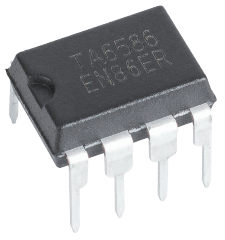
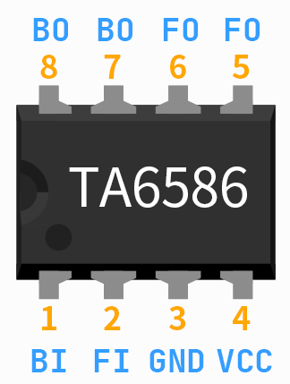
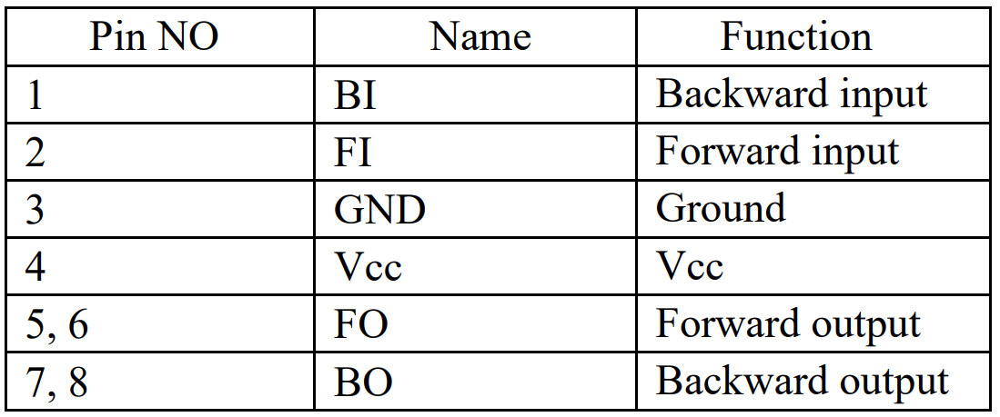
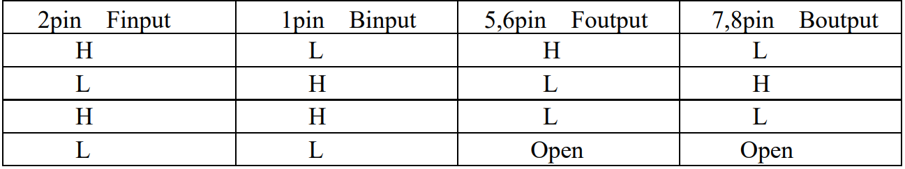

.. _cpn_ta6586:

TA6586 - 电机驱动芯片
=================================

TA6586是一款用于驱动双向直流电机的单片IC。它具有两个逻辑输入引脚用于控制方向：正向和反向。该电路具有良好的抗干扰性能、较小的待机电流和低输出饱和压降。它内置了钳位二极管以反向抑制感性负载电流释放的冲击，使其在驱动继电器、直流电机、步进电机或控制开关电源时安全可靠。TA6586适用于玩具车、遥控飞机电机驱动、自动阀门电机、电磁锁驱动、精密仪器等电路。

**特性**

* 低待机电流：≦2uA
* 宽电源电压范围
* 内置制动功能
* 热关断保护
* 过流限制和短路保护功能
* DIP8无铅封装

**引脚功能**

**输入真值表**

**示例**

* :ref:`basic_motor` （基础项目）
* :ref:`basic_pump` （基础项目）
* :ref:`fun_smart_fan` （趣味项目）
* :ref:`fun_plant_monitor` （趣味项目）
