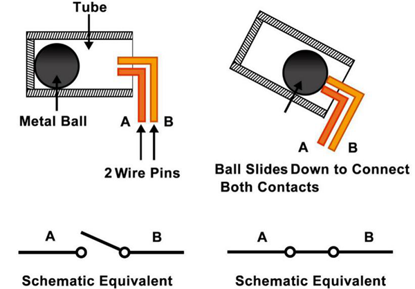

.. _cpn_tilt_switch:

倾侧开关
=============================

这里使用的倾侧开关是一种内部带有金属球的滚珠开关。用于检测小角度的倾斜。

原理非常简单。当开关向某个角度倾斜时，内部的球会滚下来并接触连接到外部引脚的两个触点，从而触发电路。否则球将远离触点，从而断开电路。

* |link_sw520d_datasheet|

**示例**

* :ref:`basic_tilt_switch` （基础项目）
