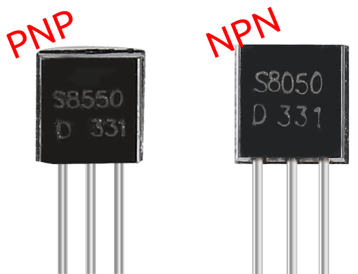
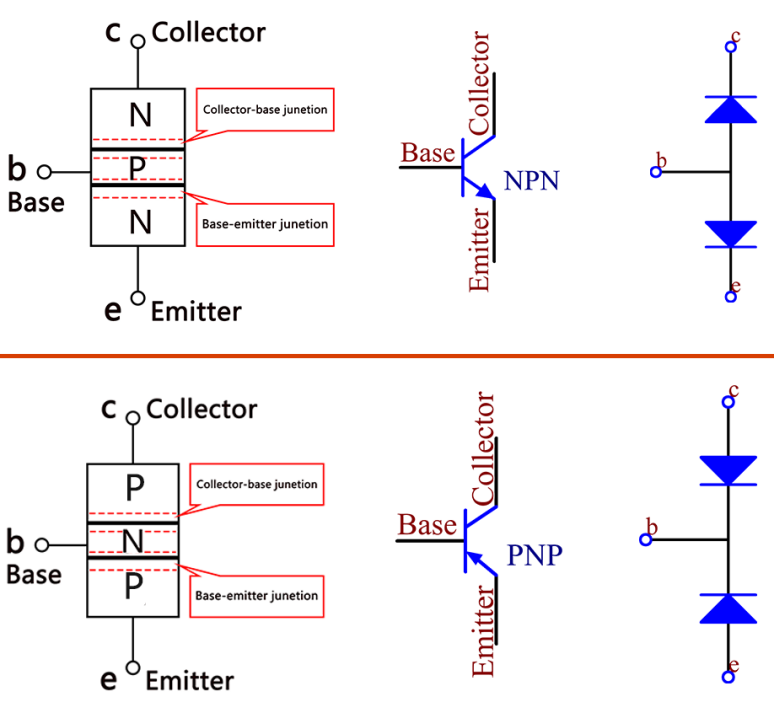

.. _cpn_transistor:

三极管
============

三极管是一种通过电流来控制电流的半导体器件。它的功能是将微弱信号放大为较大幅度的信号，也用于无触点开关。

三极管是由P型和N型半导体组成的三层结构。它们内部形成三个区域。中间较薄的是基区；另外两个都是N型或P型——多数载流子浓度较高的较小区域是发射区，另一个是集电区。这种结构使三极管能够成为放大器。
从这三个区域分别引出三个极，即基极（b）、发射极（e）和集电极（c）。它们形成两个PN结，即发射结和集电结。三极管电路符号中箭头的方向指示了发射结的方向。

* `PN结 - 维基百科 <https://en.wikipedia.org/wiki/P-n_junction>`_

根据半导体类型，三极管可分为两组，NPN型和PNP型。从缩写可知，前者由两个N型半导体和一个P型半导体组成，后者则相反。见下图。

.. note::
    s8550是PNP三极管，s8050是NPN三极管。它们外观非常相似，需要仔细检查标签。

当高电平信号通过NPN三极管时，它被导通。但PNP三极管需要低电平信号来控制。两种类型的三极管都常用于无触点开关，就像本实验中的用法一样。

将标签面朝向自己，引脚朝下。从左到右的引脚分别是发射极（e）、基极（b）和集电极（c）。

* |link_s8050_datasheet|
* |link_s8550_datasheet|

**示例**

* :ref:`basic_relay` （基础项目）
* :ref:`basic_active_buzzer` （基础项目）
* :ref:`basic_passive_buzzer` （基础项目）
