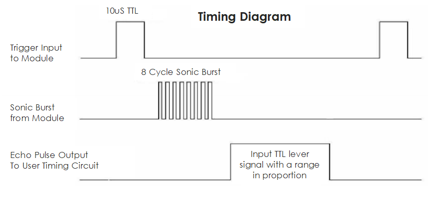

.. _cpn_ultrasonic:

超声波模块
================================

.. image:: img/ultrasonic_pic.png
    :width: 400
    :align: center

超声波传感器模块是一种使用超声波测量与物体之间距离的仪器。它有两个探头，一个用于发送超声波，另一个用于接收波，并将发送和接收的时间转换为距离，从而检测设备与障碍物之间的距离。在实际应用中非常方便和实用。

它提供2cm - 400cm的非接触式测量功能，测距精度可达3mm。
它可以确保信号在5m内稳定，5m后信号逐渐减弱，直到7m位置消失。

该模块包括超声波发射器、接收器和控制电路。基本原理如下：

#. 使用IO触发器处理至少10us的高电平信号。

#. 模块自动发送八个40khz脉冲，并检测是否有脉冲信号返回。

#. 如果信号返回，通过高电平，高输出IO持续时间是从超声波发送到返回的时间。这里，测试距离 = (高电平时间 x 声速（340 m/s）/ 2。

时序图如下所示。

您只需为触发输入提供一个短暂的10us脉冲即可开始测距，然后模块
将发送8个40 kHz的超声波周期脉冲并拉高其
回声。您可以通过发送触发信号和接收回波信号之间的时间间隔来计算距离。

公式：us / 58 = 厘米 或 us / 148 = 英寸；或：距离 = 高
电平时间 \* 速度（340M/S）/ 2；建议使用
超过60ms的测量周期，以防止触发信号和回波信号的信号冲突。

**示例**

* :ref:`basic_ultrasonic_sensor` （基础项目）
* :ref:`fun_smart_can` （趣味项目）
