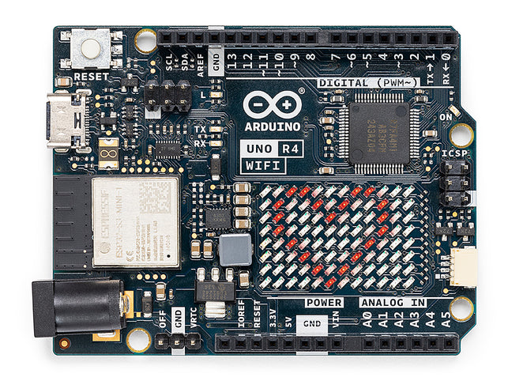

.. note::

    こんにちは、SunFounderのRaspberry Pi & Arduino & ESP32愛好家コミュニティへようこそ！Facebook上でRaspberry Pi、Arduino、ESP32についてもっと深く掘り下げ、他の愛好家と交流しましょう。

    **参加する理由は？**

    - **エキスパートサポート**：コミュニティやチームの助けを借りて、販売後の問題や技術的な課題を解決します。
    - **学び＆共有**：ヒントやチュートリアルを交換してスキルを向上させましょう。
    - **独占的なプレビュー**：新製品の発表や先行プレビューに早期アクセスしましょう。
    - **特別割引**：最新製品の独占割引をお楽しみください。
    - **祭りのプロモーションとギフト**：ギフトや祝日のプロモーションに参加しましょう。

    👉 私たちと一緒に探索し、創造する準備はできていますか？[|link_sf_facebook|]をクリックして今すぐ参加しましょう！

.. _uno_r4_wifi:

Arduino Uno R4 WiFi
=================================

**概要**

Arduino UNO R4 WiFiは、IoTとワイヤレスイノベーションの頂点を象徴しています。ルネサスのRA4M1マイクロコントローラのパワーを搭載し、さらにESP32-S3コプロセッサで強化されたこのボードは、現代のメーカーの進化する要求を満たすために細心の注意を払って作られています。Arduinoの世界に新しい方でも熟練の技術愛好家でも、UNO R4 WiFiはトップレベルのパフォーマンスを保証し、信頼できるフォームファクターと5Vの動作電圧を維持しています。

Arduino領域にさらに進むと、UNO R4 WiFiは接続性、効率性、創造性の象徴として現れます。

Arduino UNO R4 WiFiの特長は以下の通りです：

* **UNOエコシステムとのシームレスな統合：** その遺産に忠実に、UNO R4 WiFiは象徴的なUNOフォームファクター、ピンアウト、5Vの動作電圧との互換性を保証します。以前のバージョンからの移行は、調和のとれたデザインと広範なArduino UNOエコシステムのおかげで容易です。
* **強化されたメモリと処理速度：** より高速な計算と複雑なプロジェクトの領域へ。UNO R4 WiFiは強化されたメモリだけでなく、3倍速いクロック速度で動作し、プロジェクトをスムーズかつ効率的に実行します。
* **多様なオンボード周辺機器：** 12ビットDAC、CANバス、OPアンプ、特有のSWDポートから、UNO R4 WiFiはプロジェクトの能力を高める特徴を備えています。無限の可能性の領域に飛び込み、創造力を解き放ちましょう。
* **最高の接続性：** 統合されたWi-Fi®とBluetooth® Low Energyを備えたUNO R4 WiFiは、IoTへの道を切り開きます。スマートホームシステムやインタラクティブなダッシュボードを作る際、このボードがあなたをサポートします。
* **インタラクティブな12×8 LEDマトリックス：** 外部ハードウェアを必要とせず、ダイナミックなアニメーションやリアルタイムのセンサーデータの可視化でプロジェクトを明るく照らしましょう。
* **高度な安全機構：** ゼロ除算など、潜在的に有害な操作を検出し防ぐボードの固有の能力は、シームレスな体験を保証します。さらに、シリアルモニターでの詳細なフィードバックで、常に状況を把握できます。
* **Qwiicコネクタによる迅速なプロトタイピング：** Qwiicコネクタでプロジェクトの範囲を広げましょう。多数のI2C互換モジュールが利用可能で、プロトタイピングが容易になります。

Arduino UNO R4 WiFiで未来のメイキングに足を踏み入れましょう。ワイヤレス機能を統合したり、広大なIoTランドスケープを探索したり、既存のセットアップをアップグレードしたりする場合、このボードはあなたの次の冒険の理想的なパートナーです。

**技術仕様**

+-----------------------+---------------------------+--------------------------+
| ボード                | 名称                      | Arduino® UNO R4 WiFi     |
+=======================+===========================+==========================+
| マイクロコントローラ  | ルネサス RA4M1 (Arm® Cortex®-M4)                     |
+-----------------------+---------------------------+--------------------------+
| USB                   | USB-C®                    | プログラミングポート     |
+-----------------------+---------------------------+--------------------------+
| ピン                  | デジタルI/Oピン           | 14                       |
+-----------------------+---------------------------+--------------------------+
| ピン                  | アナログ入力ピン          | 6                        |
|                       +---------------------------+--------------------------+
|                       | DAC                       | 1                        |
|                       +---------------------------+--------------------------+
|                       | PWMピン                   | 6                        |
+-----------------------+---------------------------+--------------------------+
| 通信                  | UART                      | はい、1x                 |
|                       +---------------------------+--------------------------+
|                       | I2C                       | はい、1x                 |
|                       +---------------------------+--------------------------+
|                       | SPI                       | はい、1x                 |
|                       +---------------------------+--------------------------+
|                       | CAN                       | はい 1 CANバス           |
+-----------------------+---------------------------+--------------------------+
| 電源                  | 回路動作電圧              | 5V (ESP32-S3は3.3V)      |
|                       +---------------------------+--------------------------+
|                       | 入力電圧 (VIN)            | 6-24V                    |
|                       +---------------------------+--------------------------+
|                       | I/OピンあたりのDC電流     | 8mA                      |
+-----------------------+---------------------------+--------------------------+
| クロック速度          | メインコア                | 48MHz                    |
|                       +---------------------------+--------------------------+
|                       | ESP32-S3                  | 最大240MHz               |
+-----------------------+---------------------------+--------------------------+
| メモリ                | RA4M1                     | 256kBフラッシュ、32kB RAM|
|                       +---------------------------+--------------------------+
|                       | ESP32-S3                  | 384kB ROM、512kB SRAM    |
+-----------------------+---------------------------+--------------------------+
| 寸法                  | 幅                        | 68.85mm                  |
|                       +---------------------------+--------------------------+
|                       | 長さ                      | 53.34mm                  |
+-----------------------+---------------------------+--------------------------+

**ピン配置**

.. image:: img/unor4_wifi_pinout.png
    :width: 100%

* |link_r4_wifi_datasheet|
* |link_r4_wifi_schematic|
* |link_r4_Wifi_doc|
* |link_r4_Wifi_cheatsheet|

