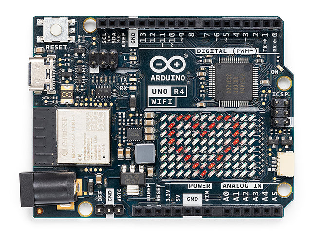
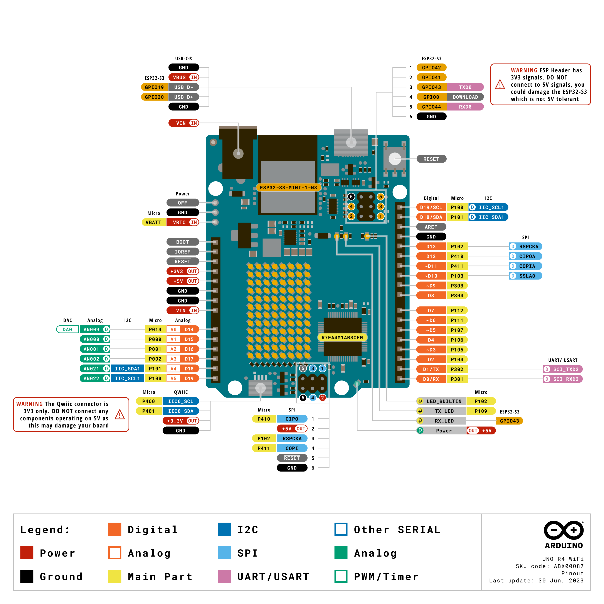

.. _uno_r4_wifi:

Arduino Uno R4 WiFi
=================================

**概述**

Arduino UNO R4 WiFi代表了物联网和无线创新的巅峰。它搭载了瑞萨RA4M1微控制器，并由ESP32-S3协处理器进一步增强，精心设计以满足现代创客不断变化的需求。无论您是Arduino世界的新手还是经验丰富的技术爱好者，UNO R4 WiFi都能确保卓越的性能，同时保持经典的板型和5V工作电压。

进一步深入Arduino领域，UNO R4 WiFi成为连接性、效率和创造力的象征。

以下是Arduino UNO R4 WiFi提供的功能：

* **与UNO生态系统的无缝集成：** UNO R4 WiFi忠实于其传统，保证与标志性的UNO外形、引脚定义和5V工作电压兼容。得益于协调的设计和庞大的Arduino UNO生态系统，从以前版本过渡毫不费力。
* **增强的内存和处理能力：** 进入更快计算和更复杂项目的领域。UNO R4 WiFi不仅拥有增强的内存，而且时钟速度是原来的三倍，确保您的项目顺畅高效地运行。
* **多样化的板载外设：** 从12位DAC和CAN BUS到OP AMP和独特的SWD端口，UNO R4 WiFi配备了提升项目能力的功能。深入无限可能的领域，释放您的创造力。
* **最佳连接性：** 凭借集成的Wi-Fi®和低功耗蓝牙，UNO R4 WiFi为物联网铺平了道路。无论是打造智能家居系统还是交互式仪表板，这块板都能满足您的需求。
* **交互式12x8 LED矩阵：** 用动态动画或实时传感器数据可视化点亮您的项目，无需外部硬件。
* **先进的安全机制：** 板子天生能够检测和防止潜在的危险操作，如除以零，确保无缝体验。此外，通过串口监视器提供详细反馈，您始终掌握情况。
* **用于快速原型制作的Qwiic连接器：** 使用Qwiic连接器拓展您的项目范围。借助大量可用的I2C兼容模块，原型制作变得轻而易举。

与Arduino UNO R4 WiFi一起迈入制造的未来。无论您的目标是集成无线功能、探索广阔的物联网领域，还是仅仅升级现有设备，这款板都是您未来项目的最佳伙伴。

**技术规格**

+-----------------+---------------------------+-------------------------+
| 板子            | 名称                      | Arduino® UNO R4 WiFi    |
+=================+===========================+=========================+
| 微控制器        | Renesas RA4M1 (Arm® Cortex®-M4)                     |
+-----------------+---------------------------+-------------------------+
| USB             | USB-C®                    | 编程端口                |
+-----------------+---------------------------+-------------------------+
| 引脚            | 数字I/O引脚               | 14                      |
+-----------------+---------------------------+-------------------------+
| 引脚            | 模拟输入引脚              | 6                       |
|                 +---------------------------+-------------------------+
|                 | DAC                       | 1                       |
|                 +---------------------------+-------------------------+
|                 | PWM引脚                   | 6                       |
+-----------------+---------------------------+-------------------------+
| 通信            | UART                      | 是, 1x                  |
|                 +---------------------------+-------------------------+
|                 | I2C                       | 是, 1x                  |
|                 +---------------------------+-------------------------+
|                 | SPI                       | 是, 1x                  |
|                 +---------------------------+-------------------------+
|                 | CAN                       | 是, 1路CAN总线          |
+-----------------+---------------------------+-------------------------+
| 电源            | 电路工作电压              | 5 V (ESP32-S3为3.3 V)   |
|                 +---------------------------+-------------------------+
|                 | 输入电压 (VIN)            | 6-24 V                  |
|                 +---------------------------+-------------------------+
|                 | 每个I/O引脚的直流电流     | 8 mA                    |
+-----------------+---------------------------+-------------------------+
| 时钟速度        | 主核心                    | 48 MHz                  |
|                 +---------------------------+-------------------------+
|                 | ESP32-S3                  | 最高 240 MHz            |
+-----------------+---------------------------+-------------------------+
| 存储器          | RA4M1                     | 256 kB Flash, 32 kB RAM |
|                 +---------------------------+-------------------------+
|                 | ESP32-S3                  | 384 kB ROM, 512 kB SRAM |
+-----------------+---------------------------+-------------------------+
| 尺寸            | 宽度                      | 68.85 mm                |
|                 +---------------------------+-------------------------+
|                 | 长度                      | 53.34 mm                |
+-----------------+---------------------------+-------------------------+

**引脚定义**

* |link_r4_wifi_datasheet|
* |link_r4_wifi_schematic|
* |link_r4_Wifi_doc|
* |link_r4_Wifi_cheatsheet|
