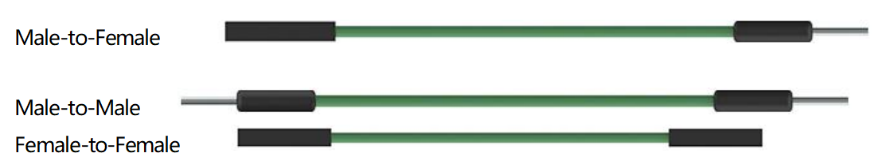

.. _cpn_wires:

杜邦线
=====================

连接两个端子的线称为杜邦线。有
各种类型的杜邦线。这里我们重点介绍那些用于
面包板的杜邦线。它们用于将电信号
从面包板的任何地方传输到微控制器的输入/输出引脚。

杜邦线通过将其"端接头"插入面包板的插槽中来安装，
面包板表面下方有几组
平行金属片，根据区域的不同，这些金属片将插槽连接成行或列的组。
"端接头"插入面包板中，无需焊接，插入到特定原型中需要连接的特定插槽。

有三种类型的杜邦线：母对母、公对公
和公对母。我们称其为公对母是因为它
一端有突出的针尖，另一端有凹陷的母座。
公对公意味着两端都是公头，母对母意味着两端
都是母头。

在一个项目中可能会使用多种类型的杜邦线。杜邦线的
颜色不同并不代表它们的功能不同；
这样设计只是为了更好地区分
每个电路之间的连接。
