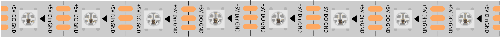

.. _cpn_ws2812:

WS2812 RGB 8 LED灯条
============================

WS2812 RGB 8 LED灯条由8个RGB LED组成。
只需一个引脚即可控制所有LED。每个RGB LED都有一个WS2812芯片，可以独立控制。
它可以实现256级亮度显示和16,777,216种颜色的完整真彩色显示。
同时，像素点内部包含智能数字接口数据锁存信号整形放大驱动电路，内置信号整形电路，有效保证像素点光色高度一致。

它灵活可变，可以随意对接、弯曲和裁剪，背面配有胶带，可随意固定在不平整的表面上，可安装在狭窄的空间内。

**特性**

* 工作电压：DC5V
* IC：一个IC驱动一个RGB LED
* 功耗：每个LED 0.3w
* 工作温度：-15-50
* 颜色：全彩RGB
* RGB类型：5050RGB（内置IC WS2812B）
* 灯条厚度：2mm
* 每个LED可单独控制

**WS2812B简介**

* |link_ws2812b_datasheet|

WS2812B是一种智能控制LED光源，将控制电路和RGB芯片集成在5050组件的封装中。内部包含智能数字端口数据锁存和信号整形放大驱动电路。还包含精密内部振荡器和12V电压可编程恒流控制部分，有效保证像素点光色高度一致。

数据传输协议采用单NZR通信模式。像素上电复位后，DIN端口从控制器接收数据，第一个像素收集初始24位数据然后发送到内部数据锁存器，其他数据经过内部信号整形放大电路整形后通过DO端口发送到下一个级联像素。每传输一个像素，信号减少24bit。像素采用自动整形传输技术，使得像素级联数量不受信号传输限制，仅取决于信号传输速度。

LED具有低驱动电压、环保节能、高亮度、散射角度大、一致性好、低功耗、长寿命等优点。控制芯片集成在LED上方使得电路更简单、体积更小、安装更方便。

.. 示例
.. -------------------

.. :ref:`RGB LED灯条`

**示例**

* :ref:`basic_ws2812` （基础项目）
* :ref:`iot_cheerlights` （物联网项目）
