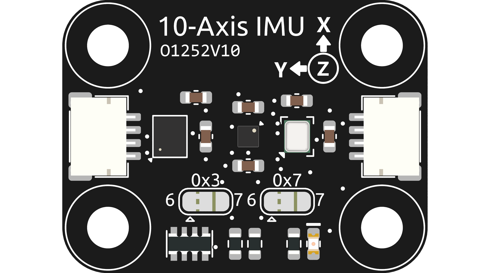

.. note::

    Bonjour, bienvenue dans la communauté SunFounder Raspberry Pi & Arduino & ESP32 Enthusiasts sur Facebook ! Plongez au cœur de Raspberry Pi, Arduino et ESP32 avec d'autres passionnés.

    **Pourquoi nous rejoindre ?**

    - **Support d'experts** : Résolvez les problèmes après-vente et les défis techniques grâce à l'aide de notre communauté et de notre équipe.
    - **Apprendre & Partager** : Échangez des astuces et des tutoriels pour améliorer vos compétences.
    - **Aperçus exclusifs** : Accédez en avant-première aux annonces de nouveaux produits et aux avant-goûts.
    - **Réductions spéciales** : Profitez de réductions exclusives sur nos nouveaux produits.
    - **Promotions festives et tirages au sort** : Participez à des tirages au sort et des promotions de vacances.

    👉 Prêt à explorer et créer avec nous ? Cliquez sur [|link_sf_facebook|] et rejoignez-nous dès aujourd'hui !

.. _cpn_10_axis_imu:

Module IMU 10 axes
============================

Le module IMU 10 axes est un module de haute précision à 10 axes (10DOF) capable de mesurer l'accélération, la vitesse angulaire et la force du champ magnétique sur trois axes : x, y et z. Il se compose de trois capteurs principaux : SH3001, QMC6310 et SPL06_001, et communique via le protocole I2C.

Ce module repose sur trois capteurs :

1. **SH3001** : C'est un accéléromètre et gyroscope à 6 axes capable de mesurer l'accélération et la vitesse angulaire sur les trois axes x, y et z.
2. **QMC6310** : C'est une boussole numérique à 3 axes capable de mesurer la force du champ magnétique sur les trois axes x, y et z.
3. **SPL06_001** : C'est un capteur barométrique de température et de pression capable de mesurer la pression atmosphérique et la température.

Le SH3001 mesure l'accélération et la vitesse angulaire sur les trois axes x, y et z. Le QMC6310 mesure la force du champ magnétique sur les trois axes x, y et z. Le SPL06_001 mesure la pression atmosphérique et la température. Les données de ces capteurs sont combinées pour fournir des informations précises sur l'orientation du module dans l'espace.

Le module IMU 10 axes est couramment utilisé dans des applications telles que les drones, la robotique et d'autres projets nécessitant des informations d'orientation précises. Il est compatible avec les cartes Arduino et peut facilement être interfacé avec elles en utilisant le protocole de communication I2C.