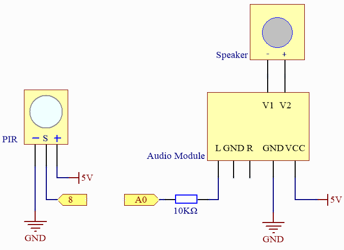

.. note::

    Hallo und willkommen in der SunFounder Raspberry Pi & Arduino & ESP32 Enthusiasten-Gemeinschaft auf Facebook! Tauchen Sie tiefer ein in die Welt von Raspberry Pi, Arduino und ESP32 mit anderen Enthusiasten.

    **Warum beitreten?**

    - **Expertenunterstützung**: Lösen Sie Nachverkaufsprobleme und technische Herausforderungen mit Hilfe unserer Gemeinschaft und unseres Teams.
    - **Lernen & Teilen**: Tauschen Sie Tipps und Anleitungen aus, um Ihre Fähigkeiten zu verbessern.
    - **Exklusive Vorschauen**: Erhalten Sie frühzeitigen Zugang zu neuen Produktankündigungen und exklusiven Einblicken.
    - **Spezialrabatte**: Genießen Sie exklusive Rabatte auf unsere neuesten Produkte.
    - **Festliche Aktionen und Gewinnspiele**: Nehmen Sie an Gewinnspielen und Feiertagsaktionen teil.

    👉 Sind Sie bereit, mit uns zu erkunden und zu erschaffen? Klicken Sie auf [|link_sf_facebook|] und treten Sie heute bei!

.. _fun_welcome:

Willkommen
========================

.. raw:: html

   <video loop controls style = "max-width:100%">
      <source src="../_static/videos/fun_projects/01_fun_welcome.mp4"  type="video/mp4">
      Ihr Browser unterstützt das Video-Tag nicht.
   </video>

In diesem Projekt verwenden wir einen PIR-Sensor, um menschliche Anwesenheit zu erkennen, und einen Lautsprecher, um eine Türklingel zu simulieren, ähnlich den Eingangstürklingeln in Convenience-Stores.
Wenn ein Fußgänger in den Bereich des PIR-Sensors kommt, wird der Lautsprecher klingeln und damit eine Türklingel nachahmen.

**Benötigte Komponenten**

Für dieses Projekt benötigen wir die folgenden Komponenten.

Es ist definitiv praktisch, ein ganzes Kit zu kaufen, hier ist der Link:

.. list-table::
    :widths: 20 20 20
    :header-rows: 1

    *   - Name	
        - ARTIKEL IN DIESEM KIT
        - LINK
    *   - Elite Explorer Kit
        - 300+
        - |link_Elite_Explorer_kit|

Sie können sie auch einzeln über die untenstehenden Links kaufen.

.. list-table::
    :widths: 30 20
    :header-rows: 1

    *   - KOMPONENTENBESCHREIBUNG
        - KAUF-LINK

    *   - :ref:`uno_r4_wifi`
        - \-
    *   - :ref:`cpn_breadboard`
        - |link_breadboard_buy|
    *   - :ref:`cpn_wires`
        - |link_wires_buy|
    *   - :ref:`cpn_resistor`
        - |link_resistor_buy|
    *   - :ref:`cpn_pir`
        - |link_pir_buy|
    *   - :ref:`cpn_audio_speaker`
        - \-

**Verdrahtung**

.. image:: img/01_welcome_bb.png
    :width: 90%
    :align: center

.. raw:: html

    

**Schaltplan**

**Code**

.. note::

    * Sie können die Datei ``01_welcome.ino`` direkt unter dem Pfad ``elite-explorer-kit-main\fun_project\01_welcome`` öffnen.
    * Oder kopieren Sie diesen Code in die Arduino IDE.

.. raw:: html

   <iframe src=https://create.arduino.cc/editor/sunfounder01/b9791d5d-169d-4603-9fc3-8081138811fa/preview?embed style="height:510px;width:100%;margin:10px 0" frameborder=0></iframe>

**Wie funktioniert das?**

Hier ist eine schrittweise Erklärung des Codes:

1. Headerdateien einbinden:

   Zwei Headerdateien, ``analogWave.h`` und ``pitches.h``, einbinden. Die Datei ``analogWave.h`` enthält die Definition der Klasse ``analogWave``, während ``pitches.h`` die Definitionen musikalischer Noten enthält.

2. Objekte instanziieren und Konstanten definieren:

   Erstellen Sie ein ``wave``-Objekt mit der Klasse ``analogWave`` und definieren Sie ``PIR_PIN`` als 2, welcher der an den PIR-Sensor angeschlossene Pin ist.

3. Melodie-Array:

   Das ``melody``-Array definiert eine musikalische Melodie, wobei jeder Note eine Zahl folgt, die ihre Dauer repräsentiert.
   Negative Zahlen stellen punktierte Noten dar (die Dauer um 50% erhöhen).

4. Globale Variablen:

   Definieren Sie einige globale Variablen, um Daten zwischen Funktionen zu teilen.

5. ``setup()``:

   Initialisieren Sie ``PIR_PIN`` als Eingang und stellen Sie die Frequenz der Sinuswelle auf 10 Hz mit ``wave.sine(10)`` ein.

6. ``loop()``:

   Überwachen Sie kontinuierlich den Wert des PIR-Sensors.
   Wenn eine menschliche Anwesenheit erkannt wird (pirValue ist HIGH), rufen Sie die Funktion ``playMelody()`` auf, um die Melodie zu spielen, und warten Sie 10 Sekunden, um das wiederholte Abspielen der Melodie zu verhindern.

7. ``playMelody()``:

   Diese Funktion berechnet die Dauer jeder Note basierend auf den Daten im ``melody``-Array und spielt die entsprechende Note. Zwischen den Noten gibt es eine kurze Pause.
   Die Funktion setzt die Frequenz der Wellenform mit ``wave.freq()`` und steuert die Dauer der Noten und Pausen zwischen den Noten mit der Funktion ``delay()``.

   Hinweis: Stellen Sie sicher, dass die Headerdatei ``pitches.h`` tatsächlich existiert, bevor Sie diesen Code ausführen.

