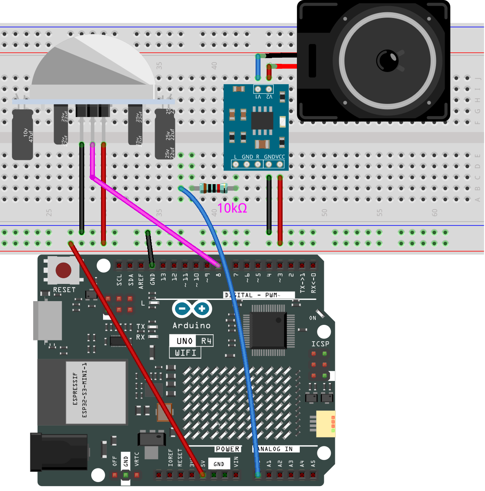
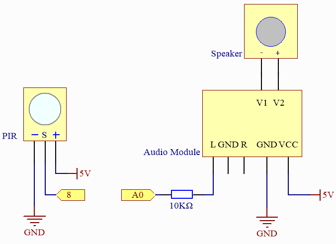

.. _fun_welcome:

欢迎
========================

.. raw:: html

   <video loop controls style = "max-width:100%">
      <source src="../_static/videos/fun_projects/01_fun_welcome.mp4"  type="video/mp4">
      Your browser does not support the video tag.
   </video>

在这个项目中，我们将使用PIR传感器检测人体存在，并使用扬声器模拟门铃，类似于便利店入口处的门铃。
当行人出现在PIR传感器范围内时，扬声器将响起，模拟门铃声。

**所需元件**

在这个项目中，我们需要以下元件。

购买整套套件会更方便，以下是链接：

.. list-table::
    :widths: 20 20 20
    :header-rows: 1

    *   - 名称
        - 套件所含项目
        - 链接
    *   - Elite Explorer 套件
        - 300+
        - |link_Elite_Explorer_kit|

您也可以从下面的链接单独购买。

.. list-table::
    :widths: 30 20
    :header-rows: 1

    *   - 元件介绍
        - 购买链接

    *   - :ref:`uno_r4_wifi`
        - \-
    *   - :ref:`cpn_breadboard`
        - |link_breadboard_buy|
    *   - :ref:`cpn_wires`
        - |link_wires_buy|
    *   - :ref:`cpn_resistor`
        - |link_resistor_buy|
    *   - :ref:`cpn_pir`
        - |link_pir_buy|
    *   - :ref:`cpn_audio_speaker`
        - \-

**接线**

.. raw:: html

    

**原理图**

**代码**

.. note::

    * 您可以直接打开路径 ``elite-explorer-kit-main\fun_project\01_welcome`` 下的 ``01_welcome.ino`` 文件。
    * 或者将这段代码复制到 Arduino IDE 中。

.. literalinclude:: /_code/pitches.h
   :language: cpp
   :caption: pitches.h

.. literalinclude:: /_code/01_fun_welcome.ino
   :language: cpp
   :linenos:
   :caption: 01_welcome.ino

**工作原理**

以下是代码的逐步说明：

1. 包含头文件：

   包含两个头文件：``analogWave.h`` 和 ``pitches.h``。``analogWave.h`` 文件包含 ``analogWave`` 类的定义，而 ``pitches.h`` 包含音符的定义。

2. 实例化对象和定义常量：

   使用 ``analogWave`` 类创建一个 ``wave`` 对象，并将 ``PIR_PIN`` 定义为 2，即连接到 PIR 传感器的引脚。

3. 旋律数组：

   ``melody`` 数组定义了一段音乐旋律，每个音符后面跟一个表示其时长的数字。
   负数表示附点音符（时长增加 50%）。

4. 全局变量：

   定义一些全局变量，用于在函数之间共享数据。

5. ``setup()``：

   将 ``PIR_PIN`` 初始化为输入，并使用 ``wave.sine(10)`` 将正弦波的频率设置为 10 Hz。

6. ``loop()``：

   持续监测 PIR 传感器的值。
   如果检测到人体存在（pirValue 为 HIGH），则调用 ``playMelody()`` 函数播放旋律，并等待 10 秒以防止旋律重复播放。

7. ``playMelody()``：

   该函数根据 ``melody`` 数组中的数据计算每个音符的时长，并播放相应的音符。音符之间有一个短暂的停顿。
   该函数使用 ``wave.freq()`` 设置波形频率，并使用 ``delay()`` 函数控制音符的时长和音符之间的停顿时间。

   注意：在运行此代码之前，请确保 ``pitches.h`` 头文件确实存在。
