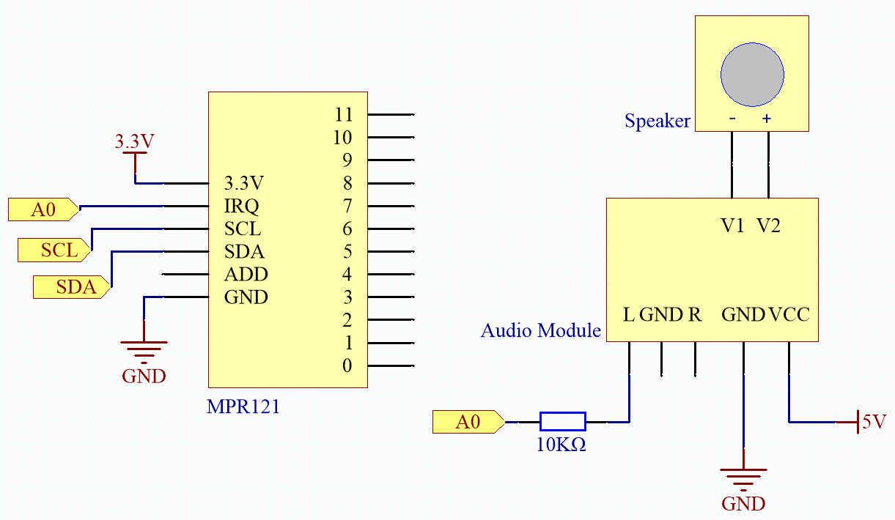

.. note::

    ¡Hola! ¡Bienvenido a la comunidad de entusiastas de SunFounder Raspberry Pi & Arduino & ESP32 en Facebook! Sumérgete en el mundo de Raspberry Pi, Arduino y ESP32 junto a otros apasionados.

    **¿Por qué unirse?**

    - **Soporte de expertos**: Resuelve problemas postventa y desafíos técnicos con la ayuda de nuestra comunidad y equipo.
    - **Aprender y compartir**: Intercambia consejos y tutoriales para mejorar tus habilidades.
    - **Avances exclusivos**: Accede anticipadamente a anuncios de nuevos productos y adelantos exclusivos.
    - **Descuentos especiales**: Disfruta de descuentos exclusivos en nuestros productos más recientes.
    - **Promociones festivas y sorteos**: Participa en sorteos y promociones de temporada.

    👉 ¿Listo para explorar y crear con nosotros? Haz clic en [|link_sf_facebook|] y únete hoy mismo!

.. _fun_fruit_piano:

Piano de Frutas
====================

.. raw:: html

   <video loop controls style = "max-width:100%">
      <source src="../_static/videos/fun_projects/02_fun_fruit_piano.mp4"  type="video/mp4">
      Your browser does not support the video tag.
   </video>

Este proyecto es un simple piano de frutas que lee la entrada de un sensor táctil MPR121 y reproduce música a través de un DAC. En otras palabras, hemos convertido frutas en un teclado, permitiéndote tocar música simplemente tocándolas.

**Componentes necesarios**

En este proyecto, necesitamos los siguientes componentes.

Es definitivamente conveniente comprar un kit completo, aquí está el enlace:

.. list-table::
    :widths: 20 20 20
    :header-rows: 1

    *   - Nombre
        - ELEMENTOS EN ESTE KIT
        - ENLACE
    *   - Elite Explorer Kit
        - 300+
        - |link_Elite_Explorer_kit|

También puedes comprarlos por separado desde los enlaces a continuación.

.. list-table::
    :widths: 30 20
    :header-rows: 1

    *   - INTRODUCCIÓN DEL COMPONENTE
        - ENLACE DE COMPRA

    *   - :ref:`uno_r4_wifi`
        - \-
    *   - :ref:`cpn_breadboard`
        - |link_breadboard_buy|
    *   - :ref:`cpn_wires`
        - |link_wires_buy|
    *   - :ref:`cpn_resistor`
        - |link_resistor_buy|
    *   - :ref:`cpn_mpr121`
        - \-
    *   - :ref:`cpn_audio_speaker`
        - \-

**Cableado**

.. image:: img/02_fruit_piano_bb.png
    :width: 80%
    :align: center

.. raw:: html

    

**Esquema**

**Código**

.. note::

    * Puedes abrir el archivo ``02_fruit_piano.ino`` bajo la ruta ``elite-explorer-kit-main\fun_project\02_fruit_piano`` directamente.
    * O copia este código en Arduino IDE.

.. note::
   Para instalar la biblioteca, utiliza el Administrador de Bibliotecas de Arduino y busca **"Adafruit MPR121"** e instálala.

.. raw:: html

   <iframe src=https://create.arduino.cc/editor/sunfounder01/e677c06a-7af1-4846-a507-dd69c0c50aae/preview?embed style="height:510px;width:100%;margin:10px 0" frameborder=0></iframe>

**¿Cómo funciona?**

Aquí hay una explicación paso a paso del código:

1. Inicialización de Biblioteca y Objetos:

   Importa las bibliotecas necesarias: biblioteca ``Wire`` (para comunicación I2C), biblioteca ``Adafruit_MPR121`` (para controlar el MPR121), biblioteca ``analogWave`` (para generar formas de onda analógicas) y ``pitches.h`` (que define las frecuencias de las notes).
   Crea instancias de los objetos ``Adafruit_MPR121`` y ``analogWave``.
   Define un array de notes para almacenar la note correspondiente a cada canal táctil.

2. ``setup()``:

   Inicializa la comunicación Serial y espera a que comience.
   Verifica e inicializa el MPR121; si no se encuentra, imprime un mensaje de error en el monitor serial y detiene la ejecución.
   Inicializa el objeto ``analogWave`` y establece la frecuencia inicial de la onda sinusoidal a 10Hz.

3. ``loop()``:

   Lee los canales actualmente tocados del MPR121.
   Itera a través de todos los canales, verifica cuál está tocado y reproduce la note correspondiente.
   Añade una pequeña demora entre cada iteración.

4. Reproducir note ``playNote()``:

   La función ``playNote`` toma un parámetro ``note`` y establece la frecuencia del DAC para reproducir la note correspondiente.
   Demora por un período para reproducir la note.
   Deja de reproducir la note.

