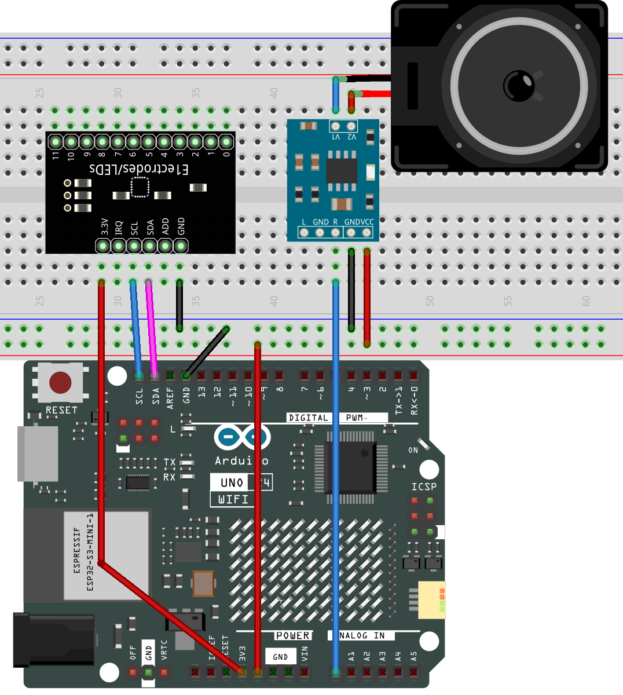
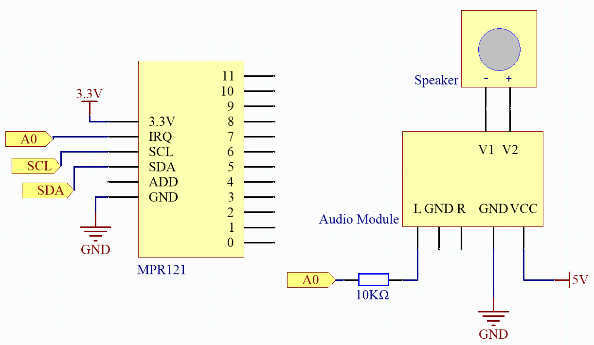

.. note::

    Hallo und willkommen in der SunFounder Raspberry Pi & Arduino & ESP32 Enthusiasten-Gemeinschaft auf Facebook! Tauchen Sie tiefer ein in die Welt von Raspberry Pi, Arduino und ESP32 mit anderen Enthusiasten.

    **Warum beitreten?**

    - **Expertenunterstützung**: Lösen Sie Nachverkaufsprobleme und technische Herausforderungen mit Hilfe unserer Gemeinschaft und unseres Teams.
    - **Lernen & Teilen**: Tauschen Sie Tipps und Anleitungen aus, um Ihre Fähigkeiten zu verbessern.
    - **Exklusive Vorschauen**: Erhalten Sie frühzeitigen Zugang zu neuen Produktankündigungen und exklusiven Einblicken.
    - **Spezialrabatte**: Genießen Sie exklusive Rabatte auf unsere neuesten Produkte.
    - **Festliche Aktionen und Gewinnspiele**: Nehmen Sie an Gewinnspielen und Feiertagsaktionen teil.

    👉 Sind Sie bereit, mit uns zu erkunden und zu erschaffen? Klicken Sie auf [|link_sf_facebook|] und treten Sie heute bei!

.. _fun_fruit_piano:

Obstklavier
========================

.. raw:: html

   <video loop controls style = "max-width:100%">
      <source src="../_static/videos/fun_projects/02_fun_fruit_piano.mp4"  type="video/mp4">
      Ihr Browser unterstützt das Video-Tag nicht.
   </video>

Dieses Projekt ist ein einfaches Obstklavier, das Eingaben von einem MPR121-Touchsensor liest und Musik über einen DAC abspielt. Mit anderen Worten, wir haben Früchte in eine Tastatur verwandelt, die es Ihnen ermöglicht, Musik zu spielen, indem Sie sie einfach berühren.

**Benötigte Komponenten**

Für dieses Projekt benötigen wir die folgenden Komponenten.

Es ist definitiv praktisch, ein ganzes Kit zu kaufen, hier ist der Link: 

.. list-table::
    :widths: 20 20 20
    :header-rows: 1

    *   - Name	
        - ARTIKEL IN DIESEM KIT
        - LINK
    *   - Elite Explorer Kit
        - 300+
        - |link_Elite_Explorer_kit|

Sie können sie auch einzeln über die untenstehenden Links kaufen.

.. list-table::
    :widths: 30 20
    :header-rows: 1

    *   - KOMPONENTENBESCHREIBUNG
        - KAUF-LINK

    *   - :ref:`uno_r4_wifi`
        - \-
    *   - :ref:`cpn_breadboard`
        - |link_breadboard_buy|
    *   - :ref:`cpn_wires`
        - |link_wires_buy|
    *   - :ref:`cpn_resistor`
        - |link_resistor_buy|
    *   - :ref:`cpn_mpr121`
        - \-
    *   - :ref:`cpn_audio_speaker`
        - \-

**Verdrahtung**

.. raw:: html

    

**Schaltplan**

**Code**

.. note::

    * Sie können die Datei ``02_fruit_piano.ino`` direkt unter dem Pfad ``elite-explorer-kit-main\fun_project\02_fruit_piano`` öffnen.
    * Oder kopieren Sie diesen Code in die Arduino IDE.

.. note::
   Um die Bibliothek zu installieren, verwenden Sie den Arduino-Bibliotheksmanager und suchen Sie nach **„Adafruit MPR121“** und installieren Sie diese.

.. literalinclude:: /_code/pitches.h
   :language: cpp
   :caption: pitches.h

.. literalinclude:: /_code/02_fun_fruit_piano.ino
   :language: cpp
   :linenos:
   :caption: 02_fruit_piano.ino

**Wie funktioniert das?**

Hier ist eine schrittweise Erklärung des Codes:

1. Bibliotheks- und Objektinitialisierung:

   Importieren Sie die notwendigen Bibliotheken: ``Wire``-Bibliothek (für I2C-Kommunikation), ``Adafruit_MPR121``-Bibliothek (zur Steuerung des MPR121), ``analogWave``-Bibliothek (zur Erzeugung analoger Wellenformen) und ``pitches.h`` (definiert die Frequenzen der Noten).
   Erstellen Sie Instanzen der Objekte ``Adafruit_MPR121`` und ``analogWave``.
   Definieren Sie ein Noten-Array, um die Note zu speichern, die jedem Berührungskanal entspricht.

2. ``setup()``:

   Initialisieren Sie die serielle Kommunikation und warten Sie, bis sie startet.
   Überprüfen und initialisieren Sie den MPR121; falls nicht gefunden, geben Sie eine Fehlermeldung auf dem seriellen Monitor aus und stoppen Sie die Ausführung.
   Initialisieren Sie das ``analogWave``-Objekt und setzen Sie die anfängliche Sinuswellenfrequenz auf 10 Hz.

3. ``loop()``:

   Lesen Sie die aktuell berührten Kanäle des MPR121.
   Durchlaufen Sie alle Kanäle, überprüfen Sie, welcher berührt wird, und spielen Sie die entsprechende Note.
   Fügen Sie eine kleine Verzögerung zwischen jeder Iteration hinzu.

4. Note abspielen ``playNote()``:

   Die Funktion ``playNote`` nimmt einen ``note``-Parameter entgegen und setzt die DAC-Frequenz, um die entsprechende Note zu spielen.
   Verzögern Sie für einen Zeitraum, um die Note zu spielen.
   Stoppen Sie das Abspielen der Note.
