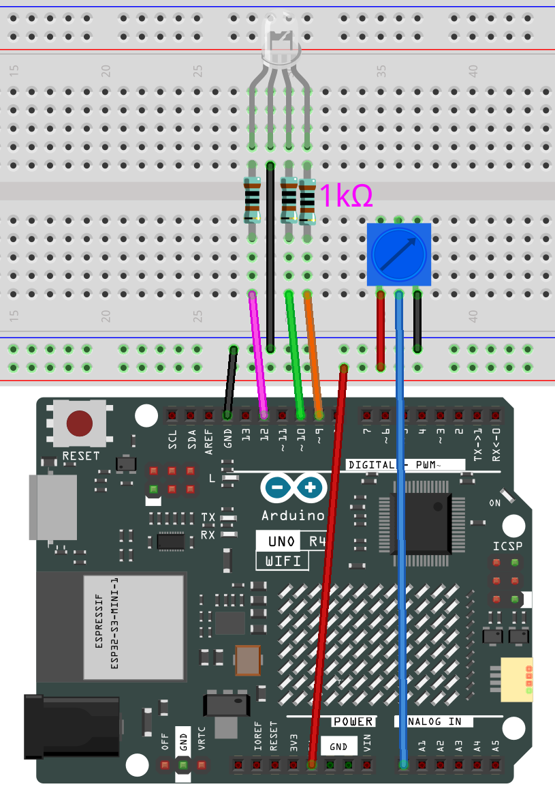
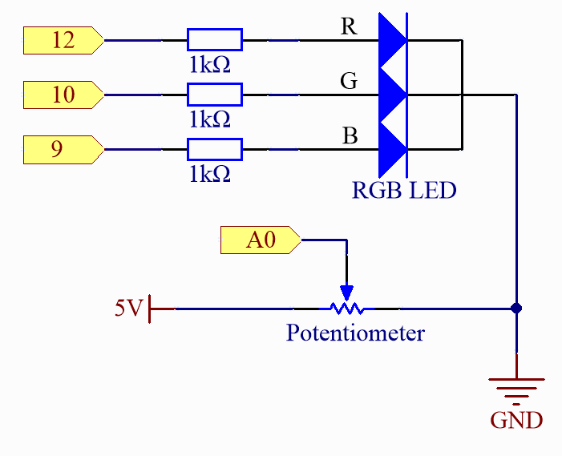

.. note::

    Ciao, benvenuto nella community SunFounder Raspberry Pi & Arduino & ESP32 Enthusiasts su Facebook! Approfondisci Raspberry Pi, Arduino ed ESP32 con altri appassionati.

    **Perché unirsi?**

    - **Supporto Esperto**: Risolvi problemi post-vendita e sfide tecniche con l'aiuto della nostra community e del nostro team.
    - **Impara & Condividi**: Scambia consigli e tutorial per migliorare le tue competenze.
    - **Anteprime Esclusive**: Ottieni l'accesso anticipato agli annunci di nuovi prodotti e anteprime esclusive.
    - **Sconti Speciali**: Goditi sconti esclusivi sui nostri prodotti più recenti.
    - **Promozioni e Concorsi Festivi**: Partecipa a concorsi e promozioni festive.

    👉 Pronto a esplorare e creare con noi? Clicca [|link_sf_facebook|] e unisciti oggi stesso!

.. _fun_hue:

HueDial
========================================

.. raw:: html

   <video loop autoplay muted style = "max-width:100%">
      <source src="../_static/videos/fun_projects/03_fun_huedial.mp4"  type="video/mp4">
      Il tuo browser non supporta il tag video.
   </video>

Questo esempio controlla il colore di un LED RGB in base alla posizione di una manopola rotante. 
Diverse posizioni della manopola corrispondono a diversi valori di tonalità (HUE), che vengono poi tradotti in valori RGB, determinando così un cambiamento di colore per il LED RGB.

**Componenti Necessari**

In questo progetto, abbiamo bisogno dei seguenti componenti.

È sicuramente conveniente acquistare un kit completo, ecco il link:

.. list-table::
    :widths: 20 20 20
    :header-rows: 1

    *   - Nome	
        - ELEMENTI IN QUESTO KIT
        - LINK
    *   - Elite Explorer Kit
        - 300+
        - |link_Elite_Explorer_kit|

Puoi anche acquistarli separatamente dai link sottostanti.

.. list-table::
    :widths: 30 20
    :header-rows: 1

    *   - INTRODUZIONE COMPONENTI
        - LINK ACQUISTO

    *   - :ref:`uno_r4_wifi`
        - \-
    *   - :ref:`cpn_breadboard`
        - |link_breadboard_buy|
    *   - :ref:`cpn_wires`
        - |link_wires_buy|
    *   - :ref:`cpn_resistor`
        - |link_resistor_buy|
    *   - :ref:`cpn_rgb_led`
        - |link_rgb_led_buy|
    *   - :ref:`potentiometer`
        - |link_potentiometer_buy|

**Collegamenti**

.. raw:: html

    

**Schema Elettrico**

**Codice**

.. note::

    * Puoi aprire il file ``03_huedial.ino`` nel percorso ``elite-explorer-kit-main\fun_project\03_huedial`` direttamente.
    * Oppure copia questo codice nell'Arduino IDE.

.. raw:: html

   <iframe src=https://create.arduino.cc/editor/sunfounder01/0ad800d4-77bb-454f-8976-a078da71ec35/preview?embed style="height:510px;width:100%;margin:10px 0" frameborder=0></iframe>

**Come funziona?**

Ecco una spiegazione dettagliata del codice:

1. Definizioni delle Variabili Globali:

   ``redPin``, ``greenPin`` e ``bluePin``: Questi definiscono i pin PWM collegati rispettivamente ai LED rosso, verde e blu.
   ``KNOB_PIN``: Definisce il pin di input analogico collegato alla manopola rotante.

2. ``setup()``:

   Imposta i pin per il LED RGB come output.
   Di default, i pin analogici sono impostati come input, quindi non c'è bisogno di impostare la modalità input per il pin della manopola.

3. ``loop()``:

   Leggi il valore della manopola rotante. Questo valore varia da 0 a 1023.
   Normalizza il valore della manopola a un intervallo da 0 a 1.
   Converti il valore normalizzato in un valore di tonalità (HUE) che varia da 0 a 360.
   Converti il valore di tonalità in valori RGB.
   Aggiorna il colore del LED utilizzando questi valori RGB.

4. ``setColor()``:

   Imposta i valori PWM appropriati per ciascun pin del LED utilizzando la funzione ``analogWrite()`` per impostare il colore del LED RGB.

5. ``HUEtoRGB()``:

   Questa funzione converte i valori di tonalità (HUE) in valori RGB utilizzando il metodo di conversione da HSL a RGB, concentrandosi solo sulla componente HUE, mantenendo saturazione e luminosità al 100%.
   L'algoritmo è diviso in 6 fasi, ciascuna delle quali copre 60 gradi.
   Calcola i valori RGB per ciascuna fase di tonalità e poi scala questi valori a un intervallo di 0-255, che è l'intervallo previsto per la funzione ``analogWrite()``.

