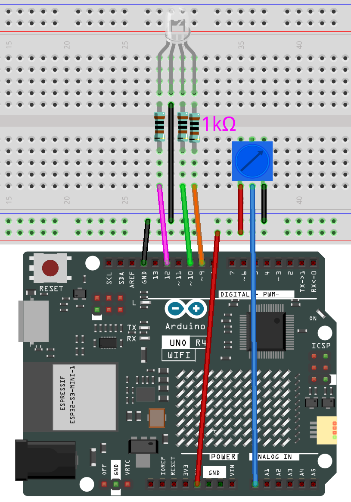
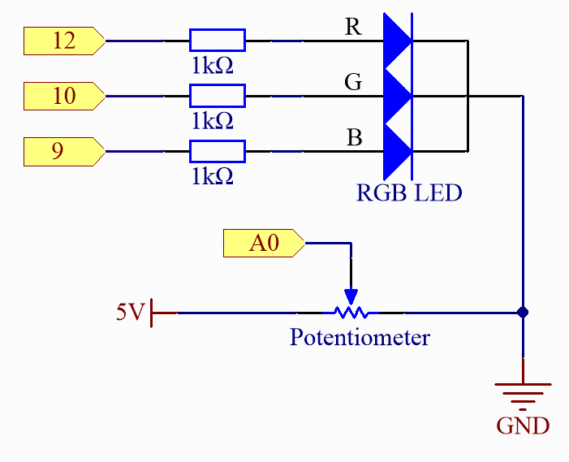

.. note::

    ¡Hola! ¡Bienvenido a la comunidad de entusiastas de SunFounder Raspberry Pi & Arduino & ESP32 en Facebook! Sumérgete en el mundo de Raspberry Pi, Arduino y ESP32 junto a otros apasionados.

    **¿Por qué unirse?**

    - **Soporte de expertos**: Resuelve problemas postventa y desafíos técnicos con la ayuda de nuestra comunidad y equipo.
    - **Aprender y compartir**: Intercambia consejos y tutoriales para mejorar tus habilidades.
    - **Avances exclusivos**: Accede anticipadamente a anuncios de nuevos productos y adelantos exclusivos.
    - **Descuentos especiales**: Disfruta de descuentos exclusivos en nuestros productos más recientes.
    - **Promociones festivas y sorteos**: Participa en sorteos y promociones de temporada.

    👉 ¿Listo para explorar y crear con nosotros? Haz clic en [|link_sf_facebook|] y únete hoy mismo!

.. _fun_hue:

HueDial
=========

.. raw:: html

   <video loop autoplay muted style = "max-width:100%">
      <source src="../_static/videos/fun_projects/03_fun_huedial.mp4"  type="video/mp4">
      Your browser does not support the video tag.
   </video>

Este ejemplo controla el color de un LED RGB basado en la posición de un mando giratorio. Diferentes posiciones del mando corresponden a diferentes valores de HUE, que luego se traducen en valores de color RGB, resultando en un cambio de color para el LED RGB.

**Componentes necesarios**

En este proyecto, necesitamos los siguientes componentes.

Es definitivamente conveniente comprar un kit completo, aquí está el enlace:

.. list-table::
    :widths: 20 20 20
    :header-rows: 1

    *   - Nombre
        - ELEMENTOS EN ESTE KIT
        - ENLACE
    *   - Elite Explorer Kit
        - 300+
        - |link_Elite_Explorer_kit|

También puedes comprarlos por separado desde los enlaces a continuación.

.. list-table::
    :widths: 30 20
    :header-rows: 1

    *   - INTRODUCCIÓN DEL COMPONENTE
        - ENLACE DE COMPRA

    *   - :ref:`uno_r4_wifi`
        - \-
    *   - :ref:`cpn_breadboard`
        - |link_breadboard_buy|
    *   - :ref:`cpn_wires`
        - |link_wires_buy|
    *   - :ref:`cpn_resistor`
        - |link_resistor_buy|
    *   - :ref:`cpn_rgb_led`
        - |link_rgb_led_buy|
    *   - :ref:`cpn_potentiometer`
        - |link_potentiometer_buy|

**Cableado**

.. raw:: html

    

**Esquema**

**Código**

.. note::

    * Puedes abrir el archivo ``03_huedial.ino`` bajo la ruta ``elite-explorer-kit-main\fun_project\03_huedial`` directamente.
    * O copia este código en Arduino IDE.

.. literalinclude:: /_code/03_fun_hue.ino
   :language: cpp
   :linenos:
   :caption: 03_HueDial.ino

**¿Cómo funciona?**

Aquí hay una explicación detallada del código:

1. Definiciones de Variables Globales:

   ``redPin``, ``greenPin`` y ``bluePin``: Estos definen los pines PWM conectados a los LEDs rojo, verde y azul, respectivamente.
   ``KNOB_PIN``: Define el pin de entrada analógica conectado al mando giratorio.

2. ``setup()``:

   Configura los pines para el LED RGB como salida.
   Por defecto, los pines analógicos están configurados como entradas, por lo que no es necesario configurar el modo de entrada para el pin del mando.

3. ``loop()``:

   Lee el valor del mando giratorio. Este valor varía de 0 a 1023.
   Normaliza el valor del mando a un rango de 0-1.
   Convierte el valor normalizado a un valor de HUE que va de 0 a 360.
   Convierte el valor de HUE a valores RGB.
   Actualiza el color del LED usando estos valores RGB.

4. ``setColor()``:

   Establece los valores PWM apropiados para cada pin del LED usando la función ``analogWrite()`` para configurar el color del LED RGB.

5. ``HUEtoRGB()``:

   Esta función convierte valores de HUE a valores RGB usando el método de conversión de HSL a RGB pero se enfoca solo en el componente HUE, manteniendo la saturación y el brillo al 100%.
   El algoritmo se divide en 6 etapas, cada una cubriendo 60 grados.
   Calcula valores RGB para cada etapa de HUE y luego escala estos valores a un rango de 0-255, que es el rango esperado para la función ``analogWrite()``.

