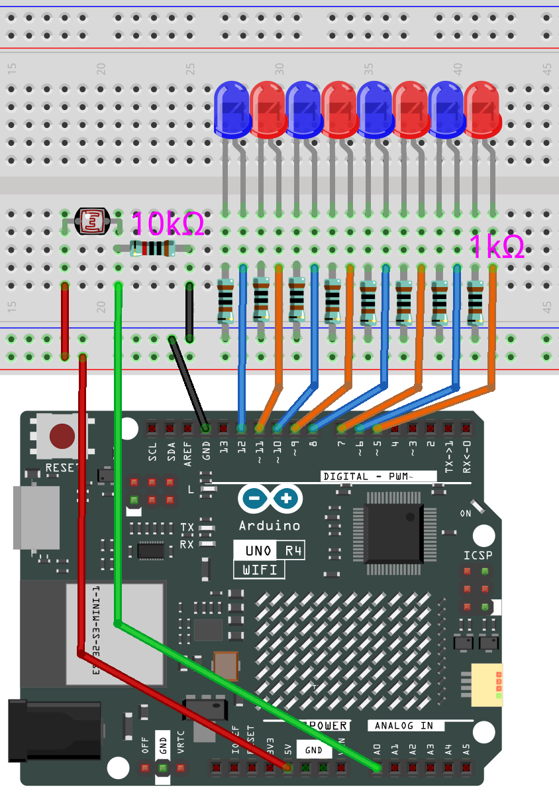
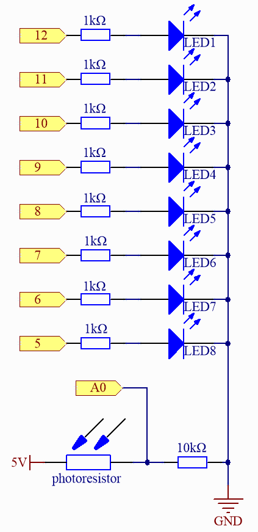

.. _fun_light_array:

光敏アレイ
==========================================

.. raw:: html

   <video loop autoplay muted style = "max-width:100%">
      <source src="../_static/videos/fun_projects/04_fun_lightarray.mp4"  type="video/mp4">
      お使いのブラウザではビデオタグがサポートされていません。
   </video>

このプログラムは、光依存抵抗器からの読み取りを対応する数の点灯するLEDライトに変換し、光の明るさのシンプルなインジケータを作成します。

**必要なコンポーネント**

このプロジェクトには以下のコンポーネントが必要です。

全体のキットを購入すると便利です。こちらがリンクです：

.. list-table::
    :widths: 20 20 20
    :header-rows: 1

    *   - 名称	
        - このキットのアイテム数
        - リンク
    *   - Elite Explorer Kit
        - 300+
        - |link_Elite_Explorer_kit|

以下のリンクから別々に購入することもできます。

.. list-table::
    :widths: 30 20
    :header-rows: 1

    *   - コンポーネント紹介
        - 購入リンク

    *   - :ref:`uno_r4_wifi`
        - \-
    *   - :ref:`cpn_breadboard`
        - |link_breadboard_buy|
    *   - :ref:`cpn_wires`
        - |link_wires_buy|
    *   - :ref:`cpn_resistor`
        - |link_resistor_buy|
    *   - :ref:`cpn_led`
        - |link_led_buy|
    *   - :ref:`cpn_photoresistor`
        - |link_photoresistor_buy|

**配線図**

.. raw:: html

    

**回路図**

**コード**

.. note::

    * ファイル ``04_light_sensitive_array.ino`` を ``elite-explorer-kit-main\fun_project\04_light_sensitive_array`` のパスから直接開くことができます。
    * または、このコードをArduino IDEにコピーしてください。

.. raw:: html

   <iframe src=https://create.arduino.cc/editor/sunfounder01/9da7af57-c002-41a0-bc84-372e91885d52/preview?embed style="height:510px;width:100%;margin:10px 0" frameborder=0></iframe>

**どのように動作しますか？**

以下はコードの詳細な説明です：

1. 定数と変数の定義：

   ``NbrLEDs``：8個のLEDの存在を定義します。
   ``ledPins[]``：LEDはArduinoのピン5から12に接続されています。
   ``photocellPin``：フォトレジスタはArduinoのA0ピンに接続されています。
   ``sensorValue``：この変数はフォトレジスタから読み取った値を保存します。
   ``ledLevel``：この変数はsensorValueの変換に基づいてLEDの数を保存します。

2. ``setup()``：

   ピン5から12を出力として設定し、LEDを駆動します。

3. ``loop()``：

   フォトレジスタのアナログ値をピンA0から読み取ります。通常は0から1023の範囲です。
   map関数を使用して、フォトレジスタの値を300-1023の範囲から0-8の範囲にマップします。
   これは、光依存抵抗器からの読み取りが300の場合、LEDは点灯しないことを意味します。
   読み取りが1023以上の場合、8個のLEDすべてが点灯します。

   続くforループは、各LEDをチェックします。そのインデックスがledLevel未満の場合、
   LEDを点灯させます。それ以外の場合は、LEDを消灯させます。

