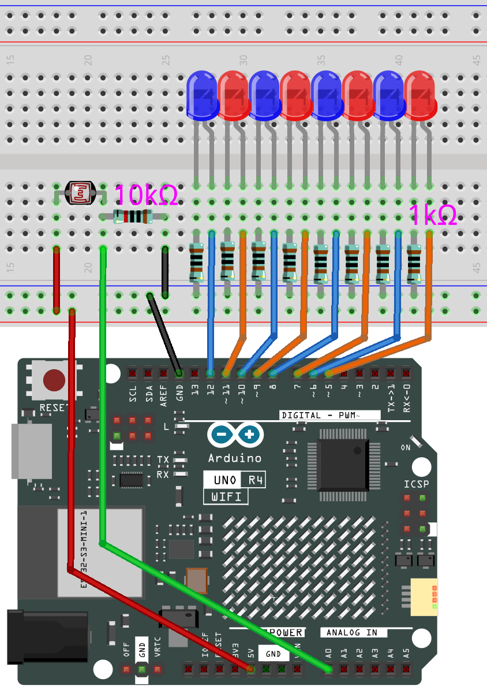
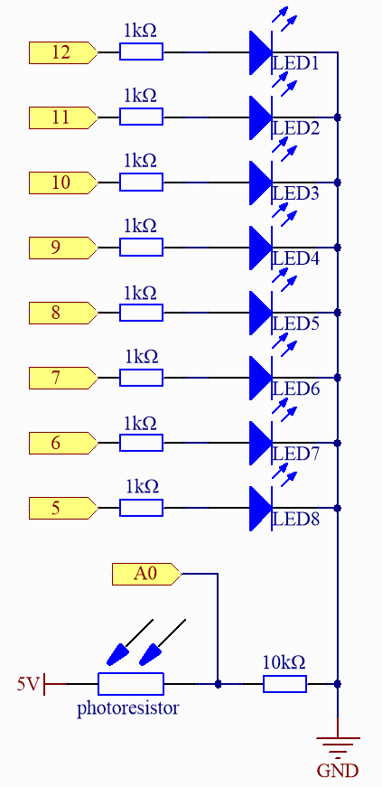

.. _fun_light_array:

光敏阵列
==========================================

.. raw:: html

   <video loop autoplay muted style = "max-width:100%">
      <source src="../_static/videos/fun_projects/04_fun_lightarray.mp4"  type="video/mp4">
      Your browser does not support the video tag.
   </video>

该程序将光敏电阻的读数转换为相应数量的点亮 LED，从而创建一个简单的亮度指示器。

**所需元件**

在这个项目中，我们需要以下元件。

购买整套套件会更方便，以下是链接：

.. list-table::
    :widths: 20 20 20
    :header-rows: 1

    *   - 名称
        - 套件所含项目
        - 链接
    *   - Elite Explorer 套件
        - 300+
        - |link_Elite_Explorer_kit|

您也可以从下面的链接单独购买。

.. list-table::
    :widths: 30 20
    :header-rows: 1

    *   - 元件介绍
        - 购买链接

    *   - :ref:`uno_r4_wifi`
        - \-
    *   - :ref:`cpn_breadboard`
        - |link_breadboard_buy|
    *   - :ref:`cpn_wires`
        - |link_wires_buy|
    *   - :ref:`cpn_resistor`
        - |link_resistor_buy|
    *   - :ref:`cpn_led`
        - |link_led_buy|
    *   - :ref:`cpn_photoresistor`
        - |link_photoresistor_buy|

**接线**

.. raw:: html

    

**原理图**

**代码**

.. note::

    * 您可以直接打开路径 ``elite-explorer-kit-main\fun_project\04_light_sensitive_array`` 下的 ``04_light_sensitive_array.ino`` 文件。
    * 或者将这段代码复制到 Arduino IDE 中。

.. literalinclude:: /_code/04_fun_light_array.ino
   :language: cpp
   :linenos:
   :caption: 04_light_sensitive_array.ino

**工作原理**

以下是代码的逐步说明：

1. 常量和变量定义：

   ``NbrLEDs``：定义了 8 个 LED。
   ``ledPins[]``：LED 连接到 Arduino 的引脚 5 到 12。
   ``photocellPin``：光敏电阻连接到 Arduino 的 A0 引脚。
   ``sensorValue``：该变量存储从光敏电阻读取的值。
   ``ledLevel``：该变量存储根据 sensorValue 转换后的 LED 数量。

2. ``setup()``：

   将引脚 5 到 12 配置为输出，以驱动 LED。

3. ``loop()``：

   从 A0 引脚读取光敏电阻的模拟值，通常范围是 0 到 1023。
   使用 map 函数将光敏电阻的值从 300-1023 范围映射到 0-8 范围。
   这意味着如果光敏电阻的读数为 300，则没有 LED 点亮；
   如果读数为 1023 或更高，则所有 8 个 LED 都将点亮。

   随后的 for 循环检查每个 LED。如果其索引小于 ledLevel，
   则 LED 点亮；否则，它将熄灭。
