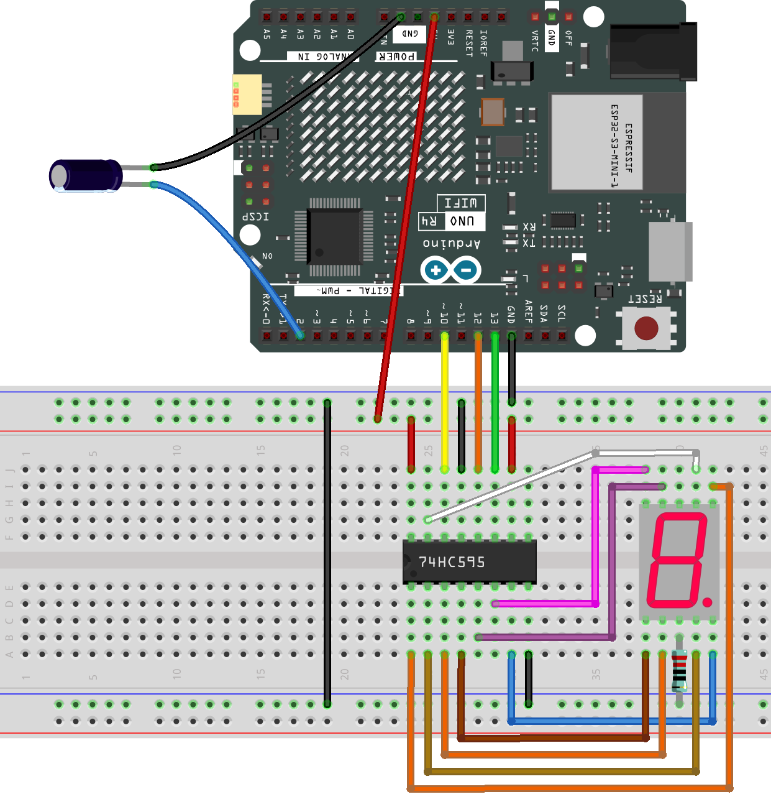

.. note::

    ¡Hola! ¡Bienvenido a la comunidad de entusiastas de SunFounder Raspberry Pi & Arduino & ESP32 en Facebook! Sumérgete en el mundo de Raspberry Pi, Arduino y ESP32 junto a otros apasionados.

    **¿Por qué unirse?**

    - **Soporte de expertos**: Resuelve problemas postventa y desafíos técnicos con la ayuda de nuestra comunidad y equipo.
    - **Aprender y compartir**: Intercambia consejos y tutoriales para mejorar tus habilidades.
    - **Avances exclusivos**: Accede anticipadamente a anuncios de nuevos productos y adelantos exclusivos.
    - **Descuentos especiales**: Disfruta de descuentos exclusivos en nuestros productos más recientes.
    - **Promociones festivas y sorteos**: Participa en sorteos y promociones de temporada.

    👉 ¿Listo para explorar y crear con nosotros? Haz clic en [|link_sf_facebook|] y únete hoy mismo!

.. _fun_digital_dice:

Dado Digital
================

.. raw:: html

   <video loop autoplay muted style = "max-width:100%">
      <source src="../_static/videos/fun_projects/05_fun_dice.mp4"  type="video/mp4">
      Your browser does not support the video tag.
   </video>

Este código está diseñado para simular el lanzamiento de un dado utilizando un registro de desplazamiento 74HC595 y una pantalla digital de 7 segmentos. La simulación del lanzamiento del dado se activa agitando directamente el interruptor de inclinación. Al hacer esta acción, la pantalla digital cicla a través de números aleatorios entre 1 y 6, simulando el lanzamiento de un dado. Después de un breve intervalo, la pantalla se detiene mostrando un número aleatorio que representa el resultado del lanzamiento del dado.

**Componentes necesarios**

En este proyecto, necesitamos los siguientes componentes.

Es definitivamente conveniente comprar un kit completo, aquí está el enlace:

.. list-table::
    :widths: 20 20 20
    :header-rows: 1

    *   - Nombre
        - ELEMENTOS EN ESTE KIT
        - ENLACE
    *   - Elite Explorer Kit
        - 300+
        - |link_Elite_Explorer_kit|

También puedes comprarlos por separado desde los enlaces a continuación.

.. list-table::
    :widths: 30 20
    :header-rows: 1

    *   - INTRODUCCIÓN DEL COMPONENTE
        - ENLACE DE COMPRA

    *   - :ref:`uno_r4_wifi`
        - \-
    *   - :ref:`cpn_breadboard`
        - |link_breadboard_buy|
    *   - :ref:`cpn_wires`
        - |link_wires_buy|
    *   - :ref:`cpn_resistor`
        - |link_resistor_buy|
    *   - :ref:`cpn_tilt_switch`
        - \-
    *   - :ref:`cpn_74hc595`
        - |link_74hc595_buy|
    *   - :ref:`cpn_7segment`
        - |link_7segment_buy|

**Cableado**

.. raw:: html

    

**Esquema**

.. image:: img/05_digital_dice_schematic.png
   :width: 100%

**Código**

.. note::

    * Puedes abrir el archivo ``05_digital_dice.ino`` bajo la ruta ``elite-explorer-kit-main\fun_project\05_digital_dice`` directamente.
    * O copia este código en Arduino IDE.

.. raw:: html

   <iframe src=https://create.arduino.cc/editor/sunfounder01/ff0528b0-a10d-49e8-8916-6cb1fdfdf9a2/preview?embed style="height:510px;width:100%;margin:10px 0" frameborder=0></iframe>

**¿Cómo funciona?**

Aquí hay una explicación detallada del código:

1. Inicialización de variables:

   ``dataPin``, ``clockPin`` y ``latchPin``: Pines para el 74HC595.
   ``buttonPin``: El pin digital donde está conectado el botón.
   ``numbers[]``: Un array para almacenar la codificación que representa los números del 1 al 6 en un tubo digital de ánodo común.

2. Variables volátiles:

   ``rolling``: Esta es una variable volátil que indica si el dado está rodando actualmente. Se declara como volátil ya que se accede tanto en la rutina de servicio de interrupción como en el programa principal.

3. ``setup()``:

   Configura los modos para los pines relevantes.
   Configura el modo de entrada para el botón utilizando la resistencia de pull-up interna.
   Asigna una interrupción al botón, que llama a la función ``rollDice`` cuando cambia el estado del botón.

4. ``loop()``:

   Verifica si ``rolling`` es verdadero. Si lo es, continúa mostrando un número aleatorio entre 1 y 6. Si el botón ha sido presionado durante más de 500 milisegundos, el rodado se detiene.

5. ``rollDice()``:

   Esta es la rutina de servicio de interrupción para el botón. Verifica si el botón está presionado (nivel bajo). Si lo está, se registra el tiempo actual y comienza el rodado.

6. ``displayNumber()``:

   Esta función muestra un número en el tubo digital. Envía el número al tubo digital a través del registro de desplazamiento 74HC595.

