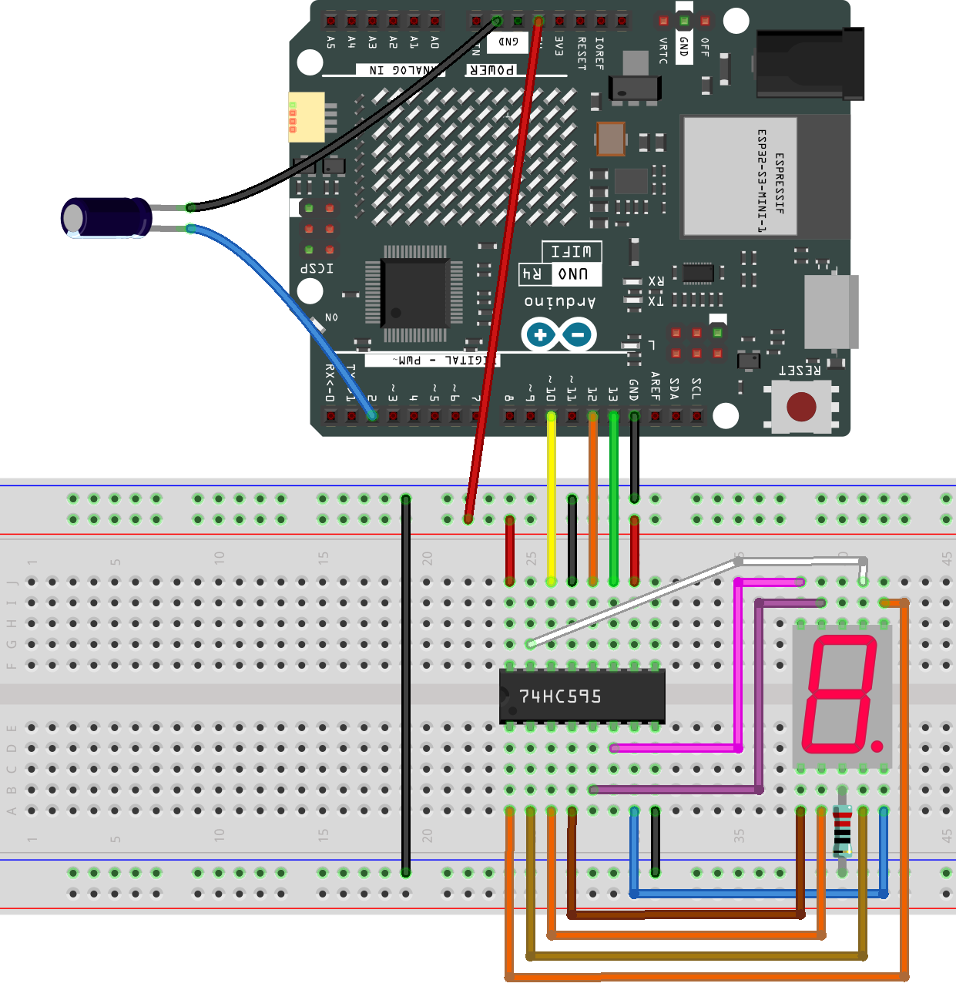
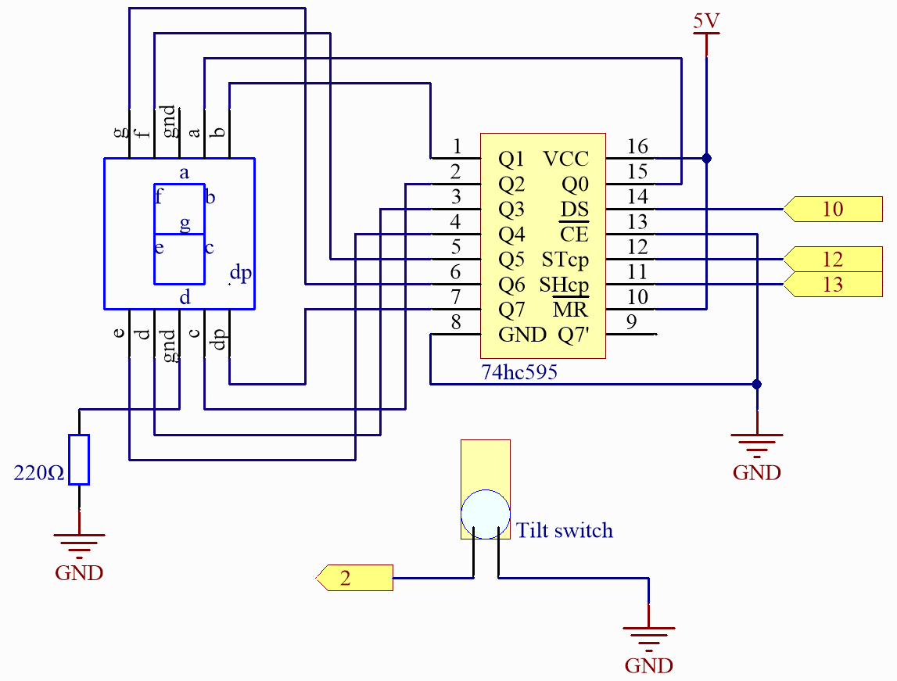

.. _fun_digital_dice:

数字骰子
=======================================

.. raw:: html

   <video loop autoplay muted style = "max-width:100%">
      <source src="../_static/videos/fun_projects/05_fun_dice.mp4"  type="video/mp4">
      Your browser does not support the video tag.
   </video>

此代码设计用于使用 74HC595 移位寄存器和 7 段数码管模拟掷骰子。通过直接摇晃倾斜开关来激活掷骰子模拟。触发后，数码管在 1 到 6 之间的随机数字之间循环，模拟骰子滚动。短暂间隔后，显示停止，显示一个随机数字，表示骰子掷出的结果。

**所需元件**

在这个项目中，我们需要以下元件。

购买整套套件会更方便，以下是链接：

.. list-table::
    :widths: 20 20 20
    :header-rows: 1

    *   - 名称
        - 套件所含项目
        - 链接
    *   - Elite Explorer 套件
        - 300+
        - |link_Elite_Explorer_kit|

您也可以从下面的链接单独购买。

.. list-table::
    :widths: 30 20
    :header-rows: 1

    *   - 元件介绍
        - 购买链接

    *   - :ref:`uno_r4_wifi`
        - \-
    *   - :ref:`cpn_breadboard`
        - |link_breadboard_buy|
    *   - :ref:`cpn_wires`
        - |link_wires_buy|
    *   - :ref:`cpn_resistor`
        - |link_resistor_buy|
    *   - :ref:`cpn_tilt_switch`
        - \-
    *   - :ref:`cpn_74hc595`
        - |link_74hc595_buy|
    *   - :ref:`cpn_7segment`
        - |link_7segment_buy|

**接线**

.. raw:: html

    

**原理图**

**代码**

.. note::

    * 您可以直接打开路径 ``elite-explorer-kit-main\fun_project\05_digital_dice`` 下的 ``05_digital_dice.ino`` 文件。
    * 或者将这段代码复制到 Arduino IDE 中。

.. raw:: html

   <iframe src=https://create.arduino.cc/editor/sunfounder01/ff0528b0-a10d-49e8-8916-6cb1fdfdf9a2/preview?embed style="height:510px;width:100%;margin:10px 0" frameborder=0></iframe>

**工作原理**

以下是代码的详细说明：

1. 变量初始化：

   ``dataPin``、``clockPin``、``latchPin``：74HC595 的引脚。
   ``buttonPin``：连接按钮的数字引脚。
   ``numbers[]``：一个数组，用于存储在共阳极数码管上表示数字 1 到 6 的编码。

2. 易失性变量：

   rolling：这是一个易失性变量，指示骰子当前是否正在滚动。
   它被声明为 volatile，因为它在中断服务程序和主程序中都会被访问。

3. ``setup()``：

   设置相关引脚的模式。
   使用内部上拉电阻设置按钮的输入模式。
   为按钮分配一个中断，当按钮状态改变时调用 rollDice 函数。

4. ``loop()``：

   检查 rolling 是否为真。如果是，则继续显示 1 到 6 之间的随机数字。如果按钮被按下超过 500 毫秒，则停止滚动。

5. ``rollDice()``：

   这是按钮的中断服务程序。它检查按钮是否被按下（低电平）。如果是，则记录当前时间并开始滚动。

6. ``displayNumber()``：

   此函数在数码管上显示一个数字。它通过 74HC595 移位寄存器将数字发送到数码管。
