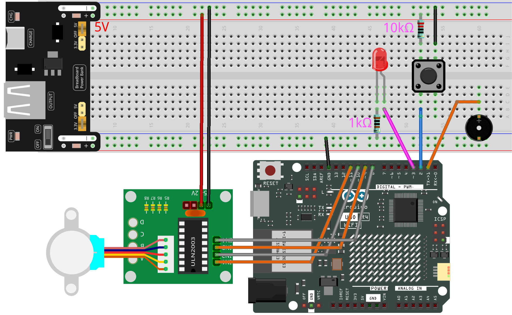

.. _fun_tomato_timer:

Pomodoro Technique
=====================

The Pomodoro Technique is a time management method invented by Francesco Cirillo in the late 1980s, named after the kitchen tomato timer he used for timing.

Principles and Steps:

1. Choose a Task: Select the task or a series of tasks you want to accomplish.
2. Set the Pomodoro Timer: Typically set to 25 minutes.
3. Work: Focus entirely on the selected task for these 25 minutes, avoiding any distractions.
4. Short Break: After 25 minutes, take a 5-minute break.
5. Repeat: After completing four such 25-minute work sessions and 5-minute breaks, you can take a longer break, typically 15-30 minutes.
6. The goal of this technique is to improve productivity, reduce distractions, and provide regular breaks to keep you focused and refreshed. Each 25-minute work session is called a "Pomodoro."

The advantage of this method is that it provides a clear time frame for tasks, making it easier for people to concentrate on work and avoid fatigue.

In this project, we will simulate a Pomodoro timer. When the "Pomodoro" starts, a stepper motor (you can attach a sticker on it as a "pointer") rotates to a specified position, indicating 25 minutes of work time. When these 25 minutes are up, the stepper motor rotates to a new position, representing a 5-minute break.

**Required Components**

* :ref:`uno_r4_wifi`
* :ref:`cpn_wires`
* :ref:`cpn_breadboard`
* :ref:`cpn_stepper_motor`
* :ref:`cpn_buzzer`
* :ref:`cpn_led`
* :ref:`cpn_resistor`
* :ref:`cpn_button`
* :ref:`cpn_power`

**Wiring**

.. raw:: html

    

**Schematic**

.. image:: img/05_tomato_timer_schematic.png
   :width: 100%

**Code**

.. note::

    * You can open the file ``05_pomodoro_technique.ino`` under the path of ``Elite-Explorer-Kit-main\fun_project\05_pomodoro_technique`` directly.
    * Or copy this code into Arduino IDE.

.. raw:: html

   <iframe src=https://create.arduino.cc/editor/sunfounder01/e17fa57f-fea0-4f4f-b04f-169caeeba6b1/preview?embed style="height:510px;width:100%;margin:10px 0" frameborder=0></iframe>

**How it works?**

This Arduino program uses a button to start a timer for work and rest intervals. In the work state, an LED is lit, and in the rest state, the LED is turned off. When switching from one state to another, a buzzer emits a sound.

Here's a detailed explanation of the code:

1. **Header, Constants, and Objects**:

   - Include the Stepper library: ``#include <Stepper.h>``.
   - Define the number of steps needed per revolution of the stepper motor: ``stepsPerRevolution``.
   - Create a Stepper object connected to Arduino pins 8, 9, 10, and 11: ``Stepper myStepper(stepsPerRevolution, 8, 9, 10, 11)``.

2. **Global Variables**:

   - ``workPosition`` and ``restPosition``: Positions for work and rest.
   - ``previousMillis``: Stores the time of the last motor movement or state change.
   - ``workInterval`` and ``restInterval``: Durations of work and rest.
   - ``enum TimerState { STOPPED, WORK, REST } state``: Represents the current state (stopped, working, or resting).

3. **Device Setup**:

   - Define pins for the buzzer, button, and LED as ``buzzerPin``, ``buttonPin``, and ``ledPin``, respectively.
   - Initialize ``timerStarted`` to track whether the timer has started.

4. ``setup()``:

   - Set the stepper motor speed to 60.
   - Initialize the state as ``STOPPED``.
   - Set the buzzer pin as output, button pin as input with internal pull-up, and LED pin as output.

5. ``loop()``:

   - Get the current time.
   - Use an ``if`` statement to check if the button is pressed and the timer is not started. If true, set the state to ``WORK`` and start the timer.
   - Use a ``switch`` statement to perform actions based on the current state:
   
     - **WORK**: In the work state, the LED is lit. If the elapsed time reaches the work duration, the motor moves to the rest position, the state becomes ``REST``, and the buzzer sounds.
     - **REST**: In the rest state, the LED is turned off. If the elapsed time reaches the rest duration, the motor moves back to the work position, the state becomes ``WORK``, and the buzzer sounds.
     - **STOPPED**: In the stopped state, the LED remains off.
