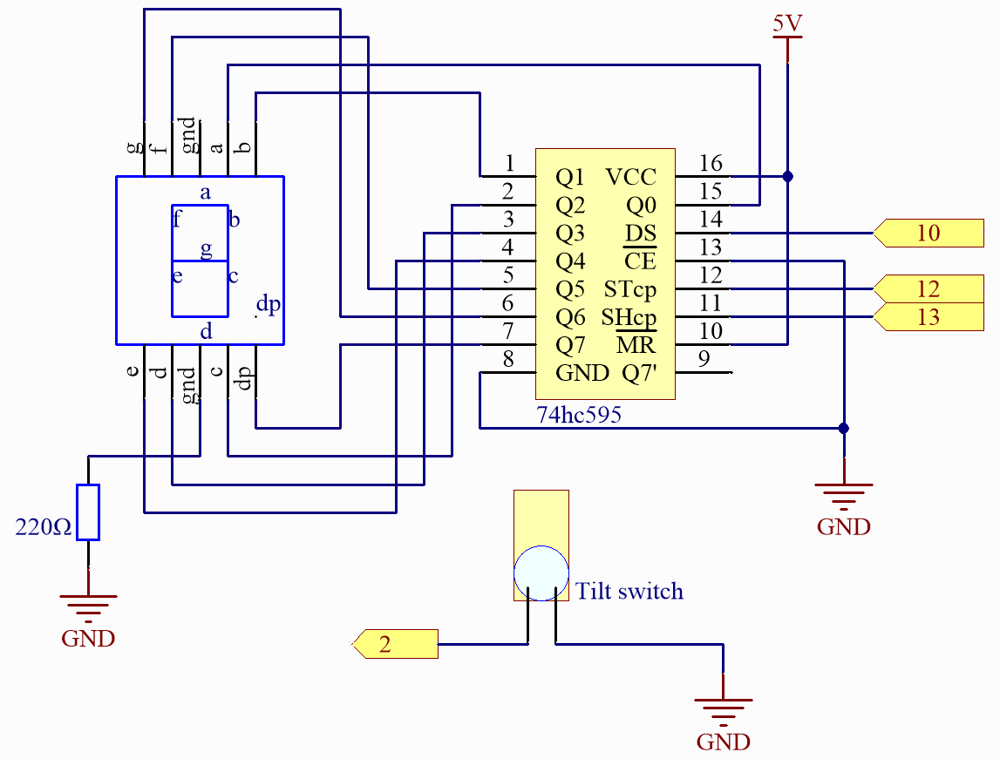

.. _fun_digital_dice:

Digital Dice
=======================================

This code is designed to simulate a rolling dice using a 74HC595 shift register and a digital tube. 
When a button is pressed, the digital tube will display a random number between 1 and 6, mimicking the effect of rolling a dice. After a certain duration, it stops and shows a random number.

**Required Components**

* :ref:`uno_r4_wifi`
* :ref:`cpn_wires`
* :ref:`cpn_breadboard`
* :ref:`cpn_74hc595`
* :ref:`cpn_7segment`
* :ref:`cpn_button`
* :ref:`cpn_resistor`

**Wiring**

.. image:: img/06_dice_bb.png
    :width: 80%
    :align: center

.. raw:: html

    

**Schematic**

**Code**

.. note::

    * You can open the file ``06_digital_dice.ino`` under the path of ``Elite-Explorer-Kit-main\fun_project\06_digital_dice`` directly.
    * Or copy this code into Arduino IDE.

.. raw:: html

   <iframe src=https://create.arduino.cc/editor/sunfounder01/ff0528b0-a10d-49e8-8916-6cb1fdfdf9a2/preview?embed style="height:510px;width:100%;margin:10px 0" frameborder=0></iframe>

**How it works?**

Here's a detailed explanation of the code:

1. Initialization of variables:

   ``dataPin``, ``clockPin``, ``latchPin``: Pins for the 74HC595.
   ``buttonPin``: The digital pin where the button is connected.
   ``numbers[]``: An array to store the encoding representing numbers 1 through 6 on a common anode digital tube.

2. Volatile variables:

   rolling: This is a volatile variable indicating whether the dice is currently rolling. 
   It's declared as volatile since it's accessed both in the interrupt service routine and the main program.

3. ``setup()``:

   Set the modes for the relevant pins.
   Set the input mode for the button using the internal pull-up resistor.
   Assign an interrupt to the button, which calls the rollDice function when the button's state changes.

4. ``loop()``:

   It checks if rolling is true. If it is, it continues to display a random number between 1 and 6. If the button has been pressed for more than 500 milliseconds, the rolling stops.

5. ``rollDice()``:

   This is the interrupt service routine for the button. It checks if the button is pressed (low level). If it is, the current time is recorded and the rolling begins.

6. ``displayNumber()``:

   This function displays a number on the digital tube. It sends the number to the digital tube through the 74HC595 shift register.
