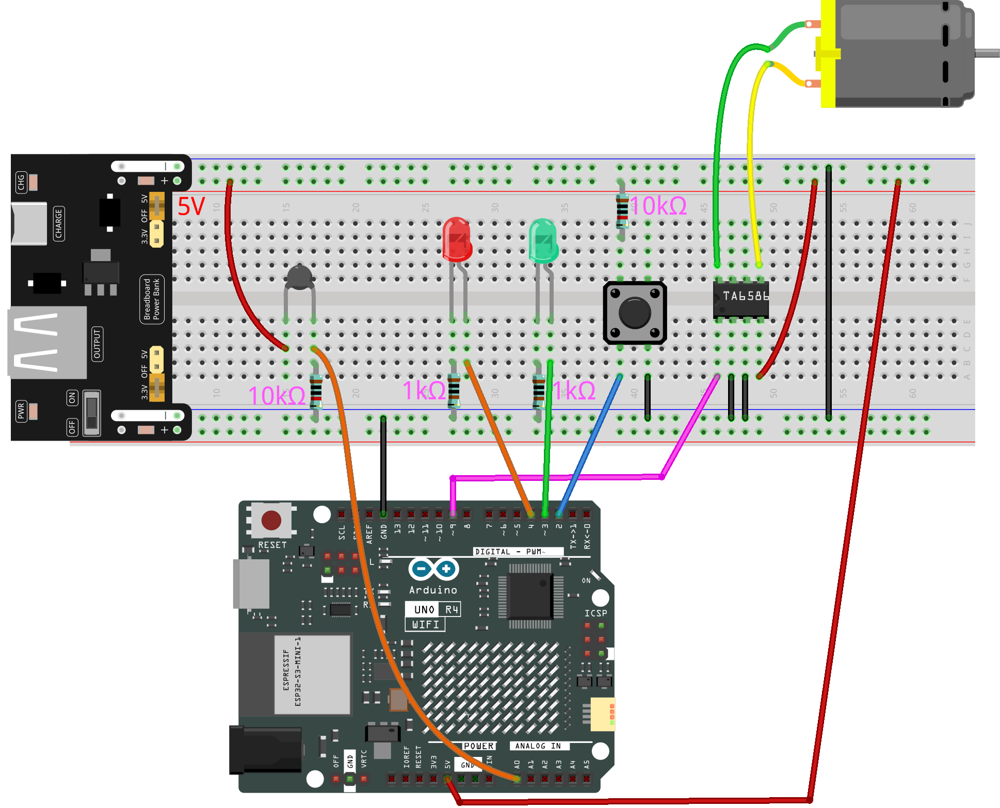
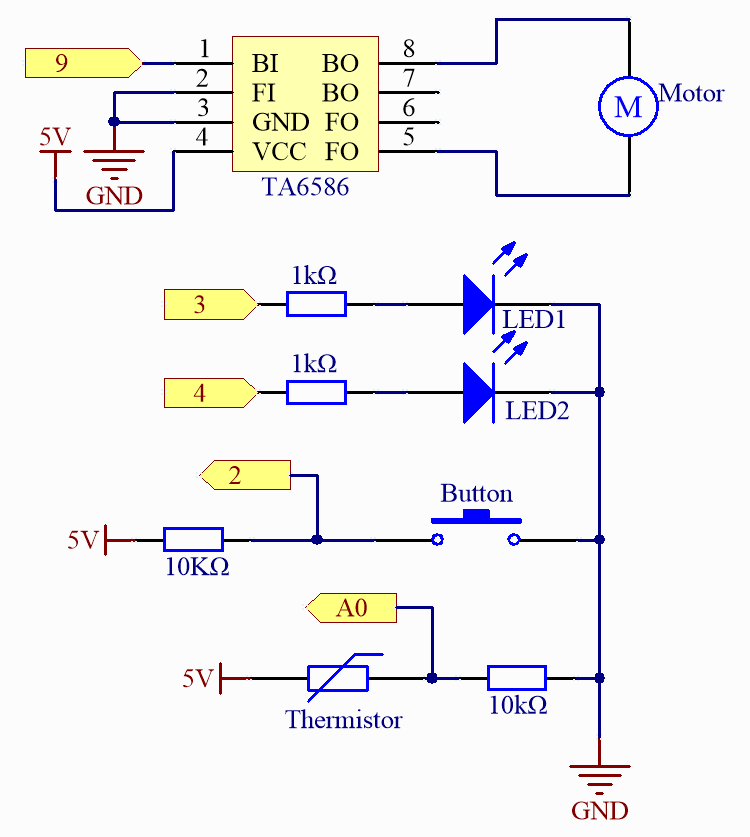

.. _fun_smart_fan:

Smarter Ventilator
=================================

.. raw:: html

   <video loop autoplay muted style = "max-width:100%">
      <source src="../_static/videos/fun_projects/06_fun_smartfan.mp4"  type="video/mp4">
      Ihr Browser unterstützt das Video-Tag nicht.
   </video>

Dieses Arduino-Projekt passt die Geschwindigkeit des Ventilators automatisch an, um die Temperatur in einem geeigneten Bereich zu halten.
Zusätzlich können Benutzer über einen Knopf in den manuellen Modus wechseln und den Ventilator mit maximaler Geschwindigkeit betreiben.

**Benötigte Komponenten**

Für dieses Projekt benötigen wir die folgenden Komponenten.

Es ist definitiv praktisch, ein ganzes Kit zu kaufen, hier ist der Link:

.. list-table::
    :widths: 20 20 20
    :header-rows: 1

    *   - Name	
        - ARTIKEL IN DIESEM KIT
        - LINK
    *   - Elite Explorer Kit
        - 300+
        - |link_Elite_Explorer_kit|

Sie können sie auch einzeln über die untenstehenden Links kaufen.

.. list-table::
    :widths: 30 20
    :header-rows: 1

    *   - KOMPONENTENBESCHREIBUNG
        - KAUF-LINK

    *   - :ref:`uno_r4_wifi`
        - \-
    *   - :ref:`cpn_breadboard`
        - |link_breadboard_buy|
    *   - :ref:`cpn_wires`
        - |link_wires_buy|
    *   - :ref:`cpn_resistor`
        - |link_resistor_buy|
    *   - :ref:`cpn_led`
        - |link_led_buy|
    *   - :ref:`cpn_button`
        - |link_button_buy|
    *   - :ref:`cpn_thermistor`
        - |link_thermistor_buy|
    *   - :ref:`cpn_motor`
        - |link_motor_buy|
    *   - :ref:`cpn_ta6586`
        - \-
    *   - :ref:`cpn_power`
        - \-

**Verdrahtung**

.. raw:: html

    

**Schaltplan**

**Code**

.. note::

    * Sie können die Datei ``06_smart_fan.ino`` direkt unter dem Pfad ``elite-explorer-kit-main\fun_project\06_smart_fan`` öffnen.
    * Oder kopieren Sie diesen Code in die Arduino IDE.

.. raw:: html

   <iframe src=https://create.arduino.cc/editor/sunfounder01/ba484912-14d6-4125-83a0-73a107904144/preview?embed style="height:510px;width:100%;margin:10px 0" frameborder=0></iframe>

**Wie funktioniert des?**

Hier ist eine schrittweise Erklärung des Codes:

1. Konstanten- und Variablendefinitionen:

   Verwenden Sie ``#define``, um die Pins für verschiedene Hardwareverbindungen zu definieren.
   ``TEMP_THRESHOLD`` ist als 25°C definiert, was die Temperaturschwelle für den Start des Ventilators ist.
   ``manualMode``: Eine boolesche Variable, die angibt, ob sich das Gerät im manuellen Modus befindet.

2. ``setup()``:

   Stellen Sie den Modus für relevante Pins ein (Ausgang, Eingang, Eingang mit Pull-up).
   Anfangs auf automatischen Modus eingestellt, sodass ``LED_AUTO`` leuchtet, während ``LED_MANUAL`` ausgeschaltet ist.

3. ``loop()``:

   Überwachen Sie den Zustand des Knopfs. Wenn der Knopf gedrückt wird, wechselt er den Modus und ändert den Status der LED.
   Im manuellen Modus arbeitet der Ventilator mit maximaler Geschwindigkeit.
   Im automatischen Modus liest der Code zuerst den Spannungswert vom Temperatursensor und wandelt ihn in einen Temperaturwert um. 
   Wenn die Temperatur die Schwelle überschreitet, wird die Geschwindigkeit des Ventilators anhand der Temperatur eingestellt.

4. ``voltageToTemperature()``:

   Dies ist eine Hilfsfunktion, die verwendet wird, um den Spannungswert vom Temperatursensor in einen Temperaturwert (in Celsius) umzuwandeln.
   Die Funktion verwendet die Standardformel für einen Thermistor, um die Temperatur zu schätzen.
   Der Rückgabewert ist in Grad Celsius.

