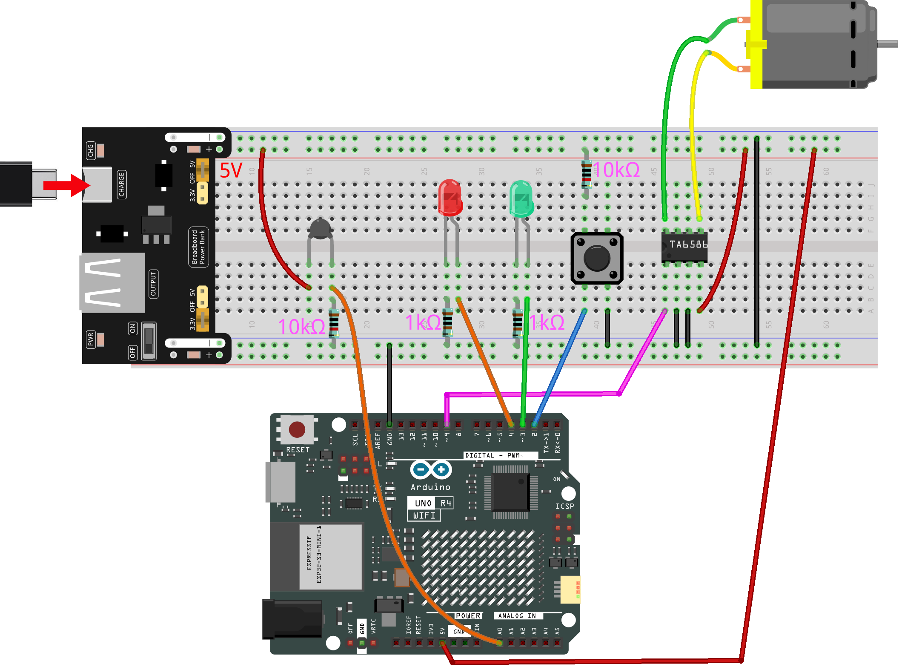
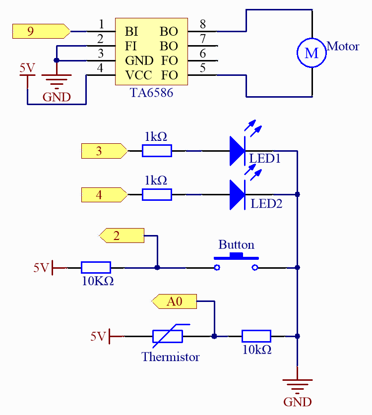

.. note::

    Bonjour, bienvenue dans la communauté des passionnés de SunFounder Raspberry Pi, Arduino et ESP32 sur Facebook ! Plongez dans l'univers du Raspberry Pi, Arduino et ESP32 avec d'autres passionnés.

    **Pourquoi nous rejoindre ?**

    - **Support d'experts** : Résolvez les problèmes après-vente et les défis techniques avec l'aide de notre communauté et de notre équipe.
    - **Apprendre et partager** : Échangez des astuces et des tutoriels pour améliorer vos compétences.
    - **Aperçus exclusifs** : Accédez en avant-première aux annonces de nouveaux produits et aux avant-premières.
    - **Réductions exclusives** : Profitez de réductions exclusives sur nos produits les plus récents.
    - **Promotions festives et cadeaux** : Participez à des concours et des promotions festives.

    👉 Prêt à explorer et créer avec nous ? Cliquez sur [|link_sf_facebook|] et rejoignez-nous dès aujourd'hui !

.. _fun_smart_fan:

Ventilateur Intelligent
=================================

.. raw:: html

   <video loop autoplay muted style = "max-width:100%">
      <source src="../_static/videos/fun_projects/06_fun_smartfan.mp4"  type="video/mp4">
      Votre navigateur ne supporte pas la balise vidéo.
   </video>

Ce projet Arduino ajuste automatiquement la vitesse du ventilateur pour maintenir la température dans une plage appropriée. De plus, les utilisateurs peuvent entrer en mode manuel via un bouton pour faire fonctionner le ventilateur à vitesse maximale.

**Composants nécessaires**

Dans ce projet, nous avons besoin des composants suivants.

Il est certainement pratique d'acheter un kit complet, voici le lien :

.. list-table::
    :widths: 20 20 20
    :header-rows: 1

    *   - Nom	
        - ARTICLES DANS CE KIT
        - LIEN
    *   - Elite Explorer Kit
        - 300+
        - |link_Elite_Explorer_kit|

Vous pouvez également les acheter séparément à partir des liens ci-dessous.

.. list-table::
    :widths: 30 20
    :header-rows: 1

    *   - INTRODUCTION DES COMPOSANTS
        - LIEN D'ACHAT

    *   - :ref:`uno_r4_wifi`
        - \-
    *   - :ref:`cpn_breadboard`
        - |link_breadboard_buy|
    *   - :ref:`cpn_wires`
        - |link_wires_buy|
    *   - :ref:`cpn_resistor`
        - |link_resistor_buy|
    *   - :ref:`cpn_led`
        - |link_led_buy|
    *   - :ref:`cpn_button`
        - |link_button_buy|
    *   - :ref:`cpn_thermistor`
        - |link_thermistor_buy|
    *   - :ref:`cpn_motor`
        - |link_motor_buy|
    *   - :ref:`cpn_ta6586`
        - \-
    *   - :ref:`cpn_power`
        - \-

**Câblage**

.. note::
    Pour protéger le Power Pack de la :ref:`cpn_power`, veuillez le charger complètement avant de l'utiliser pour la première fois.

.. raw:: html

    

**Schéma**

**Code**

.. note::

    * Vous pouvez ouvrir le fichier ``06_smart_fan.ino`` sous le chemin ``elite-explorer-kit-main\fun_project\06_smart_fan`` directement.
    * Ou copiez ce code dans l'IDE Arduino.

.. raw:: html

   <iframe src=https://create.arduino.cc/editor/sunfounder01/ba484912-14d6-4125-83a0-73a107904144/preview?embed style="height:510px;width:100%;margin:10px 0" frameborder=0></iframe>

**Comment ça marche ?**

Voici une explication étape par étape du code :

1. Définition des constantes et des variables :

   Utilisez ``#define`` pour définir les broches pour les diverses connexions matérielles.
   ``TEMP_THRESHOLD`` est défini à 25°C, ce qui est le seuil de température pour démarrer le ventilateur.
   ``manualMode`` : Une variable booléenne qui indique si le mode manuel est activé.

2. ``setup()`` :

   Définissez le mode des broches pertinentes (sortie, entrée, entrée avec pull-up).
   Initialement réglé en mode automatique, donc ``LED_AUTO`` est allumé tandis que ``LED_MANUAL`` est éteint.

3. ``loop()`` :

   Surveillez l'état du bouton. Lorsque le bouton est pressé, il bascule le mode et change le statut de la LED.
   En mode manuel, le ventilateur fonctionne à vitesse maximale.
   En mode automatique, le code lit d'abord la valeur de tension du capteur de température et la convertit en une valeur de température.
   Si la température dépasse le seuil, la vitesse du ventilateur est ajustée en fonction de la température.

4. ``voltageToTemperature()`` :

   Il s'agit d'une fonction auxiliaire utilisée pour convertir la valeur de tension du capteur de température en une valeur de température (en Celsius).
   La fonction utilise la formule standard pour une thermistance afin d'estimer la température.
   La valeur de retour est en degrés Celsius.

