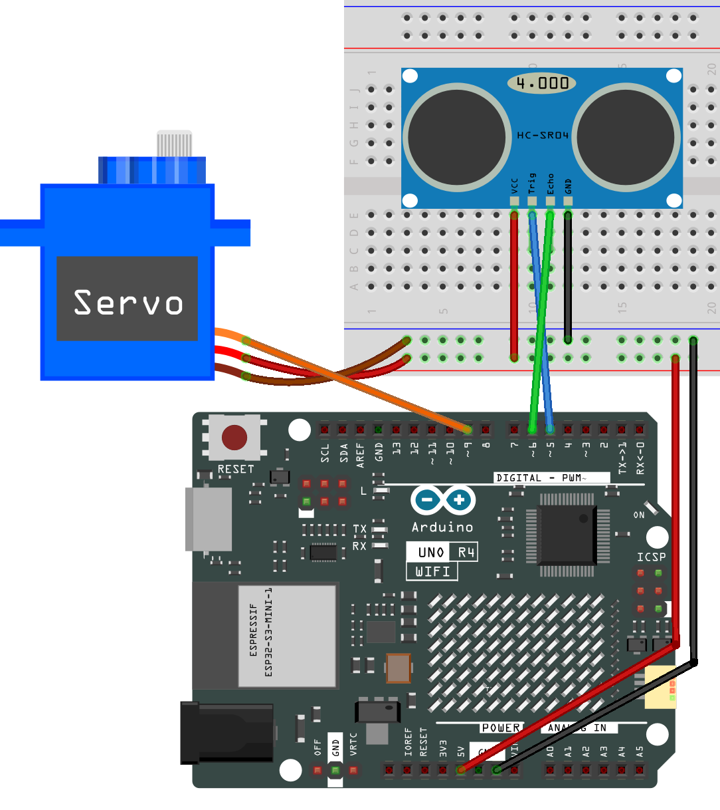
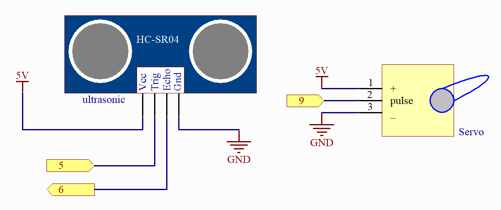

.. note::

    ¡Hola! Bienvenido a la comunidad de entusiastas de SunFounder Raspberry Pi & Arduino & ESP32 en Facebook. Sumérgete en el mundo de Raspberry Pi, Arduino y ESP32 junto a otros entusiastas.

    **¿Por qué unirse?**

    - **Soporte de expertos**: Resuelve problemas postventa y desafíos técnicos con ayuda de nuestra comunidad y equipo.
    - **Aprender y compartir**: Intercambia consejos y tutoriales para mejorar tus habilidades.
    - **Avances exclusivos**: Accede anticipadamente a anuncios de nuevos productos y adelantos exclusivos.
    - **Descuentos especiales**: Disfruta de descuentos exclusivos en nuestros productos más recientes.
    - **Promociones festivas y sorteos**: Participa en sorteos y promociones de temporada.

    👉 ¿Listo para explorar y crear con nosotros? Haz clic en [|link_sf_facebook|] y únete hoy mismo!

.. _fun_smart_can:

Basurero Inteligente
=========================

.. raw:: html

   <video loop autoplay muted style = "max-width:100%">
      <source src="../_static/videos/fun_projects/07_fun_smartcan.mp4"  type="video/mp4">
      Your browser does not support the video tag.
   </video>

Este es un código Arduino diseñado para controlar un basurero inteligente. 
Cuando un objeto se encuentra dentro de un rango de 20 centímetros frente al basurero, su tapa se abre automáticamente. 
Este proyecto utiliza un motor servo SG90 y un sensor de distancia ultrasónico HC-SR04.

**Componentes necesarios**

En este proyecto, necesitamos los siguientes componentes.

Es definitivamente conveniente comprar un kit completo, aquí está el enlace:

.. list-table::
    :widths: 20 20 20
    :header-rows: 1

    *   - Nombre
        - ELEMENTOS EN ESTE KIT
        - ENLACE
    *   - Elite Explorer Kit
        - 300+
        - |link_Elite_Explorer_kit|

También puedes comprarlos por separado desde los enlaces a continuación.

.. list-table::
    :widths: 30 20
    :header-rows: 1

    *   - INTRODUCCIÓN DEL COMPONENTE
        - ENLACE DE COMPRA

    *   - :ref:`uno_r4_wifi`
        - \-
    *   - :ref:`cpn_breadboard`
        - |link_breadboard_buy|
    *   - :ref:`cpn_wires`
        - |link_wires_buy|
    *   - :ref:`cpn_ultrasonic`
        - |link_ultrasonic_buy|
    *   - :ref:`cpn_servo`
        - |link_servo_buy|

**Cableado**

**Esquema**

**Código**

.. note::

    * Puedes abrir el archivo ``07_smart_trash_can.ino`` bajo la ruta ``elite-explorer-kit-main\fun_project\07_smart_trash_can`` directamente.
    * O copiar este código en Arduino IDE.

.. literalinclude:: /_code/07_fun_smart_can.ino
   :language: cpp
   :linenos:
   :caption: 07_smart_trash_can.ino

**¿Cómo funciona?**

Aquí hay una explicación paso a paso del código:

1. Importar bibliotecas y definir constantes/variables:

   Se importa la biblioteca ``Servo.h`` para controlar el motor servo SG90.
   Se definen los parámetros para el motor servo, el sensor ultrasónico y otras constantes y variables necesarias.

2. ``setup()``:

   Inicializa la comunicación serial con la computadora a una velocidad de 9600 baudios.
   Configura los pines de disparo y eco del sensor ultrasónico.
   Conecta el motor servo a su pin de control y establece su posición inicial en el ángulo cerrado. Después de establecer el ángulo, el motor servo se desactiva para ahorrar energía.

3. ``loop()``:

   Mide la distancia tres veces y almacena los valores de cada medición.
   Calcula la distancia promedio de las tres mediciones.
   Si la distancia promedio es menor o igual a 20 centímetros (umbral de distancia definido), el motor servo gira al ángulo de apertura (0 grados). 
   De lo contrario, el motor servo vuelve a la posición cerrada (90 grados) después de un retraso de un segundo. El motor servo se desactiva cuando no está en uso para conservar energía.

4. ``readDistance()``:

   Envía un pulso al pin de disparo del sensor ultrasónico.
   Mide el ancho del pulso del pin de eco y calcula el valor de la distancia.
   Este cálculo utiliza la velocidad del sonido en el aire para calcular la distancia basada en el tiempo del pulso.

