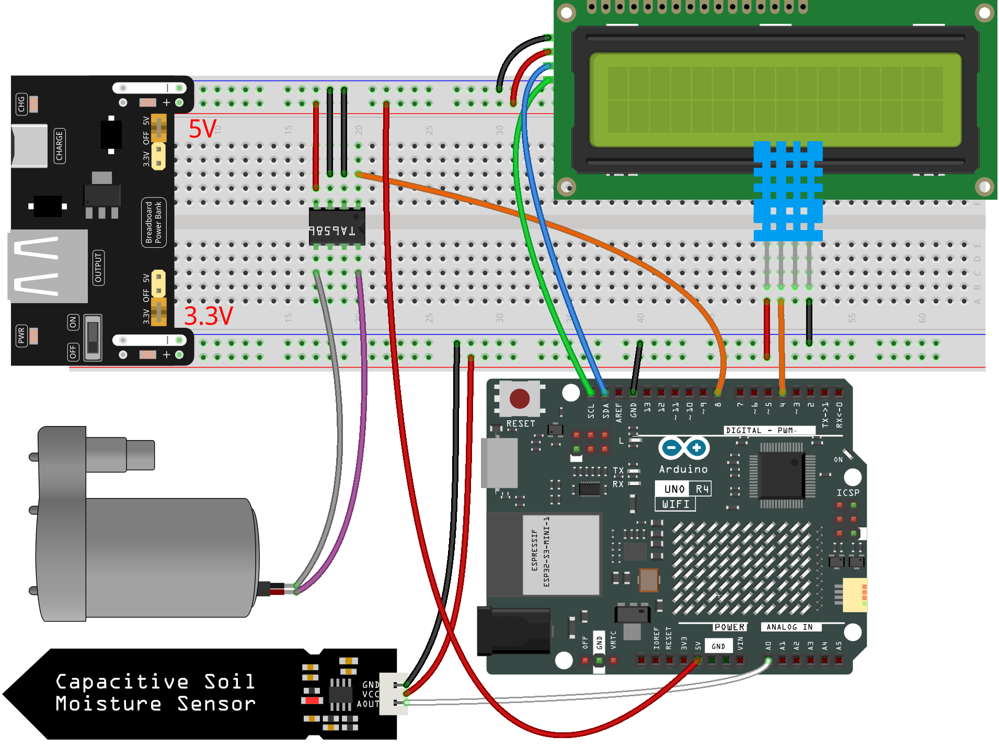
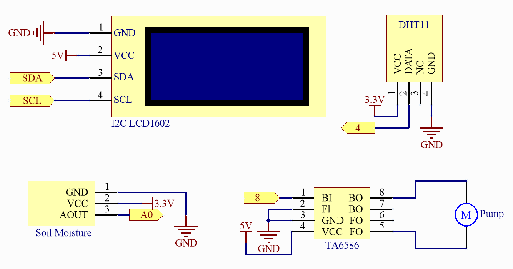

.. _fun_plant_monitor:

Pflanzenmonitor
============================

.. raw:: html

   <video loop autoplay muted style = "max-width:100%">
      <source src="../_static/videos/fun_projects/08_fun_plant_monitor.mp4"  type="video/mp4">
      Ihr Browser unterstützt das Video-Tag nicht.
   </video>

Dieses Projekt bewässert Pflanzen automatisch, indem es eine Wasserpumpe aktiviert, wenn die Bodenfeuchtigkeit unter einen bestimmten Schwellenwert fällt.
Zusätzlich werden Temperatur, Luftfeuchtigkeit und Bodenfeuchtigkeit auf einem LCD-Bildschirm angezeigt, um den Benutzern Einblicke in die Wachstumsumgebung der Pflanze zu geben.

**Benötigte Komponenten**

Für dieses Projekt benötigen wir die folgenden Komponenten.

Es ist definitiv praktisch, ein ganzes Kit zu kaufen, hier ist der Link:

.. list-table::
    :widths: 20 20 20
    :header-rows: 1

    *   - Name	
        - ARTIKEL IN DIESEM KIT
        - LINK
    *   - Elite Explorer Kit
        - 300+
        - |link_Elite_Explorer_kit|

Sie können sie auch einzeln über die untenstehenden Links kaufen.

.. list-table::
    :widths: 30 20
    :header-rows: 1

    *   - KOMPONENTENBESCHREIBUNG
        - KAUF-LINK

    *   - :ref:`uno_r4_wifi`
        - \-
    *   - :ref:`cpn_breadboard`
        - |link_breadboard_buy|
    *   - :ref:`cpn_wires`
        - |link_wires_buy|
    *   - :ref:`cpn_i2c_lcd1602`
        - |link_i2clcd1602_buy|
    *   - :ref:`cpn_pump`
        - \-
    *   - :ref:`cpn_ta6586`
        - \-
    *   - :ref:`cpn_soil_moisture`
        - |link_soil_moisture_buy|
    *   - :ref:`cpn_dht11`
        - |link_humiture_buy|
    *   - :ref:`cpn_power`
        - \-

**Verdrahtung**

.. raw:: html

    

**Schaltplan**

.. raw:: html

    

**Code**

.. note::

    * Sie können die Datei ``08_plant_monitor.ino`` direkt unter dem Pfad ``elite-explorer-kit-main\fun_project\08_plant_monitor`` öffnen.
    * Oder kopieren Sie diesen Code in die Arduino IDE.

.. note::
   Um die Bibliothek zu installieren, verwenden Sie den Arduino-Bibliotheksmanager und suchen Sie nach **„DHT sensor library“** und **„LiquidCrystal I2C“** und installieren Sie diese.

.. raw:: html

   <iframe src=https://create.arduino.cc/editor/sunfounder01/a9d6c9c7-0d7f-4dc2-84b6-9dbda15c89ae/preview?embed style="height:510px;width:100%;margin:10px 0" frameborder=0></iframe>

**Wie funktioniert des?**

Hier ist eine detaillierte Erklärung des Codes:

1. Bibliothekseinbindungen und Konstanten/Variablen:

   Importieren Sie die Bibliotheken ``Wire.h``, ``LiquidCrystal_I2C.h`` und ``DHT.h``.
   Definieren Sie Pinnummern und andere Parameter, die mit dem DHT11, dem Bodenfeuchtigkeitssensor und der Wasserpumpe zusammenhängen.

2. ``setup()``:

   Initialisieren Sie die Pinmodi, die mit dem Bodenfeuchtigkeitssensor und der Wasserpumpe zusammenhängen.
   Schalten Sie die Wasserpumpe anfangs aus.
   Initialisieren Sie das LCD-Display und schalten Sie die Hintergrundbeleuchtung ein.
   Starten Sie den DHT-Sensor.

3. ``loop()``:

   Lesen Sie die Luftfeuchtigkeit und Temperatur vom DHT-Sensor.
   Lesen Sie die Bodenfeuchtigkeit vom Bodenfeuchtigkeitssensor.
   Zeigen Sie die Temperatur- und Luftfeuchtigkeitswerte auf dem LCD-Bildschirm an, löschen Sie dann den Bildschirm und zeigen Sie den Bodenfeuchtigkeitswert an.
   Entscheiden Sie, ob die Wasserpumpe aufgrund der Bodenfeuchtigkeit aktiviert werden soll. Wenn die Bodenfeuchtigkeit unter 500 (einem konfigurierbaren Schwellenwert) liegt, aktivieren Sie die Wasserpumpe für 1 Sekunde.

