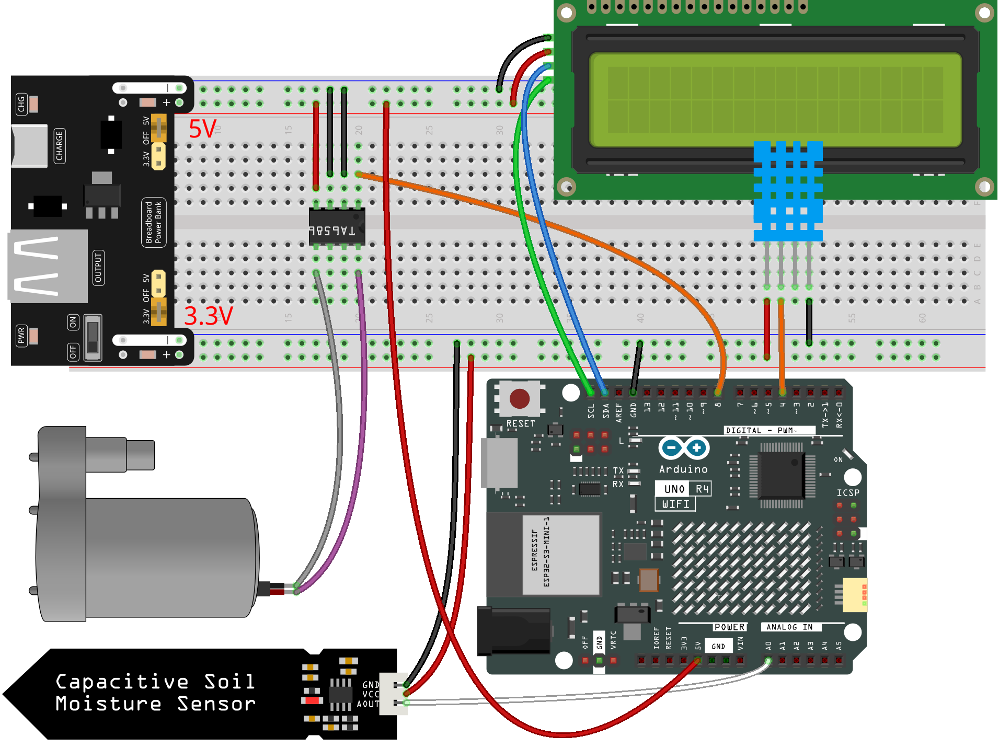
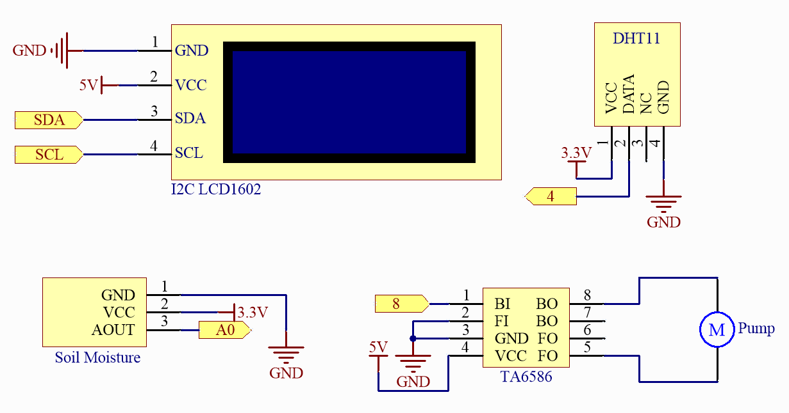

.. note::

    Bonjour, bienvenue dans la communauté des passionnés de SunFounder Raspberry Pi, Arduino et ESP32 sur Facebook ! Plongez dans l'univers du Raspberry Pi, Arduino et ESP32 avec d'autres passionnés.

    **Pourquoi nous rejoindre ?**

    - **Support d'experts** : Résolvez les problèmes après-vente et les défis techniques avec l'aide de notre communauté et de notre équipe.
    - **Apprendre et partager** : Échangez des astuces et des tutoriels pour améliorer vos compétences.
    - **Aperçus exclusifs** : Accédez en avant-première aux annonces de nouveaux produits et aux avant-premières.
    - **Réductions exclusives** : Profitez de réductions exclusives sur nos produits les plus récents.
    - **Promotions festives et cadeaux** : Participez à des concours et des promotions festives.

    👉 Prêt à explorer et créer avec nous ? Cliquez sur [|link_sf_facebook|] et rejoignez-nous dès aujourd'hui !

.. _fun_plant_monitor:

Moniteur de Plantes
============================

.. raw:: html

   <video loop autoplay muted style = "max-width:100%">
      <source src="../_static/videos/fun_projects/08_fun_plant_monitor.mp4"  type="video/mp4">
      Votre navigateur ne supporte pas la balise vidéo.
   </video>

Ce projet arrose automatiquement les plantes en activant une pompe à eau lorsque l'humidité du sol tombe en dessous d'un seuil spécifique.
De plus, il affiche la température, l'humidité et l'humidité du sol sur un écran LCD, fournissant aux utilisateurs des informations sur l'environnement de croissance des plantes.

**Composants nécessaires**

Dans ce projet, nous avons besoin des composants suivants.

Il est certainement pratique d'acheter un kit complet, voici le lien :

.. list-table::
    :widths: 20 20 20
    :header-rows: 1

    *   - Nom	
        - ARTICLES DANS CE KIT
        - LIEN
    *   - Elite Explorer Kit
        - 300+
        - |link_Elite_Explorer_kit|

Vous pouvez également les acheter séparément à partir des liens ci-dessous.

.. list-table::
    :widths: 30 20
    :header-rows: 1

    *   - INTRODUCTION DES COMPOSANTS
        - LIEN D'ACHAT

    *   - :ref:`uno_r4_wifi`
        - \-
    *   - :ref:`cpn_breadboard`
        - |link_breadboard_buy|
    *   - :ref:`cpn_wires`
        - |link_wires_buy|
    *   - :ref:`cpn_i2c_lcd1602`
        - |link_i2clcd1602_buy|
    *   - :ref:`cpn_pump`
        - \-
    *   - :ref:`cpn_ta6586`
        - \-
    *   - :ref:`cpn_soil_moisture`
        - |link_soil_moisture_buy|
    *   - :ref:`cpn_dht11`
        - |link_humiture_buy|
    *   - :ref:`cpn_power`
        - \-

**Câblage**

.. note::
    Pour protéger le Power Pack de la :ref:`cpn_power`, veuillez le charger complètement avant de l'utiliser pour la première fois.

.. raw:: html

    

**Schéma**

.. raw:: html

    

**Code**

.. note::

    * Vous pouvez ouvrir le fichier ``08_plant_monitor.ino`` sous le chemin ``elite-explorer-kit-main\fun_project\08_plant_monitor`` directement.
    * Ou copiez ce code dans l'IDE Arduino.

.. note::
   Pour installer la bibliothèque, utilisez le gestionnaire de bibliothèque Arduino et recherchez **"DHT sensor library"** et **"LiquidCrystal I2C"** et installez-les.

.. literalinclude:: /_code/08_fun_plant_monitor.ino
   :language: cpp
   :linenos:
   :caption: 08_plant_monitor.ino

**Comment ça marche ?**

Voici une explication détaillée du code :

1. Inclusion des bibliothèques et définition des constantes/variables :

   Importez les bibliothèques ``Wire.h``, ``LiquidCrystal_I2C.h`` et ``DHT.h``.
   Définissez les numéros de broche et d'autres paramètres liés au DHT11, au capteur d'humidité du sol et à la pompe à eau.

2. ``setup()`` :

   Initialisez les modes de broche relatifs au capteur d'humidité du sol et à la pompe à eau.
   Éteignez initialement la pompe à eau.
   Initialisez l'affichage LCD et allumez le rétroéclairage.
   Démarrez le capteur DHT.

3. ``loop()`` :

   Lisez l'humidité et la température à partir du capteur DHT.
   Lisez l'humidité du sol à partir du capteur d'humidité du sol.
   Affichez les valeurs de température et d'humidité sur l'écran LCD, puis effacez l'écran et affichez la valeur de l'humidité du sol.
   Déterminez s'il faut activer la pompe à eau en fonction de l'humidité du sol. Si l'humidité du sol est inférieure à 500 (un seuil configurable), activez la pompe à eau pendant 1 seconde.

