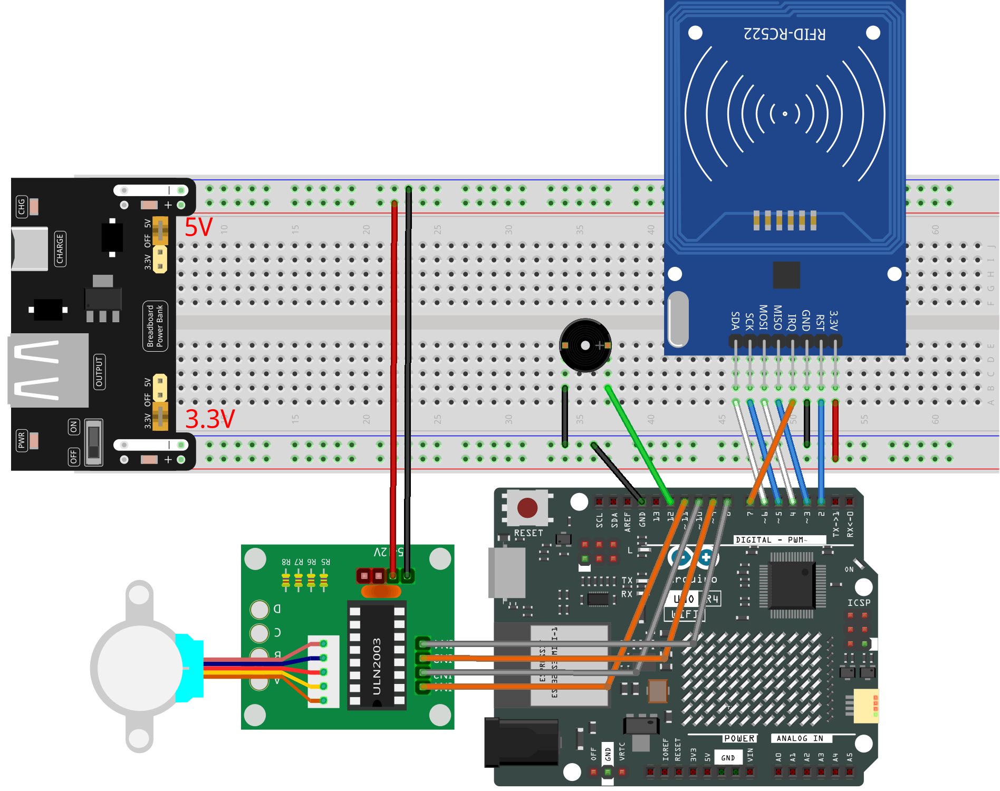
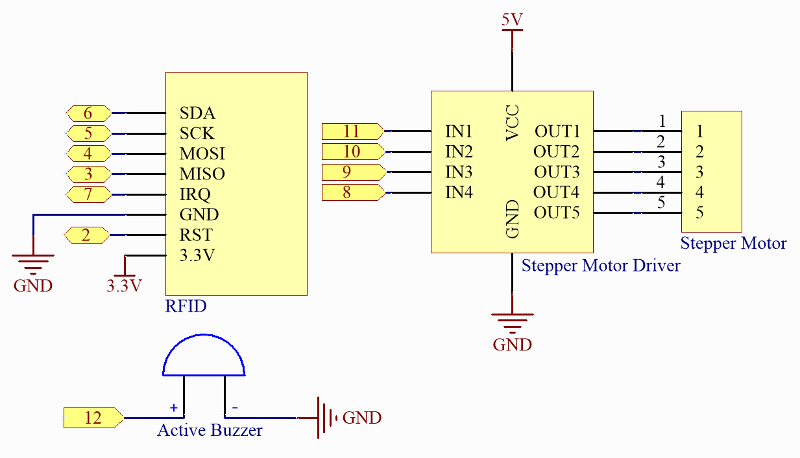

.. note::

    Bonjour, bienvenue dans la communauté des passionnés de SunFounder Raspberry Pi, Arduino et ESP32 sur Facebook ! Plongez dans l'univers du Raspberry Pi, Arduino et ESP32 avec d'autres passionnés.

    **Pourquoi nous rejoindre ?**

    - **Support d'experts** : Résolvez les problèmes après-vente et les défis techniques avec l'aide de notre communauté et de notre équipe.
    - **Apprendre et partager** : Échangez des astuces et des tutoriels pour améliorer vos compétences.
    - **Aperçus exclusifs** : Accédez en avant-première aux annonces de nouveaux produits et aux avant-premières.
    - **Réductions exclusives** : Profitez de réductions exclusives sur nos produits les plus récents.
    - **Promotions festives et cadeaux** : Participez à des concours et des promotions festives.

    👉 Prêt à explorer et créer avec nous ? Cliquez sur [|link_sf_facebook|] et rejoignez-nous dès aujourd'hui !

.. _fun_access:

Système de Contrôle d'Accès
======================================

.. raw:: html

   <video loop controls style = "max-width:100%">
      <source src="../_static/videos/fun_projects/09_fun_access.mp4"  type="video/mp4">
      Votre navigateur ne supporte pas la balise vidéo.
   </video>

La fonction principale de ce code est d'effectuer l'authentification des utilisateurs à l'aide d'un module RFID. 
Si l'authentification est réussie, il contrôle un moteur pas à pas pour ouvrir la porte et émet un son via un buzzer pour indiquer le résultat de l'authentification. 
Si l'authentification échoue, la porte ne s'ouvrira pas.

Vous pouvez ouvrir le moniteur série pour voir l'ID de votre carte RFID et reconfigurer le mot de passe dans ce code.

**Composants nécessaires**

Dans ce projet, nous avons besoin des composants suivants.

Il est certainement pratique d'acheter un kit complet, voici le lien :

.. list-table::
    :widths: 20 20 20
    :header-rows: 1

    *   - Nom	
        - ARTICLES DANS CE KIT
        - LIEN
    *   - Elite Explorer Kit
        - 300+
        - |link_Elite_Explorer_kit|

Vous pouvez également les acheter séparément à partir des liens ci-dessous.

.. list-table::
    :widths: 30 20
    :header-rows: 1

    *   - INTRODUCTION DES COMPOSANTS
        - LIEN D'ACHAT

    *   - :ref:`uno_r4_wifi`
        - \-
    *   - :ref:`cpn_breadboard`
        - |link_breadboard_buy|
    *   - :ref:`cpn_wires`
        - |link_wires_buy|
    *   - :ref:`cpn_mfrc522`
        - |link_mfrc522_rfid_buy|
    *   - :ref:`cpn_stepper_motor`
        - |link_stepper_motor_buy|
    *   - :ref:`cpn_buzzer`
        - \-
    *   - :ref:`cpn_power`
        - \-

**Câblage**

.. note::
    Pour protéger la batterie de la :ref:`cpn_power`, veuillez la charger complètement avant de l'utiliser pour la première fois.

.. raw:: html

    

**Schéma**

.. raw:: html

    

**Code**

.. note::

    * Vous pouvez ouvrir le fichier ``09_access_control_system.ino`` sous le chemin ``elite-explorer-kit-main\fun_project09_access_control_system`` directement.
    * Ou copiez ce code dans l'IDE Arduino.

.. note::

    * La bibliothèque ``RFID1`` est utilisée ici. La bibliothèque se trouve dans le répertoire ``elite-explorer-kit-main/library/``, ou vous pouvez cliquer ici :download:`RFID1.zip </_static/RFID1.zip>` pour la télécharger. Reportez-vous à :ref:`manual_install_lib` pour un tutoriel sur son installation.

.. raw:: html

   <iframe src=https://create.arduino.cc/editor/sunfounder01/3486dd4e-a76e-478f-b5a4-a86281f7f374/preview?embed style="height:510px;width:100%;margin:10px 0" frameborder=0></iframe>

**Comment ça marche ?**

Voici une explication étape par étape du code :

1. **Inclure les fichiers de bibliothèque** : Vous avez inclus trois fichiers de bibliothèque : ``rfid1.h``, ``Stepper.h`` et ``Wire.h``. Ces bibliothèques sont utilisées pour communiquer avec le module RFID, le moteur pas à pas et pour la communication I2C.

2. **Définitions des constantes** : Vous avez défini certaines constantes, notamment ``ID_LEN`` (longueur de l'ID), ``stepsPerRevolution`` (pas par révolution pour le moteur pas à pas), ``rolePerMinute`` (vitesse du moteur pas à pas), ainsi que les quatre broches du moteur pas à pas (IN1, IN2, IN3, IN4), la broche du buzzer (``buzPin``) et les variables liées à l'authentification.

3. **Définitions des variables** : Vous avez défini des variables telles qu'un tableau pour stocker l'ID utilisateur lu (``userIdRead``), l'ID utilisateur authentifié (``userId``) et une variable booléenne (``approved``) pour indiquer le succès de l'authentification.

4. **Instantiation des objets** : Vous avez créé des instances de deux objets : ``RFID1 rfid`` et ``Stepper stepper`` pour interagir avec le module RFID et le moteur pas à pas, respectivement.

5. ``setup()`` : Dans la fonction ``setup()``, vous initialisez la vitesse du moteur pas à pas, définissez la broche du buzzer comme une sortie et initialisez le module RFID.

6. ``loop()`` : Dans la fonction ``loop()``, votre logique principale s'exécute. Si ``approved`` est 0 (indiquant non authentifié), il appelle la fonction ``rfidRead()`` pour lire les données du module RFID, puis efface le tableau ``userIdRead``. Si ``approved`` est 1 (indiquant une authentification réussie), il appelle la fonction ``openDoor()`` pour ouvrir la porte et réinitialise ``approved`` à 0.

7. ``beep()`` : Cette fonction contrôle le son du buzzer en fonction des paramètres ``duration`` et ``frequency`` fournis.

8. ``verifyPrint()`` : Cette fonction produit différents sons de buzzer en fonction du paramètre ``result`` pour indiquer si l'authentification a réussi ou échoué.

9. ``openDoor()`` : Cette fonction contrôle le moteur pas à pas pour ouvrir la porte à un certain angle (``doorStep``) puis attend une période avant de refermer la porte.

10. ``rfidRead()`` : Cette fonction lit les données du module RFID, appelle d'abord ``getId()`` pour obtenir l'ID utilisateur, puis ``idVerify()`` pour vérifier si l'ID utilisateur correspond à l'ID authentifié.

11. ``getId()`` : Cette fonction récupère l'ID utilisateur du module RFID et le stocke dans le tableau ``userIdRead``. Elle émet un bip en cas d'échec de la lecture.

12. ``idVerify()`` : Cette fonction vérifie si l'ID utilisateur correspond à l'ID authentifié et produit un son indiquant une authentification réussie ou échouée.

