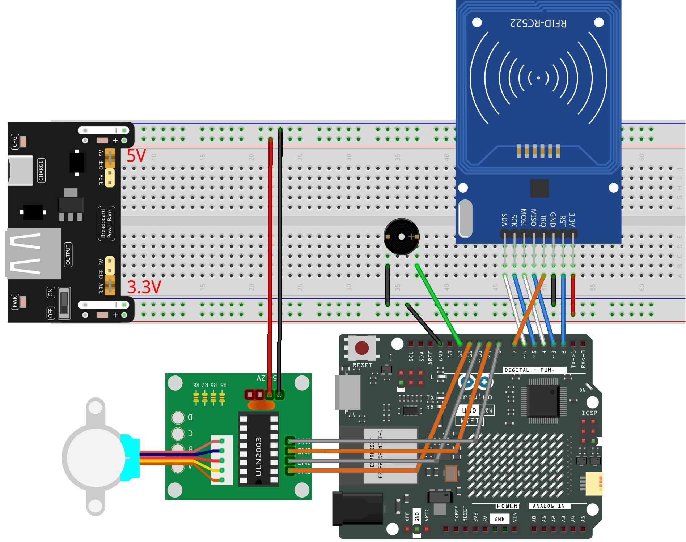
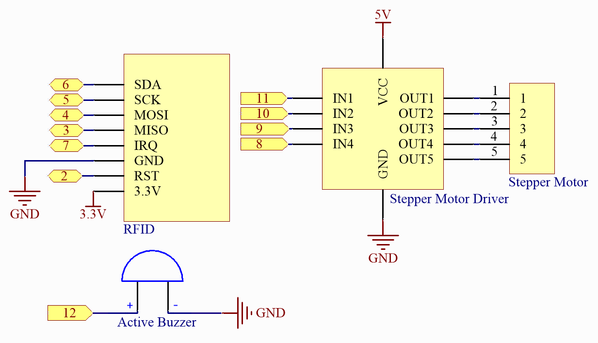

.. _fun_access:

门禁系统
======================================

.. raw:: html

   <video loop controls style = "max-width:100%">
      <source src="../_static/videos/fun_projects/09_fun_access.mp4"  type="video/mp4">
      Your browser does not support the video tag.
   </video>

此代码的主要功能是使用 RFID 模块进行用户身份验证。
如果认证成功，它将控制步进电机打开门，并通过蜂鸣器发出声音指示认证结果。
如果认证失败，门将不会打开。

您可以打开串口监视器查看 RFID 卡的 ID，并在此代码中重新配置密码。

**所需元件**

在这个项目中，我们需要以下元件。

购买整套套件会更方便，以下是链接：

.. list-table::
    :widths: 20 20 20
    :header-rows: 1

    *   - 名称
        - 套件所含项目
        - 链接
    *   - Elite Explorer 套件
        - 300+
        - |link_Elite_Explorer_kit|

您也可以从下面的链接单独购买。

.. list-table::
    :widths: 30 20
    :header-rows: 1

    *   - 元件介绍
        - 购买链接

    *   - :ref:`uno_r4_wifi`
        - \-
    *   - :ref:`cpn_breadboard`
        - |link_breadboard_buy|
    *   - :ref:`cpn_wires`
        - |link_wires_buy|
    *   - :ref:`cpn_mfrc522`
        - |link_mfrc522_rfid_buy|
    *   - :ref:`cpn_stepper_motor`
        - |link_stepper_motor_buy|
    *   - :ref:`cpn_buzzer`
        - \-
    *   - :ref:`cpn_power`
        - \-

**接线**

.. note::
    为了保护 :ref:`cpn_power` 的电池，首次使用前请将其充满电。

.. raw:: html

    

**原理图**

.. raw:: html

    

**代码**

.. note::

    * 您可以直接打开路径 ``elite-explorer-kit-main\fun_project09_access_control_system`` 下的 ``09_access_control_system.ino`` 文件。
    * 或者将这段代码复制到 Arduino IDE 中。

.. note::

    * 这里使用了 ``RFID1`` 库。该库可以在 ``elite-explorer-kit-main/library/`` 目录中找到，或者您可以点击此处 :download:`RFID1.zip </_static/RFID1.zip>` 下载。有关安装教程，请参阅 :ref:`manual_install_lib` 。

.. raw:: html

   <iframe src=https://create.arduino.cc/editor/sunfounder01/3486dd4e-a76e-478f-b5a4-a86281f7f374/preview?embed style="height:510px;width:100%;margin:10px 0" frameborder=0></iframe>

**工作原理**

以下是代码的逐步说明：

1. **包含库文件** ：您包含了三个库文件：``rfid1.h``、``Stepper.h`` 和 ``Wire.h``。这些库用于与 RFID 模块、步进电机进行通信以及进行 I2C 通信。

2. **常量定义** ：您定义了一些常量，包括 ``ID_LEN``（ID 长度）、``stepsPerRevolution``（步进电机每转步数）、``rolePerMinute``（步进电机速度），以及四个步进电机引脚（IN1、IN2、IN3、IN4）、蜂鸣器引脚（``buzPin``）和与认证相关的变量。

3. **变量定义** ：您定义了变量，例如用于存储读取的用户 ID 的数组（``userIdRead``）、经过身份验证的用户 ID（``userId``），以及指示认证成功的布尔变量（``approved``）。

4. **对象实例化** ：您创建了两个对象的实例：``RFID1 rfid`` 和 ``Stepper stepper``，用于分别与 RFID 模块和步进电机交互。

5. ``setup()``：在 ``setup()`` 函数中，您初始化步进电机的速度，将蜂鸣器引脚设置为输出，并初始化 RFID 模块。

6. ``loop()``：在 ``loop()`` 函数中，您的主要逻辑运行。如果 ``approved`` 为 0（表示尚未认证），则调用 ``rfidRead()`` 函数从 RFID 模块读取数据，然后清除 ``userIdRead`` 数组。如果 ``approved`` 为 1（表示认证成功），则调用 ``openDoor()`` 函数打开门，并将 ``approved`` 重置为 0。

7. ``beep()``：此函数根据提供的 ``duration`` 和 ``frequency`` 参数控制蜂鸣器声音。

8. ``verifyPrint()``：此函数根据 ``result`` 参数产生不同的蜂鸣器声音，以指示认证是否成功。

9. ``openDoor()``：此函数控制步进电机将门打开到一定角度（``doorStep``），然后等待一段时间再关闭门。

10. ``rfidRead()``：此函数从 RFID 模块读取数据，首先调用 ``getId()`` 获取用户 ID，然后调用 ``idVerify()`` 验证用户 ID 是否与认证 ID 匹配。

11. ``getId()``：此函数从 RFID 模块获取用户 ID 并将其存储在 ``userIdRead`` 数组中。如果读取失败，则发出蜂鸣声。

12. ``idVerify()``：此函数验证用户 ID 是否与认证 ID 匹配，并发出表示认证成功或失败的声音。
