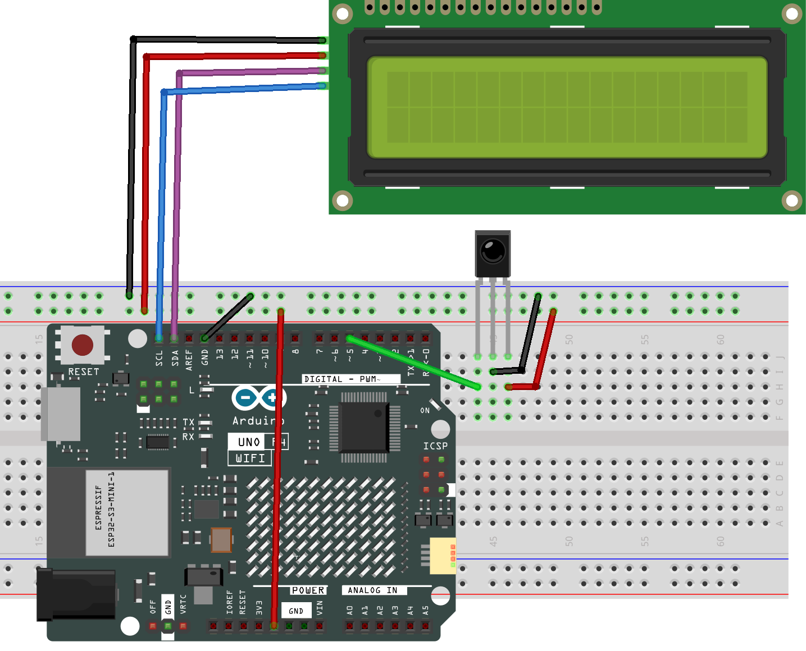

.. _fun_guess_number:

ゲーム - 数当てゲーム
============================

.. raw:: html

   <video loop autoplay muted style = "max-width:100%">
      <source src="../_static/videos/fun_projects/10_fun_guess_game.mp4"  type="video/mp4">
      お使いのブラウザーはビデオタグをサポートしていません。
   </video>

数当てゲームは、あなたとあなたの友人が交代で数字（0~99）を入力するエンターテイメント性の高いパーティーゲームです。
各数字の入力により範囲が狭まり、プレイヤーが正解を当てるまで続きます。
正解を当てたプレイヤーは敗者と宣言され、罰を受けます。
例えば、秘密の数字が51であり、プレイヤー1が50を入力した場合、
数字の範囲のプロンプトは50~99に変わります。プレイヤー2が70を入力した場合、数字の範囲は50~70になります。
プレイヤー3が51を入力した場合、彼らが不運な人です。
このゲームでは、数字を入力するためにIRリモートコントローラを使用し、結果を表示するためにLCDを使用します。

**必要なコンポーネント**

このプロジェクトでは、以下のコンポーネントが必要です。

一式を購入するのが便利です。こちらがリンクです：

.. list-table::
    :widths: 20 20 20
    :header-rows: 1

    *   - 名称	
        - このキットのアイテム数
        - リンク
    *   - Elite Explorer Kit
        - 300+
        - |link_Elite_Explorer_kit|

以下のリンクから個別に購入することもできます。

.. list-table::
    :widths: 30 20
    :header-rows: 1

    *   - コンポーネント紹介
        - 購入リンク

    *   - :ref:`uno_r4_wifi`
        - \-
    *   - :ref:`cpn_breadboard`
        - |link_breadboard_buy|
    *   - :ref:`cpn_wires`
        - |link_wires_buy|
    *   - :ref:`cpn_i2c_lcd1602`
        - |link_i2clcd1602_buy|
    *   - :ref:`cpn_ir_receiver`
        - |link_receiver_buy|

**配線図**

**回路図**

.. image:: img/10_guess_number_schematic.png
   :width: 100%
   :align: center

**コード**

.. note::

    * ファイル ``10_guess_number.ino`` は、パス ``elite-explorer-kit-main\fun_project\10_guess_number`` で直接開けます。
    * または、このコードをArduino IDEにコピーしてください。

.. note::
   ライブラリをインストールするには、Arduinoライブラリマネージャーで **「IRremote」** と **「LiquidCrystal I2C」** を検索し、インストールしてください。

.. raw:: html

   <iframe src=https://create.arduino.cc/editor/sunfounder01/935cd2e8-23e1-4af8-bdf5-94ac00f10e8b/preview?embed style="height:510px;width:100%;margin:10px 0" frameborder=0></iframe>

**どのように機能しますか？**

1. ライブラリのインポートとグローバル変数の定義：

   3つのライブラリがインポートされます：I2C通信用の ``Wire`` 、LCDディスプレイの制御用の ``LiquidCrystal_I2C`` 、赤外線リモートコントローラからの信号を受信する ``IRremote`` 。
   ゲームの状態と設定を保存するためのいくつかのグローバル変数が定義されています。

2. ``setup()`` 

   LCDディスプレイを初期化し、バックライトをオンにします。
   9600のボーレートでシリアル通信を開始します。
   赤外線レシーバーを起動します。
   初期ゲーム状態を設定するために ``initNewValue()`` 関数を呼び出します。

3. ``loop()`` 

   赤外線リモートコントローラからの信号が受信されたかどうかを確認します。
   受信した赤外線信号をデコードします。
   デコードされた値（数字またはコマンド）に基づいてゲームの状態を更新するか、対応するアクションを実行します。

4. ``initNewValue()`` 

   ``analogRead`` を使用してランダム数のシードを初期化し、毎回異なるランダム数が生成されることを保証します。
   0から98の間でランダムな数字を生成し、それを当てる必要がある幸運な数字とします。
   上限と下限のプロンプトをリセットします。
   LCDにウェルカムメッセージを表示します。
   入力された数字をリセットします。

5. ``detectPoint()`` 

   プレイヤーの入力した数字と幸運な数字の関係を確認します。
   入力した数字が幸運な数字より大きい場合、上限のプロンプトを更新します。
   入力した数字が幸運な数字より小さい場合、下限のプロンプトを更新します。
   プレイヤーが正しい数字を入力した場合、入力をリセットし、trueを返します。

6. ``lcdShowInput()`` 

   プレイヤーの入力と現在の上限・下限のプロンプトをLCDに表示します。
   プレイヤーが正しく当てた場合、成功メッセージを表示し、ゲームを再開する前に5秒間一時停止します。

