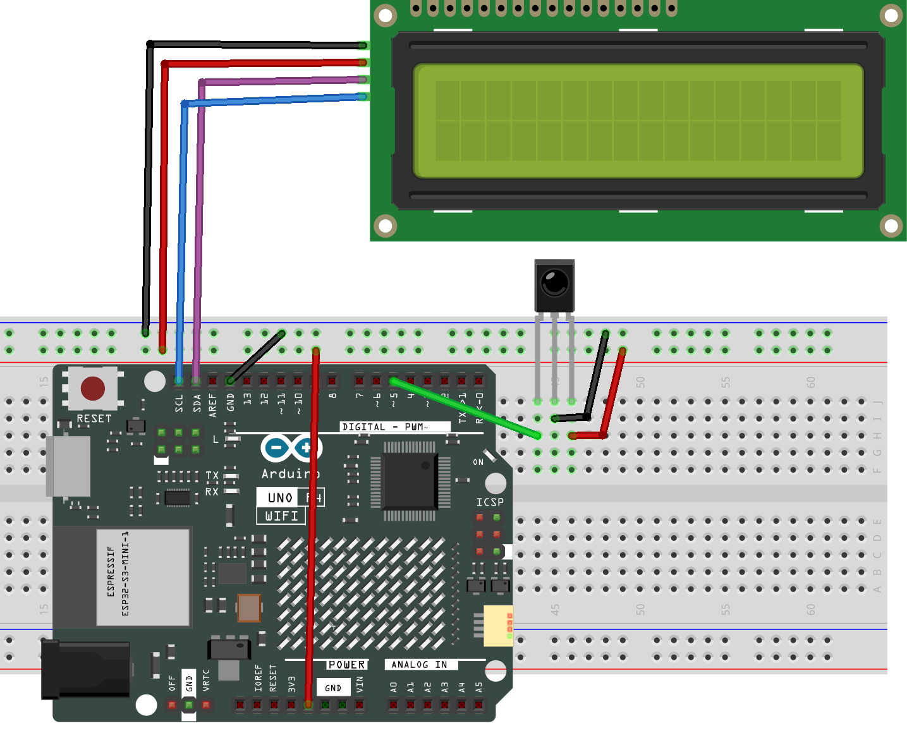
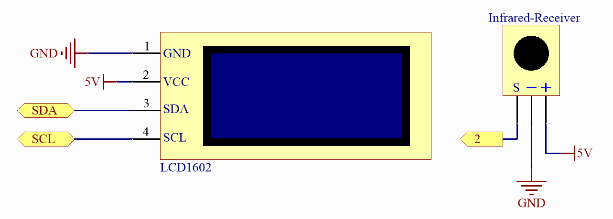

.. note::

    Bonjour, bienvenue dans la communauté des passionnés de SunFounder Raspberry Pi, Arduino et ESP32 sur Facebook ! Plongez dans l'univers du Raspberry Pi, Arduino et ESP32 avec d'autres passionnés.

    **Pourquoi nous rejoindre ?**

    - **Support d'experts** : Résolvez les problèmes après-vente et les défis techniques avec l'aide de notre communauté et de notre équipe.
    - **Apprendre et partager** : Échangez des astuces et des tutoriels pour améliorer vos compétences.
    - **Aperçus exclusifs** : Accédez en avant-première aux annonces de nouveaux produits et aux avant-premières.
    - **Réductions exclusives** : Profitez de réductions exclusives sur nos produits les plus récents.
    - **Promotions festives et cadeaux** : Participez à des concours et des promotions festives.

    👉 Prêt à explorer et créer avec nous ? Cliquez sur [|link_sf_facebook|] et rejoignez-nous dès aujourd'hui !

.. _fun_guess_number:

JEU - Devinez le nombre
============================

.. raw:: html

   <video loop autoplay muted style = "max-width:100%">
      <source src="../_static/videos/fun_projects/10_fun_guess_game.mp4"  type="video/mp4">
      Votre navigateur ne supporte pas la balise vidéo.
   </video>

Devinez le nombre est un jeu de fête amusant où vous et vos amis prenez tour à tour pour entrer un nombre (0~99). 
La plage devient plus étroite à chaque entrée jusqu'à ce qu'un joueur devine correctement le nombre. 
Le joueur qui devine correctement est déclaré perdant et soumis à une pénalité. 
Par exemple, si le nombre secret est 51, que les joueurs ne peuvent pas voir, et que le joueur 1 entre 50, 
l'intervalle de nombre devient 50~99. Si le joueur 2 entre 70, l'intervalle de nombre devient 50~70. 
Si le joueur 3 entre 51, il est le malchanceux. 
Dans ce jeu, nous utilisons une télécommande IR pour entrer les nombres et un écran LCD pour afficher les résultats.

**Composants nécessaires**

Dans ce projet, nous avons besoin des composants suivants.

Il est certainement pratique d'acheter un kit complet, voici le lien :

.. list-table::
    :widths: 20 20 20
    :header-rows: 1

    *   - Nom	
        - ARTICLES DANS CE KIT
        - LIEN
    *   - Elite Explorer Kit
        - 300+
        - |link_Elite_Explorer_kit|

Vous pouvez également les acheter séparément à partir des liens ci-dessous.

.. list-table::
    :widths: 30 20
    :header-rows: 1

    *   - INTRODUCTION DES COMPOSANTS
        - LIEN D'ACHAT

    *   - :ref:`uno_r4_wifi`
        - \-
    *   - :ref:`cpn_breadboard`
        - |link_breadboard_buy|
    *   - :ref:`cpn_wires`
        - |link_wires_buy|
    *   - :ref:`cpn_i2c_lcd1602`
        - |link_i2clcd1602_buy|
    *   - :ref:`cpn_ir_receiver`
        - |link_receiver_buy|

**Câblage**

**Schéma**

**Code**

.. note::

    * Vous pouvez ouvrir le fichier ``10_guess_number.ino`` sous le chemin ``elite-explorer-kit-main\fun_project\10_guess_number`` directement.
    * Ou copiez ce code dans l'IDE Arduino.

.. note::
   Pour installer la bibliothèque, utilisez le gestionnaire de bibliothèque Arduino et recherchez **"IRremote"** et **"LiquidCrystal I2C"** et installez-les.

.. literalinclude:: /_code/10_fun_guess_number.ino
   :language: cpp
   :linenos:
   :caption: 10_guess_number.ino

**Comment ça marche ?**

1. Importation des bibliothèques et définition des variables globales :

   Trois bibliothèques sont importées : ``Wire`` pour la communication I2C, ``LiquidCrystal_I2C`` pour contrôler l'affichage LCD, et ``IRremote`` pour recevoir les signaux de la télécommande infrarouge.
   Plusieurs variables globales sont définies pour stocker l'état et les paramètres du jeu.

2. ``setup()`` 

   Initialisez l'affichage LCD et allumez le rétroéclairage.
   Initialisez la communication série avec un débit de 9600 bauds.
   Démarrez le récepteur infrarouge.
   Appelez la fonction ``initNewValue()`` pour définir l'état initial du jeu.

3. ``loop()`` 

   Vérifiez si un signal est reçu de la télécommande infrarouge.
   Décodez le signal infrarouge reçu.
   Mettez à jour l'état du jeu ou effectuez les actions correspondantes en fonction de la valeur décodée (nombre ou commande).

4. ``initNewValue()`` 

   Utilisez ``analogRead`` pour initialiser la graine de nombre aléatoire, garantissant des nombres aléatoires différents à chaque fois.
   Générez un nombre aléatoire entre 0 et 98 comme nombre chanceux (le nombre que les joueurs doivent deviner).
   Réinitialisez les invites de limites supérieures et inférieures.
   Affichez un message de bienvenue sur le LCD.
   Réinitialisez le nombre d'entrée.

5. ``detectPoint()`` 

   Vérifiez la relation entre le nombre entré par le joueur et le nombre chanceux.
   Si le nombre entré est supérieur au nombre chanceux, mettez à jour l'invite de limite supérieure.
   Si le nombre entré est inférieur au nombre chanceux, mettez à jour l'invite de limite inférieure.
   Si le joueur entre le nombre correct, réinitialisez l'entrée et retournez true.

6. ``lcdShowInput()`` 

   Affichez l'entrée du joueur et les invites de limites supérieures et inférieures actuelles sur le LCD.
   Si le joueur devine correctement, affichez un message de succès et faites une pause de 5 secondes avant de redémarrer le jeu.

