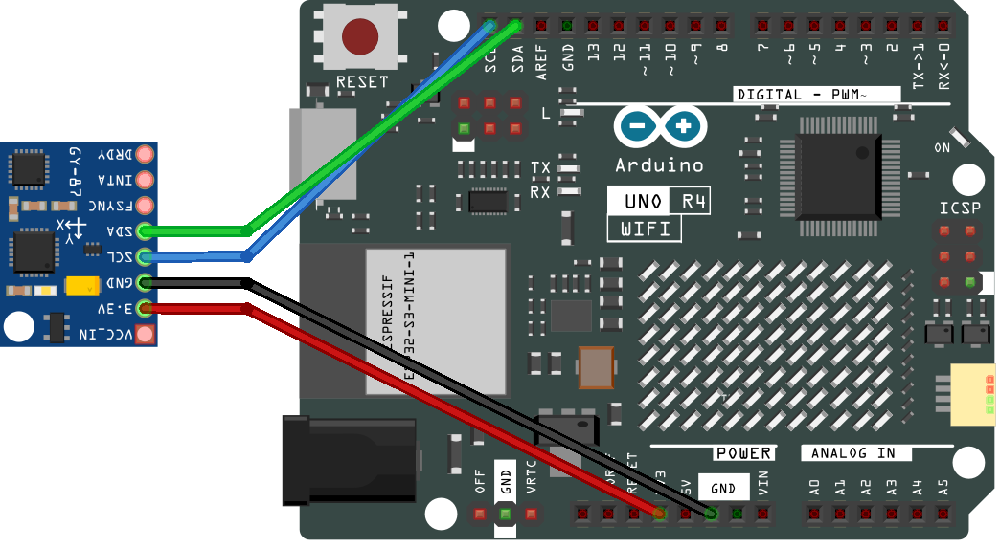

.. note::

    Hallo und willkommen in der SunFounder Raspberry Pi & Arduino & ESP32 Enthusiasten-Gemeinschaft auf Facebook! Tauchen Sie tiefer ein in die Welt von Raspberry Pi, Arduino und ESP32 mit anderen Enthusiasten.

    **Warum beitreten?**

    - **Expertenunterstützung**: Lösen Sie Nachverkaufsprobleme und technische Herausforderungen mit Hilfe unserer Gemeinschaft und unseres Teams.
    - **Lernen & Teilen**: Tauschen Sie Tipps und Anleitungen aus, um Ihre Fähigkeiten zu verbessern.
    - **Exklusive Vorschauen**: Erhalten Sie frühzeitigen Zugang zu neuen Produktankündigungen und exklusiven Einblicken.
    - **Spezialrabatte**: Genießen Sie exklusive Rabatte auf unsere neuesten Produkte.
    - **Festliche Aktionen und Gewinnspiele**: Nehmen Sie an Gewinnspielen und Feiertagsaktionen teil.

    👉 Sind Sie bereit, mit uns zu erkunden und zu erschaffen? Klicken Sie auf [|link_sf_facebook|] und treten Sie heute bei!

.. _fun_escape:

SPIEL - Flucht
==================================

.. raw:: html

   <video loop autoplay muted style = "max-width:100%">
      <source src="../_static/videos/fun_projects/11_fun_escape_square.mp4"  type="video/mp4">
      Ihr Browser unterstützt das Video-Tag nicht.
   </video>

Dieses Spiel heißt „Flucht“.
Das Ziel des Spielers ist es, den MPU6050-Sensor zu neigen, um einen Pixel auf der LED-Matrix zu bewegen und zu versuchen, ihn durch eine Öffnung im Rand der Matrix (den Ausgang) zu manövrieren.

**Benötigte Komponenten**

Für dieses Projekt benötigen wir die folgenden Komponenten.

Es ist definitiv praktisch, ein ganzes Kit zu kaufen, hier ist der Link:

.. list-table::
    :widths: 20 20 20
    :header-rows: 1

    *   - Name	
        - ARTIKEL IN DIESEM KIT
        - LINK
    *   - Elite Explorer Kit
        - 300+
        - |link_Elite_Explorer_kit|

Sie können sie auch einzeln über die untenstehenden Links kaufen.

.. list-table::
    :widths: 30 20
    :header-rows: 1

    *   - KOMPONENTENBESCHREIBUNG
        - KAUF-LINK

    *   - :ref:`uno_r4_wifi`
        - \-
    *   - :ref:`cpn_wires`
        - |link_wires_buy|
    *   - :ref:`cpn_gy87`
        - \-

**Verdrahtung**

**Schaltplan**

.. image:: img/11_escape_schematic.png
   :width: 70%
   :align: center

**Code**

.. note::

    * Sie können die Datei ``11_escape_square.ino`` direkt unter dem Pfad ``elite-explorer-kit-main\fun_project\11_escape_square`` öffnen.
    * Oder kopieren Sie diesen Code in die Arduino IDE.

.. note::
   Um die Bibliothek zu installieren, verwenden Sie den Arduino-Bibliotheksmanager und suchen Sie nach **„Adafruit MPU6050“** und installieren Sie diese.

.. raw:: html

   <iframe src=https://create.arduino.cc/editor/sunfounder01/6b239445-f921-48fb-a93e-70cc7ef8afc7/preview?embed style="height:510px;width:100%;margin:10px 0" frameborder=0></iframe>

**Wie funktioniert des?**

Hier ist eine detaillierte Erklärung des Codes:

1. Bibliotheksimporte und globale Variablen:

   Importierte Bibliotheken umfassen die LED-Matrix, Wire (für I2C-Kommunikation), MPU6050 (Bewegungssensor) und die ``Adafruit_Sensor``-Bibliothek.
   Initialisierung von MPU6050 und LED-Matrix-Objekten.
   Definition globaler Variablen wie pixelX und pixelY (Pixelposition), gapStart und side (Startposition der Lücke und welche Seite), level (Schwierigkeitsgrad des Spiels) und mehr.

2. ``setup()``:

   Initialisieren Sie die LED-Matrix und zeichnen Sie die Matrix mit der Lücke.
   Initialisieren Sie die serielle Kommunikation und prüfen Sie, ob der MPU6050-Sensor korrekt startet, und stellen Sie seinen Beschleunigungsbereich auf 2g ein.

3. ``loop()``:

   Aktualisieren Sie regelmäßig die Position des Pixels basierend auf den MPU6050-Sensorwerten.
   Verschieben Sie regelmäßig die Position der Lücke.
   Laden Sie das neue Pixel-Layout und rendern Sie es auf der LED-Matrix.
   Überprüfen Sie, ob das Pixel durch die Lücke gegangen ist.
   Wenn ja, warten Sie 1,5 Sekunden, um den Erfolg anzuzeigen, erhöhen Sie den Schwierigkeitsgrad des Spiels und setzen Sie die Pixelposition zurück.

4. Weitere Funktionen:

   * ``drawSquareWithGap()``: Zeichnen Sie einen 8x8-Rand und erstellen Sie eine Lücke darin.
   * ``createGap()``: Erstellen Sie eine 2 Pixel lange Lücke auf der angegebenen Seite.
   * ``moveGap()``: Verschieben Sie die Position der Lücke basierend auf der aktuellen Seite und gapStart und ändern Sie bei Bedarf die Seite.
   * ``movePixelBasedOnMPU()``: Lesen Sie die Beschleunigungsdaten von MPU6050. Bewegen Sie die Pixelposition basierend auf den Beschleunigungsdaten (zurücksetzen, wenn das Pixel außerhalb der Grenzen oder in Wände geht).
   * ``resetPixel()``: Setzen Sie die Pixelposition auf die Mitte der Matrix zurück.
   * ``checkPixelPosition()``: Überprüfen Sie, ob sich das Pixel auf der Lücke befindet. Wenn ja, erhöhen Sie den Schwierigkeitsgrad des Spiels und setzen Sie das Pass-Flag auf wahr.

