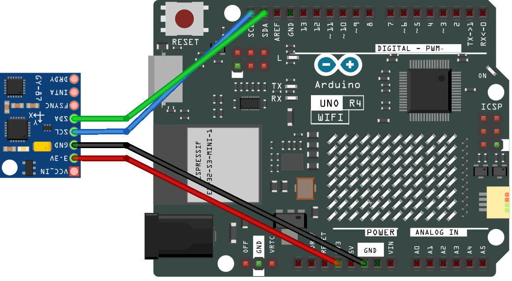
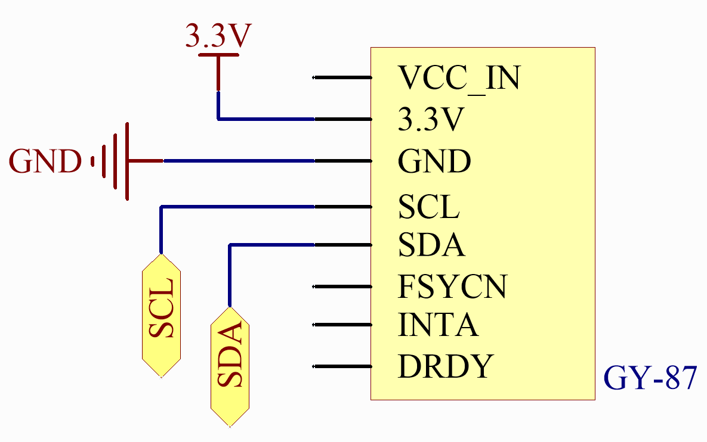

.. _fun_escape:

游戏 - 逃脱
==================================

.. raw:: html

   <video loop autoplay muted style = "max-width:100%">
      <source src="../_static/videos/fun_projects/11_fun_escape_square.mp4"  type="video/mp4">
      Your browser does not support the video tag.
   </video>

这个游戏叫做"逃脱"。
玩家的目标是倾斜 MPU6050 传感器来移动 LED 矩阵上的一个像素，并尝试将其穿过矩阵边框上的一个开口（出口）。

**所需元件**

在这个项目中，我们需要以下元件。

购买整套套件会更方便，以下是链接：

.. list-table::
    :widths: 20 20 20
    :header-rows: 1

    *   - 名称
        - 套件所含项目
        - 链接
    *   - Elite Explorer 套件
        - 300+
        - |link_Elite_Explorer_kit|

您也可以从下面的链接单独购买。

.. list-table::
    :widths: 30 20
    :header-rows: 1

    *   - 元件介绍
        - 购买链接

    *   - :ref:`uno_r4_wifi`
        - \-
    *   - :ref:`cpn_wires`
        - |link_wires_buy|
    *   - :ref:`cpn_gy87`
        - \-

**接线**

**原理图**

**代码**

.. note::

    * 您可以直接打开路径 ``elite-explorer-kit-main\fun_project\11_escape_square`` 下的 ``11_escape_square.ino`` 文件。
    * 或者将这段代码复制到 Arduino IDE 中。

.. note::
   要安装库，请使用 Arduino 库管理器搜索 **"Adafruit MPU6050"** 并安装。

.. raw:: html

   <iframe src=https://create.arduino.cc/editor/sunfounder01/6b239445-f921-48fb-a93e-70cc7ef8afc7/preview?embed style="height:510px;width:100%;margin:10px 0" frameborder=0></iframe>

**工作原理**

以下是代码的详细说明：

1. 库导入和全局变量：

   导入的库包括 LED 矩阵库、Wire（用于 I2C 通信）、MPU6050（运动传感器）和 ``Adafruit_Sensor`` 库。
   初始化 MPU6050 和 LED 矩阵对象。
   定义全局变量，如 pixelX 和 pixelY（像素位置）、gapStart 和 side（缺口起始位置和所在边）、level（游戏难度等级）等。

2. ``setup()``：

   初始化 LED 矩阵并绘制带缺口的矩阵。
   初始化串行通信，检查 MPU6050 传感器是否正常启动，并将其加速度范围设置为 2g。

3. ``loop()``：

   根据 MPU6050 传感器的读数定期更新像素位置。
   定期移动缺口的位置。
   加载新的像素布局并在 LED 矩阵上呈现。
   检查像素是否通过了缺口。
   如果已通过，延迟 1.5 秒显示成功，增加游戏难度，并重置像素位置。

4. 其他函数：

   * ``drawSquareWithGap()``：绘制一个 8x8 的边框并在其中创建一个缺口。
   * ``createGap()``：在指定边上创建一个长度为 2 的缺口。
   * ``moveGap()``：根据当前边和 gapStart 移动缺口位置，必要时改变边。
   * ``movePixelBasedOnMPU()``：从 MPU6050 读取加速度数据。根据加速度数据移动像素位置（如果像素越界或撞墙则重置）。
   * ``resetPixel()``：将像素位置重置到矩阵中心。
   * ``checkPixelPosition()``：检查像素是否在缺口上。如果是，则增加游戏难度级别并将通过标志设置为 true。
