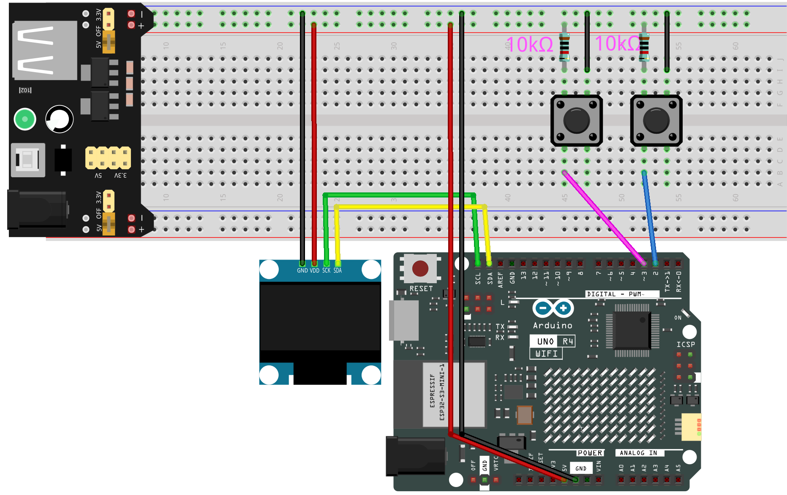

.. note::

    Bonjour, bienvenue dans la communauté des passionnés de SunFounder Raspberry Pi, Arduino et ESP32 sur Facebook ! Plongez dans l'univers du Raspberry Pi, Arduino et ESP32 avec d'autres passionnés.

    **Pourquoi nous rejoindre ?**

    - **Support d'experts** : Résolvez les problèmes après-vente et les défis techniques avec l'aide de notre communauté et de notre équipe.
    - **Apprendre et partager** : Échangez des astuces et des tutoriels pour améliorer vos compétences.
    - **Aperçus exclusifs** : Accédez en avant-première aux annonces de nouveaux produits et aux avant-premières.
    - **Réductions exclusives** : Profitez de réductions exclusives sur nos produits les plus récents.
    - **Promotions festives et cadeaux** : Participez à des concours et des promotions festives.

    👉 Prêt à explorer et créer avec nous ? Cliquez sur [|link_sf_facebook|] et rejoignez-nous dès aujourd'hui !

.. _fun_pong:

JEU - Pong
=================================

.. raw:: html

   <video loop autoplay muted style = "max-width:100%">
      <source src="../_static/videos/fun_projects/12_fun_pong.mp4"  type="video/mp4">
      Votre navigateur ne supporte pas la balise vidéo.
   </video>

Voici un jeu de Pong simple conçu avec un écran OLED et une carte Arduino.
Dans le jeu de Pong, les joueurs affrontent l'ordinateur en contrôlant une palette verticale pour renvoyer une balle rebondissante. 
Le but est d'empêcher la balle de passer le bord de votre palette, sinon l'adversaire marque un point.

Les mécanismes du jeu se divisent en plusieurs parties :

1. Mouvement de la balle - La balle se déplace dans sa direction actuelle à une vitesse déterminée. À chaque collision avec une palette, la vitesse de la balle augmente, rendant le jeu plus difficile.

2. Mouvement des palettes - Utilisées pour bloquer la balle, les palettes peuvent se déplacer vers le haut ou vers le bas. Les joueurs contrôlent leur palette avec des boutons, tandis que la palette de l'ordinateur suit automatiquement la position de la balle.

3. Comptage des points - Chaque fois que la balle dépasse le bord gauche ou droit de l'écran, le joueur ou l'ordinateur marque un point.

**Composants nécessaires**

Dans ce projet, nous avons besoin des composants suivants.

Il est certainement pratique d'acheter un kit complet, voici le lien :

.. list-table::
    :widths: 20 20 20
    :header-rows: 1

    *   - Nom	
        - ARTICLES DANS CE KIT
        - LIEN
    *   - Elite Explorer Kit
        - 300+
        - |link_Elite_Explorer_kit|

Vous pouvez également les acheter séparément à partir des liens ci-dessous.

.. list-table::
    :widths: 30 20
    :header-rows: 1

    *   - INTRODUCTION DES COMPOSANTS
        - LIEN D'ACHAT

    *   - :ref:`uno_r4_wifi`
        - \-
    *   - :ref:`cpn_breadboard`
        - |link_breadboard_buy|
    *   - :ref:`cpn_wires`
        - |link_wires_buy|
    *   - :ref:`cpn_resistor`
        - |link_resistor_buy|
    *   - :ref:`cpn_oled`
        - |link_oled_buy|
    *   - :ref:`cpn_button`
        - |link_button_buy|
    *   - :ref:`cpn_power`
        - \-

**Câblage**

.. note::
    Pour protéger la batterie de la :ref:`cpn_power`, veuillez la charger complètement avant de l'utiliser pour la première fois.

**Schéma**

.. image:: img/12_pong_schematic.png
    :width: 100%
    :align: center

**Code**

.. note::

    * Vous pouvez ouvrir le fichier ``12_pong_oled.ino`` sous le chemin ``elite-explorer-kit-main\fun_project\12_pong_oled`` directement.
    * Ou copiez ce code dans l'IDE Arduino.

.. note::
   Pour installer la bibliothèque, utilisez le gestionnaire de bibliothèque Arduino et recherchez **"Adafruit SSD1306"** et **"Adafruit GFX"** et installez-les.

.. raw:: html

   <iframe src=https://create.arduino.cc/editor/sunfounder01/86dbb549-d425-4f42-8b5b-28d486e3f7f8/preview?embed style="height:510px;width:100%;margin:10px 0" frameborder=0></iframe>

**Comment ça marche ?**

La structure du programme se divise en cinq parties :

1. Importation des bibliothèques nécessaires - Utilisées pour contrôler l'écran OLED et lire les entrées des boutons.

2. Définition des constantes et variables globales :

   Définitions de la largeur et de la hauteur de l'écran OLED.
   Définitions des boutons et des broches de réinitialisation de l'OLED.
   Position, vitesse, taille et direction de la balle et des palettes.
   Scores pour le joueur et l'ordinateur.

3. Initialisation :

   Initialiser la communication série, l'écran OLED et afficher l'interface initiale.
   Configurer les boutons comme entrées et connecter des résistances pull-up.
   Dessiner le terrain de jeu.

4. Boucle principale :

   Lire l'état des boutons.
   Déplacer la balle en fonction du taux de rafraîchissement défini.
   Détecter les collisions entre la balle et les palettes ou les murs, ajuster la direction et la vitesse de la balle en conséquence.
   Mettre à jour l'écran avec les scores basés sur les événements de comptage.
   Rafraîchir les positions des palettes.

5. Fonctions supplémentaires :

   ``crossesPlayerPaddle`` et ``crossesCpuPaddle`` - Utilisées pour détecter si la balle heurte la palette du joueur ou de l'ordinateur.
   
   ``drawCourt`` - Dessine le terrain de jeu sur l'écran OLED.

   ``displayScore`` - Affiche les scores du joueur et de l'ordinateur sur l'écran.

