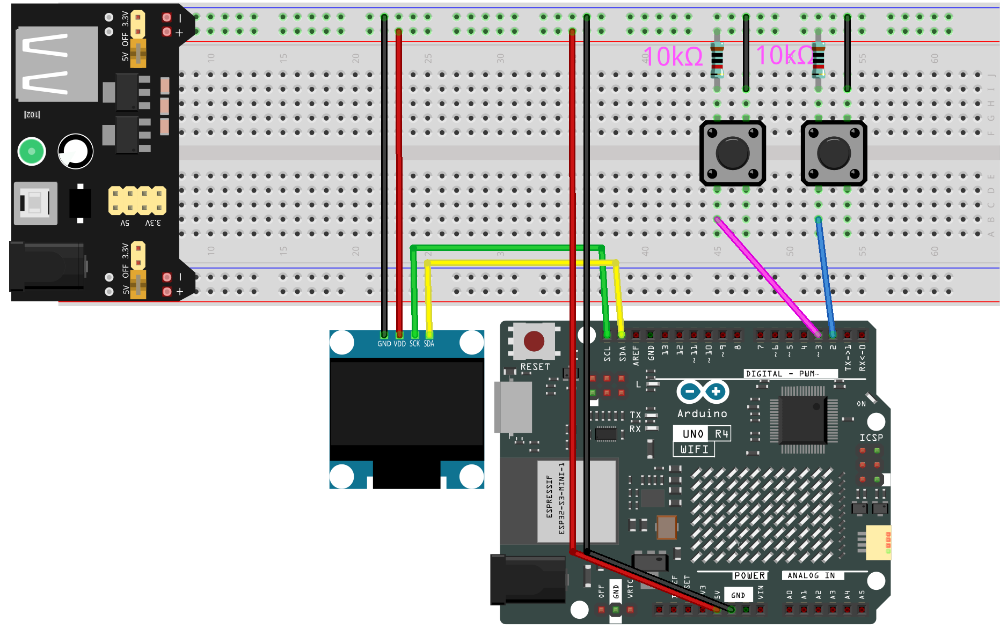
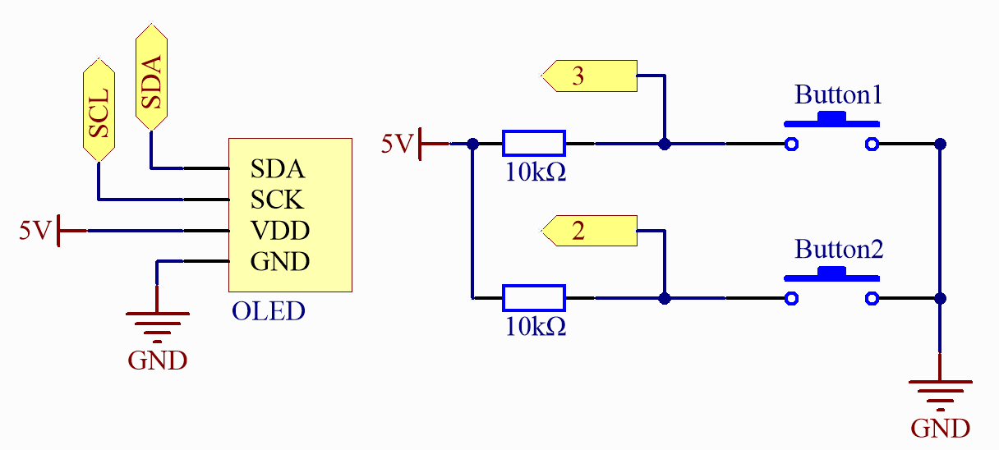

.. _fun_pong:

游戏 - 乒乓球
=================================

.. raw:: html

   <video loop autoplay muted style = "max-width:100%">
      <source src="../_static/videos/fun_projects/12_fun_pong.mp4"  type="video/mp4">
      Your browser does not support the video tag.
   </video>

这是一个使用 OLED 显示屏和 Arduino 板设计的简单乒乓球游戏。
在乒乓球游戏中，玩家与电脑对战，控制一个垂直球拍来回击弹跳的球。
目标是防止球越过您的球拍边缘，否则对手将得分。

游戏机制可以分为以下几个部分：

1. 球的运动 - 球以设定速度沿当前方向移动。每当球与球拍碰撞时，其速度会增加，使游戏更具挑战性。

2. 球拍运动 - 用于阻挡球的运动，球拍可以上下移动。玩家使用按钮控制自己的球拍，而电脑的球拍会自动跟随球的位置。

3. 计分 - 每当球越过屏幕的左侧或右侧边缘时，相应的玩家或 CPU 得分。

**所需元件**

在这个项目中，我们需要以下元件。

购买整套套件会更方便，以下是链接：

.. list-table::
    :widths: 20 20 20
    :header-rows: 1

    *   - 名称
        - 套件所含项目
        - 链接
    *   - Elite Explorer 套件
        - 300+
        - |link_Elite_Explorer_kit|

您也可以从下面的链接单独购买。

.. list-table::
    :widths: 30 20
    :header-rows: 1

    *   - 元件介绍
        - 购买链接

    *   - :ref:`uno_r4_wifi`
        - \-
    *   - :ref:`cpn_breadboard`
        - |link_breadboard_buy|
    *   - :ref:`cpn_wires`
        - |link_wires_buy|
    *   - :ref:`cpn_resistor`
        - |link_resistor_buy|
    *   - :ref:`cpn_oled`
        - |link_oled_buy|
    *   - :ref:`cpn_button`
        - |link_button_buy|
    *   - :ref:`cpn_power`
        - \-

**接线**

.. note::
    为了保护 :ref:`cpn_power` 的电池，首次使用前请将其充满电。

**原理图**

**代码**

.. note::

    * 您可以直接打开路径 ``elite-explorer-kit-main\fun_project\12_pong_oled`` 下的 ``12_pong_oled.ino`` 文件。
    * 或者将这段代码复制到 Arduino IDE 中。

.. note::
   要安装库，请使用 Arduino 库管理器搜索 **"Adafruit SSD1306" ** 和 **"Adafruit GFX"** 并安装它们。

.. raw:: html

   <iframe src=https://create.arduino.cc/editor/sunfounder01/86dbb549-d425-4f42-8b5b-28d486e3f7f8/preview?embed style="height:510px;width:100%;margin:10px 0" frameborder=0></iframe>

**工作原理**

程序结构可以分为以下五个部分：

1. 导入必要的库 - 用于控制 OLED 屏幕和读取按钮输入。

2. 定义常量和全局变量：

   OLED 屏幕宽度和高度的定义。
   按钮和 OLED 复位引脚的定义。
   球和球拍的位置、速度、大小和方向。
   玩家和 CPU 的分数。

3. 初始化：

   初始化串行通信、OLED 屏幕，并显示初始界面。
   将按钮设置为输入并连接上拉电阻。
   绘制比赛场地。

4. 主循环：

   读取按钮状态。
   根据设定的刷新率移动球。
   检测球与球拍或墙壁之间的碰撞，相应调整球的方向和速度。
   根据得分事件更新屏幕上的分数。
   刷新球拍位置。

5. 附加函数：

   ``crossesPlayerPaddle`` 和 ``crossesCpuPaddle`` - 用于检测球是否与玩家或 CPU 的球拍碰撞。

   ``drawCourt`` - 在 OLED 屏幕上绘制比赛场地。

   ``displayScore`` - 在屏幕上显示玩家和 CPU 的分数。
