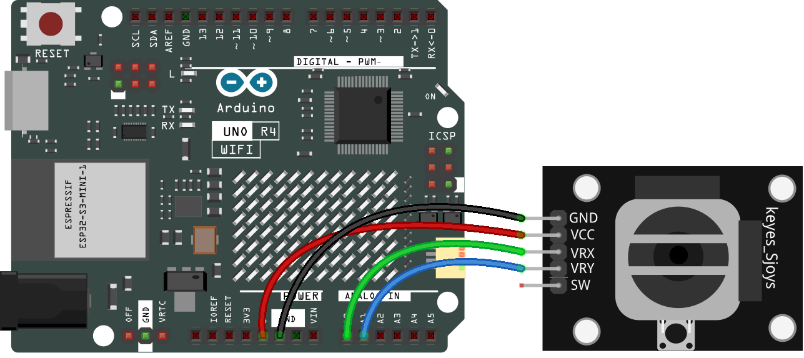
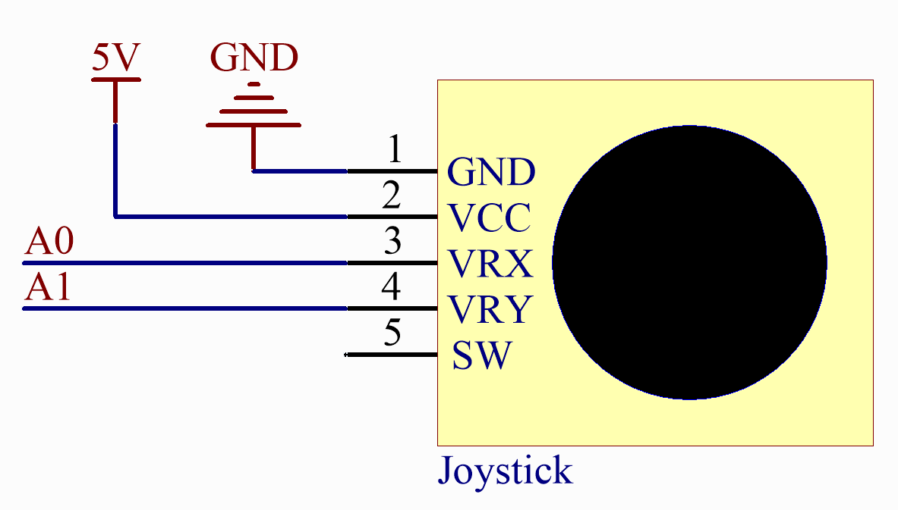

.. note::

    Hallo und willkommen in der SunFounder Raspberry Pi & Arduino & ESP32 Enthusiasten-Gemeinschaft auf Facebook! Tauchen Sie tiefer ein in die Welt von Raspberry Pi, Arduino und ESP32 mit anderen Enthusiasten.

    **Warum beitreten?**

    - **Expertenunterstützung**: Lösen Sie Nachverkaufsprobleme und technische Herausforderungen mit Hilfe unserer Gemeinschaft und unseres Teams.
    - **Lernen & Teilen**: Tauschen Sie Tipps und Anleitungen aus, um Ihre Fähigkeiten zu verbessern.
    - **Exklusive Vorschauen**: Erhalten Sie frühzeitigen Zugang zu neuen Produktankündigungen und exklusiven Einblicken.
    - **Spezialrabatte**: Genießen Sie exklusive Rabatte auf unsere neuesten Produkte.
    - **Festliche Aktionen und Gewinnspiele**: Nehmen Sie an Gewinnspielen und Feiertagsaktionen teil.

    👉 Sind Sie bereit, mit uns zu erkunden und zu erschaffen? Klicken Sie auf [|link_sf_facebook|] und treten Sie heute bei!

.. _fun_snake:

SPIEL - Snake
=========================

.. raw:: html

   <video loop autoplay muted style = "max-width:100%">
      <source src="../_static/videos/fun_projects/13_fun_snake.mp4"  type="video/mp4">
      Ihr Browser unterstützt das Video-Tag nicht.
   </video>

Dieses Beispiel implementiert das klassische Snake-Spiel auf einer 8x12 LED-Matrix mit dem R4 Wifi Board.
Spieler steuern die Richtung der Schlange mit einem Zwei-Achsen-Joystick.

**Benötigte Komponenten**

Für dieses Projekt benötigen wir die folgenden Komponenten.

Es ist definitiv praktisch, ein ganzes Kit zu kaufen, hier ist der Link:

.. list-table::
    :widths: 20 20 20
    :header-rows: 1

    *   - Name	
        - ARTIKEL IN DIESEM KIT
        - LINK
    *   - Elite Explorer Kit
        - 300+
        - |link_Elite_Explorer_kit|

Sie können sie auch einzeln über die untenstehenden Links kaufen.

.. list-table::
    :widths: 30 20
    :header-rows: 1

    *   - KOMPONENTENBESCHREIBUNG
        - KAUF-LINK

    *   - :ref:`uno_r4_wifi`
        - \-
    *   - :ref:`cpn_wires`
        - |link_wires_buy|
    *   - :ref:`cpn_joystick`
        - |link_joystick_buy|

**Verdrahtung**

**Schaltplan**

**Code**

.. note::

    * Sie können die Datei ``13_snake.ino`` direkt unter dem Pfad ``elite-explorer-kit-main\fun_project\13_snake`` öffnen.
    * Oder kopieren Sie diesen Code in die Arduino IDE.

.. literalinclude:: /_code/13_fun_snake.ino
   :language: cpp
   :linenos:
   :caption: 13_snake.ino

**Wie funktioniert des?**

Hier ist eine detaillierte Erklärung des Codes:

1. Variablendefinition und -initialisierung

   Importieren Sie die Bibliothek ``Arduino_LED_Matrix`` für LED-Matrix-Operationen.
   matrix ist eine Instanz der LED-Matrix.
   ``frame`` und ``flatFrame`` sind Arrays, die verwendet werden, um Pixelinformationen auf dem Bildschirm zu speichern und zu verarbeiten.
   Die Schlange wird als ein Array von ``Point``-Strukturen dargestellt, wobei jeder Punkt eine x- und y-Koordinate hat.
   food repräsentiert die Position des Futters.
   ``direction`` ist die aktuelle Bewegungsrichtung der Schlange.

2. ``setup()`` 

   Initialisieren Sie die X- und Y-Achsen des Joysticks als Eingänge.
   Starten Sie die LED-Matrix.
   Initialisieren Sie die Startposition der Schlange in der Mitte des Bildschirms.
   Generieren Sie die anfängliche Position des Futters zufällig.

3. ``loop()`` 

   Bestimmen Sie die Richtung der Schlange anhand der Ablesungen vom Joystick.
   Bewegen Sie die Schlange.
   Überprüfen Sie, ob der Kopf der Schlange mit dem Futter kollidiert. 
   Wenn ja, wächst die Schlange und neues Futter wird an einem neuen Ort generiert.
   Überprüfen Sie, ob die Schlange mit sich selbst kollidiert. Wenn ja, setzen Sie das Spiel zurück.
   Zeichnen Sie den aktuellen Spielstand (Positionen von Schlange und Futter) auf der LED-Matrix.
   Fügen Sie eine Verzögerung hinzu, um die Geschwindigkeit des Spiels zu steuern.

4. ``moveSnake()`` 

   Bewegen Sie jeden Teil der Schlange an die Position des vorherigen Teils, beginnend am Schwanz und bewegend zum Kopf.
   Bewegen Sie den Kopf der Schlange basierend auf ihrer Richtung.

5. ``generateFood()`` 

   Generieren Sie alle möglichen Futterpositionen.
   Überprüfen Sie, ob jede Position mit irgendeinem Teil der Schlange überlappt. Wenn es nicht überlappt, wird die Position als möglicher Futterort betrachtet.
   Wählen Sie zufällig einen möglichen Futterort aus.

6. ``drawFrame()`` 

   Löschen Sie das aktuelle Frame.
   Zeichnen Sie die Schlange und das Futter auf dem Frame.
   Flachen Sie das zweidimensionale Frame-Array in ein eindimensionales Array (flatFrame) ab und laden Sie es auf die LED-Matrix.
