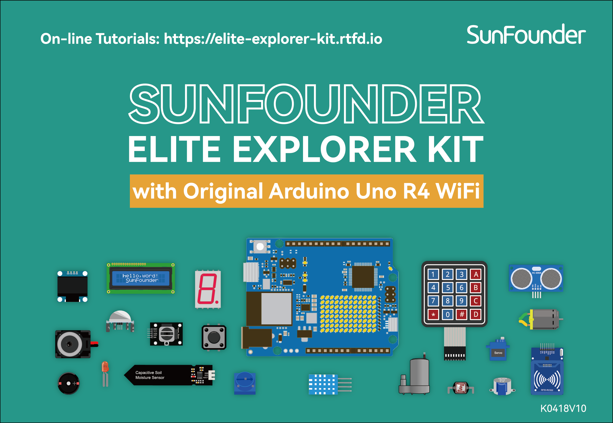

.. note::

    Hallo und willkommen in der SunFounder Raspberry Pi & Arduino & ESP32 Enthusiasten-Gemeinschaft auf Facebook! Tauchen Sie tiefer ein in die Welt von Raspberry Pi, Arduino und ESP32 mit anderen Enthusiasten.

    **Warum beitreten?**

    - **Expertenunterstützung**: Lösen Sie Nachverkaufsprobleme und technische Herausforderungen mit Hilfe unserer Gemeinschaft und unseres Teams.
    - **Lernen & Teilen**: Tauschen Sie Tipps und Anleitungen aus, um Ihre Fähigkeiten zu verbessern.
    - **Exklusive Vorschauen**: Erhalten Sie frühzeitigen Zugang zu neuen Produktankündigungen und exklusiven Einblicken.
    - **Spezialrabatte**: Genießen Sie exklusive Rabatte auf unsere neuesten Produkte.
    - **Festliche Aktionen und Gewinnspiele**: Nehmen Sie an Gewinnspielen und Feiertagsaktionen teil.

    👉 Sind Sie bereit, mit uns zu erkunden und zu erschaffen? Klicken Sie auf [|link_sf_facebook|] und treten Sie heute bei!

SunFounder Elite Explorer Kit
=======================================================

Danke, dass Sie sich für unser Elite Explorer Kit entschieden haben.

.. note::
    Dieses Dokument ist in den folgenden Sprachen verfügbar.

        * |link_german_tutorials|
        * |link_jp_tutorials|
        * |link_en_tutorials|
        * |link_fr_tutorials|
        * |link_es_tutorials|
    
    Bitte klicken Sie auf die jeweiligen Links, um das Dokument in Ihrer bevorzugten Sprache aufzurufen.

Müde von grundlegenden Arduino-Kits mit begrenzten Projekten? Möchten Sie fortgeschrittene IoT-Systeme aufbauen, wissen aber nicht, wo Sie anfangen sollen?

Suchen Sie nicht weiter als das SunFounder Elite Explorer Kit mit dem brandneuen Arduino Uno R4 WiFi!

Das leistungsstarke Arduino Uno R4 WiFi-Board stellt einen großen Fortschritt für die weltweit beliebteste Open-Source-Elektronikplattform dar. Mit seinem 32-Bit-Prozessor, erweitertem Speicher, USB-C und integriertem WiFi/Bluetooth eröffnet R4 unendliche Möglichkeiten.

Unser Elite-Kit entfaltet das volle Potenzial von R4 mit einer umfangreichen Auswahl an Komponenten, um kreative Projekte zu bauen, von Musikmachern bis hin zu Pflanzenmonitoren. Einfache Tutorials lehren Sie die Grundlagen, während geführte Projekte Ihnen ermöglichen, automatisierte Ventilatoren, RFID-Türschlösser und smartphonegesteuerte Roboter zu konstruieren.

Erforschen Sie die Welt des IoT mit WiFi-Webservern, Cloud-Dashboards, MQTT-Netzwerken und mehr. Das Kit verwandelt R4 in ein vielseitiges IoT-Prototyping-Tool, das nur durch Ihre Vorstellungskraft begrenzt ist.

Mit SunFounder wird das Programmieren von Arduino aufgewertet. Das Elite Explorer Kit, kombiniert mit dem bahnbrechenden Uno R4 WiFi, ist die ultimative All-in-One-Lösung, um Arduino zu meistern und fortgeschrittene DIY-Elektronikprojekte zu bauen. Bestellen Sie noch heute und lassen Sie Ihre Kreativität in die Höhe schnellen!

.. **Über die Anzeigesprache**

.. Dieses Dokument ist auch in anderen Sprachen verfügbar. Um die Anzeigesprache zu wechseln, klicken Sie bitte auf das Read the Docs-Symbol in der unteren linken Ecke der Seite.

.. .. image:: img/translation.png
..     :align: center

.. .. raw:: html

..      

**Inhaltsverzeichnis**

.. toctree::
    :maxdepth: 2

    Über das Elite Explorer Kit <self>
    components/00_component_list
    arduino_start/00_get_start
    download_the_code
    basic_projects/00_basic_project
    new_feature_projects/00_new_feature_project
    fun_projects/00_fun_project
    iot_projects/00_iot_project
    appendix/appendix
    video_lesson/video_lesson

.. toctree::
    :maxdepth: 2

    thank_learning

**Urheberrechtshinweis**

Alle Inhalte, einschließlich aber nicht beschränkt auf Texte, Bilder und Code in diesem Handbuch, sind Eigentum der SunFounder Company. Sie dürfen nur für persönliches Studium, Untersuchungen, Vergnügen oder andere nichtkommerzielle oder gemeinnützige Zwecke verwendet werden, entsprechend den geltenden Vorschriften und Urheberrechtsgesetzen, ohne die gesetzlichen Rechte des Autors und relevanter Rechteinhaber zu verletzen. Für jede Einzelperson oder Organisation, die diese zu kommerziellen Zwecken ohne Erlaubnis verwendet, behält sich das Unternehmen das Recht vor, rechtliche Schritte einzuleiten.
