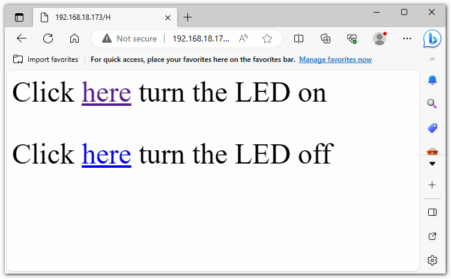

Simple Webserver
===========================

.. raw:: html

   <video loop autoplay muted style = "max-width:100%">
      <source src="../_static/videos/new_feature_projects/wifi.mp4"  type="video/mp4">
      Your browser does not support the video tag.
   </video>

This simple Arduino program is designed to create a basic WiFi web server, allowing users to control the on and off state of an LED on the Arduino board via a web browser.

**Run the Code**

.. note::

    * You can open the file ``01_simple_webserver.ino`` under the path of ``elite-explorer-kit-main\iot_project\01_simple_webserver`` directly.
    * Or copy this code into Arduino IDE.

.. note::
    In the code, SSID and password are stored in ``arduino_secrets.h``. Before uploading this example, you need to modify them with your own WiFi credentials. Additionally, for security purposes, ensure that this information is kept confidential when sharing or storing the code.

.. raw:: html

   <iframe src=https://create.arduino.cc/editor/sunfounder01/7ed8f58d-2ed8-4dc9-82cb-7e49b6977ea1/preview?embed style="height:510px;width:100%;margin:10px 0" frameborder=0></iframe>

After uploading the code, you will be able to see the IP address in the serial monitor. You can enter this IP address in your web browser to turn the onboard LED on/off.

**How it works?**

Here is an explanation of the code:

1. Header Files and Global Variables:

   * ``#include "WiFiS3.h"``: This includes the WiFi library for connecting and managing WiFi. This library is included with Arduino UNO R4 Core, so no additional installation is required.
   * ``#include "arduino_secrets.h"``: This includes sensitive WiFi connection data such as SSID and password.
   * ``ssid``, ``pass``, ``keyIndex``: These are network credentials used for WiFi connection.
   * ``led``, ``status``, ``server``: These define the LED pin, WiFi status, and web server object.

2. ``setup()``:

   * Begin serial communication.
   * Check for the presence of the WiFi module.
   * Check if the WiFi module's firmware version is up-to-date.
   * Attempt to connect to the WiFi network.
   * Start the web server.
   * Print the WiFi status.

3. ``loop()``:

   * Check for new web client connections.
   * If there are client connections, read their incoming HTTP requests.
   * Based on the requests, you can control the on/off state of the LED. For example, if the request is "GET /H," it will turn on the LED; if it's "GET /L," it will turn off the LED.
   * Send an HTTP response to instruct the user on how to control the LED.
   * Disconnect the client.

4. ``printWifiStatus()``:

   * Print the connected WiFi SSID.
   * Print the IP address of the Arduino board.
   * Print the received signal strength.
   * Explain how to view this page in a web browser.
