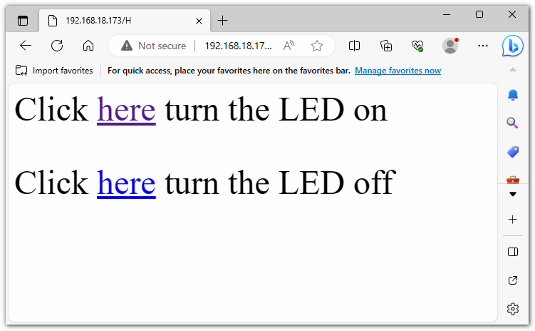

.. note::

    Ciao, benvenuto nella community SunFounder Raspberry Pi & Arduino & ESP32 Enthusiasts su Facebook! Approfondisci Raspberry Pi, Arduino ed ESP32 con altri appassionati.

    **Perché unirsi?**

    - **Supporto Esperto**: Risolvi problemi post-vendita e sfide tecniche con l'aiuto della nostra community e del nostro team.
    - **Impara & Condividi**: Scambia consigli e tutorial per migliorare le tue competenze.
    - **Anteprime Esclusive**: Ottieni l'accesso anticipato agli annunci di nuovi prodotti e anteprime esclusive.
    - **Sconti Speciali**: Goditi sconti esclusivi sui nostri prodotti più recenti.
    - **Promozioni e Concorsi Festivi**: Partecipa a concorsi e promozioni festive.

    👉 Pronto a esplorare e creare con noi? Clicca [|link_sf_facebook|] e unisciti oggi stesso!

Simple Webserver
===========================

.. raw:: html

   <video loop autoplay muted style = "max-width:100%">
      <source src="../_static/videos/new_feature_projects/wifi.mp4"  type="video/mp4">
      Il tuo browser non supporta il tag video.
   </video>

Questo semplice programma Arduino è progettato per creare un server web WiFi di base, permettendo agli utenti di controllare lo stato di accensione e spegnimento di un LED sulla scheda Arduino tramite un browser web.

**Esegui il Codice**

.. note::

    * Puoi aprire il file ``01_simple_webserver.ino`` nel percorso ``elite-explorer-kit-main\iot_project\01_simple_webserver`` direttamente.
    * Oppure copia questo codice nell'IDE Arduino.

.. note::
    Nel codice, SSID e password sono memorizzati in ``arduino_secrets.h``. Prima di caricare questo esempio, devi modificarli con le tue credenziali WiFi. Inoltre, per motivi di sicurezza, assicurati che queste informazioni siano mantenute riservate quando condividi o memorizzi il codice.

.. literalinclude:: /_code/01_iot_webserver_secrets.h
   :language: cpp
   :caption: arduino_secrets.h

.. literalinclude:: /_code/01_iot_webserver.ino
   :language: cpp
   :linenos:
   :caption: 01_simple_webserver.ino

Dopo aver caricato il codice, sarai in grado di vedere l'indirizzo IP nel monitor seriale. Puoi inserire questo indirizzo IP nel tuo browser web per accendere/spegnere il LED integrato.

**Come funziona?**

Ecco una spiegazione del codice:

1. File di Intestazione e Variabili Globali:

   * ``#include "WiFiS3.h"``: Include la libreria WiFi per la connessione e la gestione del WiFi. Questa libreria è inclusa con Arduino UNO R4 Core, quindi non è necessaria un'installazione aggiuntiva.
   * ``#include "arduino_secrets.h"``: Include i dati sensibili di connessione WiFi come SSID e password.
   * ``ssid``, ``pass``, ``keyIndex``: Queste sono le credenziali di rete utilizzate per la connessione WiFi.
   * ``led``, ``status``, ``server``: Definiscono il pin del LED, lo stato del WiFi e l'oggetto del server web.

2. ``setup()``:

   * Inizia la comunicazione seriale.
   * Verifica la presenza del modulo WiFi.
   * Controlla se la versione del firmware del modulo WiFi è aggiornata.
   * Tenta di connettersi alla rete WiFi.
   * Avvia il server web.
   * Stampa lo stato del WiFi.

3. ``loop()``:

   * Controlla nuove connessioni client web.
   * Se ci sono connessioni client, legge le loro richieste HTTP in arrivo.
   * In base alle richieste, puoi controllare lo stato di accensione/spegnimento del LED. Ad esempio, se la richiesta è "GET /H," accenderà il LED; se è "GET /L," spegnerà il LED.
   * Invia una risposta HTTP per istruire l'utente su come controllare il LED.
   * Disconnetti il client.

4. ``printWifiStatus()``:

   * Stampa l'SSID del WiFi connesso.
   * Stampa l'indirizzo IP della scheda Arduino.
   * Stampa l'intensità del segnale ricevuto.
   * Spiega come visualizzare questa pagina in un browser web.

