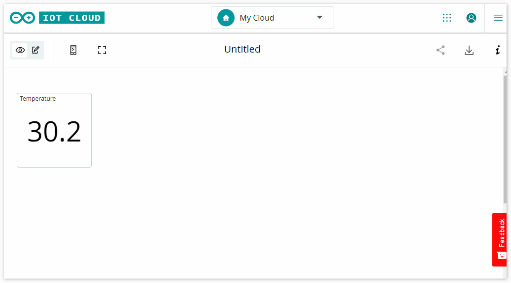
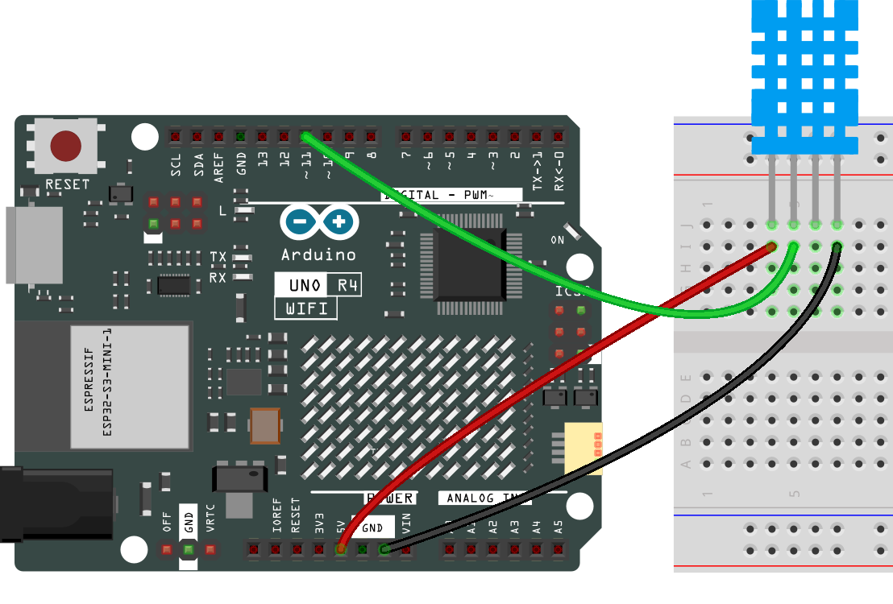
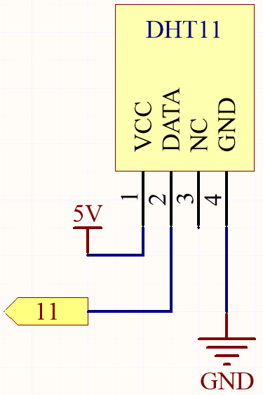

.. note::

    Hello, welcome to the SunFounder Raspberry Pi & Arduino & ESP32 Enthusiasts Community on Facebook! Dive deeper into Raspberry Pi, Arduino, and ESP32 with fellow enthusiasts.

    **Why Join?**

    - **Expert Support**: Solve post-sale issues and technical challenges with help from our community and team.
    - **Learn & Share**: Exchange tips and tutorials to enhance your skills.
    - **Exclusive Previews**: Get early access to new product announcements and sneak peeks.
    - **Special Discounts**: Enjoy exclusive discounts on our newest products.
    - **Festive Promotions and Giveaways**: Take part in giveaways and holiday promotions.

    👉 Ready to explore and create with us? Click [|link_sf_facebook|] and join today!

.. _iot_arduino_cloud:

Arduino IoT Cloud
===========================

This example demonstrates code for communicating with the Arduino IoT Cloud. Its purpose is to connect to the Arduino IoT Cloud and interact with cloud variables. Here, we send the temperature values read from the DHT11 sensor to the Arduino IoT Cloud, allowing us to monitor it from the cloud.

**Required Components**

In this project, we need the following components. 

It's definitely convenient to buy a whole kit, here's the link: 

.. list-table::
    :widths: 20 20 20
    :header-rows: 1

    *   - Name	
        - ITEMS IN THIS KIT
        - LINK
    *   - Elite Explorer Kit
        - 300+
        - |link_Elite_Explorer_kit|

You can also buy them separately from the links below.

.. list-table::
    :widths: 30 20
    :header-rows: 1

    *   - COMPONENT INTRODUCTION
        - PURCHASE LINK

    *   - :ref:`uno_r4_wifi`
        - \-
    *   - :ref:`cpn_breadboard`
        - |link_breadboard_buy|
    *   - :ref:`cpn_wires`
        - |link_wires_buy|
    *   - :ref:`cpn_dht11`
        - |link_humiture_buy|

**Wiring**

.. raw:: html
    
     

**Schematic**

**1. Get Started with Arduino Cloud**

#. Visit the Arduino Cloud 首页， |link_cloud|，你可以点击 **GET STARTED FOR FREE** to have a free plan, which can be upgraded to a number of affordable plans. 如果你没有登录，将会提示需要登录。

   .. image:: img/cloud_get_start.png
      :width: 95%

#. 如果你是第一次登录，将会有个弹窗提示""Start making on Arduino Cloud"， 然后点击**LET'S GET STARTED**.

   .. image:: img/cloud_click_get.png
      :width: 95%

#. 你可以选择已经存在的设备或者是选择一个新设备。

   .. image:: img/cloud_choose_device.png
      :width: 95%

#. 你可以将你的Arduino R4 WiFi板用USB线连接到你的电脑，或者通过蓝牙连接。选择一种连接方式

   .. image:: img/cloud_usb_bluetooth.png
      :width: 95%

#. To use Arduino Cloud effectively, 你需要安装最新的Arduino Cloud Agent， 点击**INSTALL**. 

   .. image:: img/cloud_agent_install.png
      :width: 95%

#. 下载Arduino Cloud Agent

   .. image:: img/cloud_download_agent.png
      :width: 95%

#. 然后到下载的文件夹双击 ``ArduinoCloudAgent-xxx.exe``，按照提示来进行安装。

   .. image:: img/cloud_agent_setup.png
      :width: 95%

#. 当Agent已经安装并打开时，将会提示你关闭这个页面。回到刚才的Arduino Cloud配置页面，将会看到你的设备已经显示在列表上。

   .. image:: img/cloud_com.png
      :width: 95%

#. 点击你的设备，to Updating Your Board for Improved Setup

   .. image:: img/cloud_device_updating.png
      :width: 95%

#. Choose a network from the list. 点击它，并输入密码来连接它。

   .. image:: img/cloud_choose_wifi.png
      :width: 95%

#. 

**Using Arduino IoT Cloud**

1. First, you need to log in or register with Arduino. 

  https://login.arduino.cc/login

2. Once logged in, click on IoT Cloud in the upper right corner.

   .. image:: img/02_iot_cloud_2.png

3. Create a new thing.

   .. image:: img/02_iot_cloud_3.png
  
4. Associate your device.

   .. image:: img/02_iot_cloud_4.png

5. Set up a new device.

   .. image:: img/02_iot_cloud_5.png

6. Choose your Arduino board.
 
   .. image:: img/02_iot_cloud_6.png

7. Wait for a moment, and your UNO R4 WiFi will be detected. Continue by clicking configure.
 
   .. image:: img/02_iot_cloud_7.png

 
8. Give your device a name.

  .. image:: img/02_iot_cloud_8.png

9. Make your device IoT-ready, and remember to save the secret key.

  .. image:: img/02_iot_cloud_9.png

10. Wait for a few minutes.

  .. image:: img/02_iot_cloud_10.png

.. 5. Select Arduino UNO R4 WiFi.

.. .. image:: img/sp231016_164654.png

11. Configure WiFi.

  .. image:: img/02_iot_cloud_11.png

12. Here you will need to enter your WiFi password and secret key.

  .. image:: img/02_iot_cloud_12.png

13. Add a variable.

  .. image:: img/02_iot_cloud_13.png

14. Here, we want to display the temperature in IoT Cloud, so we configure a read-only float variable.

  .. image:: img/02_iot_cloud_14.png

15. After completion, go to the sketch.

  .. image:: img/02_iot_cloud_15.png

16. Open the full editor.

  .. image:: img/02_iot_cloud_16.png

17. Click on Libraries on the right side, then Library Manager.

  .. image:: img/02_iot_cloud_17.png

18. Search for the DHT sensor library and check it.

  .. image:: img/02_iot_cloud_18.png

19. Now, we need to edit the code. You can see that the editor has already prepared the IoT Cloud-related code for you. You just need to add the specific functionality you need. In this example, we added code to read the temperature using the DHT11 sensor.

  .. code-block::
      :emphasize-lines: 1,2,3,22,23,24,32,55,56
  
      // DHT sensor library - Version: Latest 
      #include <DHT.h>
      #include <DHT_U.h>
  
      /* 
      Sketch generated by the Arduino IoT Cloud Thing "Untitled"
      https://create.arduino.cc/cloud/things/260edac8-34f9-4e2e-9214-ba0c20994220 
  
      Arduino IoT Cloud Variables description
  
      The following variables are automatically generated and updated when changes are made to the Thing
  
      float temperature;
  
      Variables which are marked as READ/WRITE in the Cloud Thing will also have functions
      which are called when their values are changed from the Dashboard.
      These functions are generated with the Thing and added at the end of this sketch.
      */
  
      #include "thingProperties.h"
  
      #define DHTPIN 11     
      #define DHTTYPE DHT11 
      DHT dht(DHTPIN, DHTTYPE);
  
      void setup() {
          // Initialize serial and wait for port to open:
          Serial.begin(9600);
          // This delay gives the chance to wait for a Serial Monitor without blocking if none is found
          delay(1500); 
  
          dht.begin();
  
          // Defined in thingProperties.h
          initProperties();
  
          // Connect to Arduino IoT Cloud
          ArduinoCloud.begin(ArduinoIoTPreferredConnection);
          
          /*
              The following function allows you to obtain more information
              related to the state of network and IoT Cloud connection and errors
              the higher number the more granular information you’ll get.
              The default is 0 (only errors).
              Maximum is 4
          */
          setDebugMessageLevel(2);
          ArduinoCloud.printDebugInfo();
      }
  
      void loop() {
          ArduinoCloud.update();
          // Your code here 
          
          float temp = dht.readTemperature();  
          temperature = temp;
          
      }
 
20. Upload the code. You may be prompted to update; follow the prompts to complete.

  .. image:: img/02_iot_cloud_20.png

21. Return to IoT CLOUD.

  .. image:: img/02_iot_cloud_21.png

22. Click on the menu in the top left corner.
  
  .. image:: img/02_iot_cloud_22.png

23. Click on the dashboard.
  
  .. image:: img/02_iot_cloud_23.png

24. Create dashboard.
  
  .. image:: img/02_iot_cloud_24.png

25. There are many widgets available; here, we choose a value widget for displaying the temperature.

  .. image:: img/02_iot_cloud_25.png

26. After clicking, a widget settings interface will appear, where you can connect the widget to the cloud variable you created earlier.

  .. image:: img/02_iot_cloud_26.png

27. Now, you can view the sensor readings on Arduino IoT Cloud.

  .. image:: img/02_iot_cloud_27.png

**How it works?**

After configuring the IoT Cloud (device setup, network setup, creating cloud variables), you will notice that the sketch on the cloud updates automatically. So, most of the code is already written for you.

Open the editor, and you will see that this sketch contains four files:

``main.ino``: Used to initialize the Arduino and perform the main loop tasks. Additionally, it includes logic for connecting and communicating with the Arduino IoT Cloud.

``thingProperties.h``: This file is used to define variables and functions in the Arduino IoT Cloud. It contains declarations of cloud variables and their associated callback functions. In the provided code, it is used to initialize cloud properties (e.g., the temperature variable) and connect to the Arduino IoT Cloud.

``Secret``: Used to store sensitive or private information, such as WiFi passwords or API keys. This sensitive information is typically not exposed directly in the code but is stored in the Secret file to enhance security.

``ReadMe.adoc``: Contains project documentation or other relevant information for easier understanding and use of the project. This file usually does not contain executable code but rather documents and descriptive information.

We need to add some code for the DHT11 sensor. This code is identical to what you would use on your local IDE. The only difference is that you need to assign the value read from the DHT11 to the cloud variable ``temperature``.

(Note: You should never modify ``thingProperties.h`` and ``Secret``. They will be modified when you make changes using the Thing editor.)
