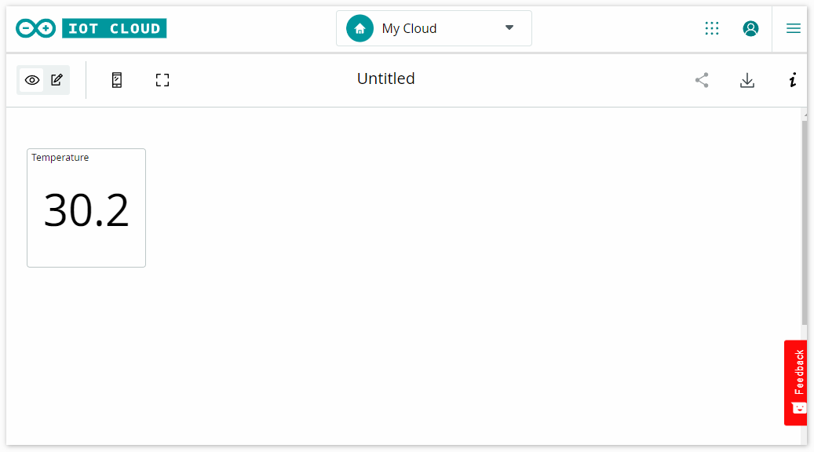
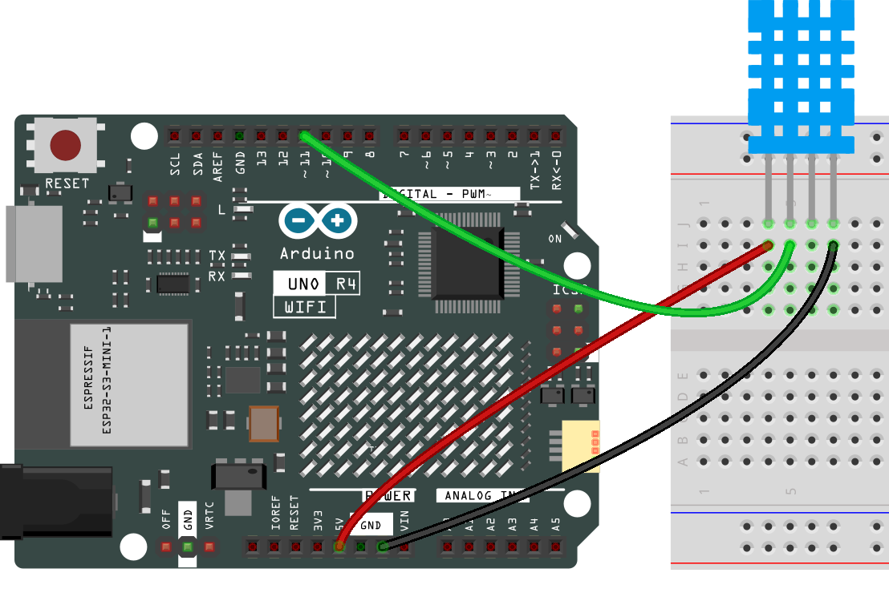

.. note::

    こんにちは、SunFounderのRaspberry Pi & Arduino & ESP32愛好家コミュニティへようこそ！Facebook上でRaspberry Pi、Arduino、ESP32についてもっと深く掘り下げ、他の愛好家と交流しましょう。

    **参加する理由は？**

    - **エキスパートサポート**：コミュニティやチームの助けを借りて、販売後の問題や技術的な課題を解決します。
    - **学び＆共有**：ヒントやチュートリアルを交換してスキルを向上させましょう。
    - **独占的なプレビュー**：新製品の発表や先行プレビューに早期アクセスしましょう。
    - **特別割引**：最新製品の独占割引をお楽しみください。
    - **祭りのプロモーションとギフト**：ギフトや祝日のプロモーションに参加しましょう。

    👉 私たちと一緒に探索し、創造する準備はできていますか？[|link_sf_facebook|]をクリックして今すぐ参加しましょう！

.. _iot_arduino_cloud:

Arduino IoTクラウド
===========================

この例は、Arduino IoTクラウドとの通信に関するコードをデモンストレーションしています。その目的は、Arduino IoTクラウドに接続し、クラウド変数とのやり取りを行うことです。ここでは、DHT11センサーから読み取った温度値をArduino IoTクラウドに送信し、クラウドからモニタリングすることができます。

**必要なコンポーネント**

このプロジェクトには以下のコンポーネントが必要です。

全体のキットを購入すると便利です。こちらがリンクです：

.. list-table::
    :widths: 20 20 20
    :header-rows: 1

    *   - 名称	
        - このキットのアイテム数
        - リンク
    *   - Elite Explorer Kit
        - 300+
        - |link_Elite_Explorer_kit|

以下のリンクから別々に購入することもできます。

.. list-table::
    :widths: 30 20
    :header-rows: 1

    *   - コンポーネント紹介
        - 購入リンク

    *   - :ref:`uno_r4_wifi`
        - \-
    *   - :ref:`cpn_breadboard`
        - |link_breadboard_buy|
    *   - :ref:`cpn_wires`
        - |link_wires_buy|
    *   - :ref:`cpn_dht11`
        - |link_humiture_buy|

**配線図**

.. raw:: html
    
     

**回路図**

.. image:: img/02_arduino_iot_cloud_schematic.png
  :width: 40%
  :align: center

**Arduino Create Agentのインストール**

1. https://create.arduino.cc/getting-started/plugin/welcome にアクセスします。

2. STARTをクリックします。

  .. image:: img/02_install_agent_2.png
     :width: 95%

3. お使いのコンピュータに適したバージョンを選び、インストールパッケージがダウンロードされます。

  .. image:: img/02_install_agent_3.png
     :width: 95%

4. エージェントをインストールします。

  .. image:: img/02_install_agent_4.png
    :width: 85%

5. インストール後、ブラウザに戻ると、次のインターフェイスが表示されます。

  .. image:: img/02_install_agent_5.png
     :width: 95%

6. NEXTをクリックし、ウェブエディタに進むことができます。

  .. image:: img/02_install_agent_6.png
     :width: 95%

**Arduino IoTクラウドの使用**

1. まず、Arduinoにログインするか登録する必要があります。

  https://login.arduino.cc/login

2. ログインしたら、右上のIoT Cloudをクリックします。

   .. image:: img/02_iot_cloud_2.png

3. 新しい「thing」を作成します。

   .. image:: img/02_iot_cloud_3.png
  
4. デバイスを関連付けます。

   .. image:: img/02_iot_cloud_4.png

5. 新しいデバイスを設定します。

   .. image:: img/02_iot_cloud_5.png

6. Arduinoボードを選択します。
 
   .. image:: img/02_iot_cloud_6.png

7. 少し待ち、UNO R4 WiFiが検出されると、設定をクリックして続行します。
 
   .. image:: img/02_iot_cloud_7.png

 
8. デバイスに名前を付けます。

  .. image:: img/02_iot_cloud_8.png

9. デバイスをIoT対応にし、シークレットキーを保存しておいてください。

  .. image:: img/02_iot_cloud_9.png

10. 数分待ちます。

  .. image:: img/02_iot_cloud_10.png

.. 5. Arduino UNO R4 WiFiを選択します。

.. .. image:: img/sp231016_164654.png

11. WiFiを設定します。

  .. image:: img/02_iot_cloud_11.png

12. ここでWiFiのパスワードとシークレットキーを入力する必要があります。

  .. image:: img/02_iot_cloud_12.png

13. 変数を追加します。

  .. image:: img/02_iot_cloud_13.png

14. ここでは、IoT Cloudに温度を表示したいので、読み取り専用のfloat変数を設定します。

  .. image:: img/02_iot_cloud_14.png

15. 完了したら、スケッチに進みます。

  .. image:: img/02_iot_cloud_15.png

16. フルエディターを開きます。

  .. image:: img/02_iot_cloud_16.png

17. 右側のライブラリをクリックし、次にライブラリマネージャーをクリックします。

  .. image:: img/02_iot_cloud_17.png

18. DHTセンサーライブラリを検索し、チェックします。

  .. image:: img/02_iot_cloud_18.png

19. 今、コードを編集する必要があります。エディターは既にIoT Cloud関連のコードを用意しています。必要な特定の機能を追加するだけです。この例では、DHT11センサーを使用して温度を読み取るコードを追加しました。

  .. code-block::
      :emphasize-lines: 1,2,3,22,23,24,32,55,56
  
      // DHT sensor library - Version: Latest 
      #include <DHT.h>
      #include <DHT_U.h>
  
      /* 
      Sketch generated by the Arduino IoT Cloud Thing "Untitled"
      https://create.arduino.cc/cloud/things/260edac8-34f9-4e2e-9214-ba0c20994220 
  
      Arduino IoT Cloud Variables description
  
      The following variables are automatically generated and updated when changes are made to the Thing
  
      float temperature;
  
      Variables which are marked as READ/WRITE in the Cloud Thing will also have functions
      which are called when their values are changed from the Dashboard.
      These functions are generated with the Thing and added at the end of this sketch.
      */
  
      #include "thingProperties.h"
  
      #define DHTPIN 11     
      #define DHTTYPE DHT11 
      DHT dht(DHTPIN, DHTTYPE);
  
      void setup() {
          // Initialize serial and wait for port to open:
          Serial.begin(9600);
          // This delay gives the chance to wait for a Serial Monitor without blocking if none is found
          delay(1500); 
  
          dht.begin();
  
          // Defined in thingProperties.h
          initProperties();
  
          // Connect to Arduino IoT Cloud
          ArduinoCloud.begin(ArduinoIoTPreferredConnection);
          
          /*
              The following function allows you to obtain more information
              related to the state of network and IoT Cloud connection and errors
              the higher number the more granular information you’ll get.
              The default is 0 (only errors).
              Maximum is 4
          */
          setDebugMessageLevel(2);
          ArduinoCloud.printDebugInfo();
      }
  
      void loop() {
          ArduinoCloud.update();
          // Your code here 
          
          float temp = dht.readTemperature();  
          temperature = temp;
          
      }
 
20. コードをアップロードします。更新を促されることがありますので、指示に従って完了させてください。

  .. image:: img/02_iot_cloud_20.png

21. IoT CLOUDに戻ります。

  .. image:: img/02_iot_cloud_21.png

22. 左上のメニューをクリックします。
  
  .. image:: img/02_iot_cloud_22.png

23. ダッシュボードをクリックします。
  
  .. image:: img/02_iot_cloud_23.png

24. ダッシュボードを作成します。
  
  .. image:: img/02_iot_cloud_24.png

25. 多くのウィジェットが利用可能ですが、ここでは温度表示用の値ウィジェットを選択します。

  .. image:: img/02_iot_cloud_25.png

26. クリックすると、ウィジェット設定インターフェイスが表示され、以前に作成したクラウド変数にウィジェットを接続できます。

  .. image:: img/02_iot_cloud_26.png

27. これで、Arduino IoTクラウドでセンサーの読み取り値を表示できます。

  .. image:: img/02_iot_cloud_27.png

**どのように動作するのか？**

IoTクラウド（デバイスの設定、ネットワークの設定、クラウド変数の作成）を設定すると、クラウド上のスケッチが自動的に更新されることに気付くでしょう。そのため、ほとんどのコードはすでに書かれています。

エディタを開くと、このスケッチには4つのファイルが含まれていることがわかります：

``main.ino``：Arduinoを初期化し、メインループタスクを実行するために使用されます。また、Arduino IoTクラウドとの接続と通信のロジックが含まれています。

``thingProperties.h``：このファイルは、Arduino IoTクラウド内の変数や関数を定義するために使用されます。クラウド変数とそれに関連するコールバック関数の宣言が含まれています。提供されたコードでは、クラウドプロパティの初期化（例：温度変数）およびArduino IoTクラウドへの接続に使用されます。

``Secret``：WiFiパスワードやAPIキーなどの機密情報やプライベート情報を保存するために使用されます。この機密情報は通常、コード内に直接露出されることはなく、セキュリティ向上のためにSecretファイルに保存されます。

``ReadMe.adoc``：プロジェクトの理解と使用を容易にするためのプロジェクト文書やその他の関連情報が含まれています。このファイルは通常、実行可能なコードを含むのではなく、ドキュメントや説明情報を含んでいます。

DHT11センサー用のコードを追加する必要があります。このコードは、ローカルIDEで使用するコードと同じです。唯一の違いは、DHT11から読み取った値をクラウド変数 ``temperature`` に割り当てる必要があることです。

（注： ``thingProperties.h`` と ``Secret`` を変更してはいけません。これらは、Thingエディタを使用して変更を加えるときに修正されます。）

