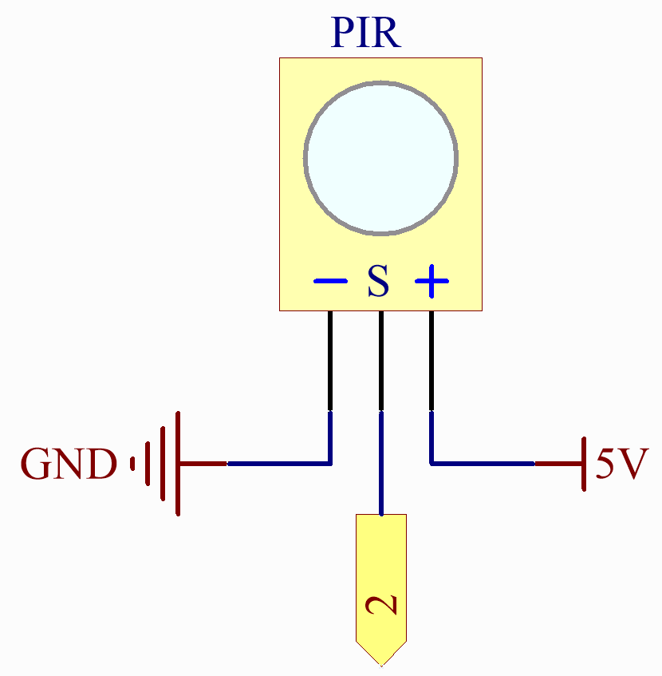

.. note::

    Bonjour, bienvenue dans la communauté des passionnés de SunFounder Raspberry Pi, Arduino et ESP32 sur Facebook ! Plongez dans l'univers du Raspberry Pi, Arduino et ESP32 avec d'autres passionnés.

    **Pourquoi nous rejoindre ?**

    - **Support d'experts** : Résolvez les problèmes après-vente et les défis techniques avec l'aide de notre communauté et de notre équipe.
    - **Apprendre et partager** : Échangez des astuces et des tutoriels pour améliorer vos compétences.
    - **Aperçus exclusifs** : Accédez en avant-première aux annonces de nouveaux produits et aux avant-premières.
    - **Réductions exclusives** : Profitez de réductions exclusives sur nos produits les plus récents.
    - **Promotions festives et cadeaux** : Participez à des concours et des promotions festives.

    👉 Prêt à explorer et créer avec nous ? Cliquez sur [|link_sf_facebook|] et rejoignez-nous dès aujourd'hui !

Système de Sécurité via IFTTT
============================================

.. raw:: html

   <video loop autoplay muted style = "max-width:100%">
      <source src="../_static/videos/iot_projects/03_iot_security_alert.mp4" type="video/mp4">
      Your browser does not support the video tag.
   </video>

Avec ce projet, nous créons un dispositif de sécurité utilisant un capteur PIR pour détecter les intrus ou les animaux errants entrant chez vous. En cas de violation, vous recevrez une alerte par email.

Nous utiliserons Webhooks comme service fondamental. Une requête POST est envoyée au service IFTTT depuis UNO R4.

**Composants nécessaires**

Pour ce projet, nous avons besoin des composants suivants.

Il est définitivement pratique d'acheter un kit complet, voici le lien :

.. list-table::
    :widths: 20 20 20
    :header-rows: 1

    *   - Nom	
        - ARTICLES DANS CE KIT
        - LIEN
    *   - Elite Explorer Kit
        - 300+
        - |link_Elite_Explorer_kit|

Vous pouvez également les acheter séparément à partir des liens ci-dessous.

.. list-table::
    :widths: 30 20
    :header-rows: 1

    *   - INTRODUCTION DU COMPOSANT
        - LIEN D'ACHAT

    *   - :ref:`uno_r4_wifi`
        - \-
    *   - :ref:`cpn_wires`
        - |link_wires_buy|
    *   - :ref:`cpn_pir`
        - |link_pir_buy|

**Câblage**

.. image:: img/03-ifttt_pir_bb.png
    :width: 90%
    :align: center

**Schéma**

**Configuration de IFTTT**

IFTTT est un service gratuit qui offre diverses méthodes pour lier différents services de données ensemble.

Créons un Applet qui répond à un webhook (URL personnalisée) envoyant des données à IFTTT, qui vous enverra ensuite un email.

Veuillez suivre les étapes ci-dessous sur IFTTT.

1. Visitez |link_ifttt| pour vous connecter ou créer un compte.

   .. image:: img/03_ifttt_1.png
       :width: 90%

2. Cliquez sur **Create**.

   .. image:: img/03_ifttt_2.png
       :width: 90%

3. Ajoutez un événement **If This**.

   .. image:: img/03_ifttt_3.png
       :width: 70%

4. Recherchez **Webhooks**.

   .. image:: img/03_ifttt_4.png
       :width: 70%

5. Sélectionnez **Receive a web request**.

   .. image:: img/03_ifttt_5.png
       :width: 90%

6. Remplissez le nom de l'événement (par exemple, SecurityWarning), et cliquez sur **Create trigger**.

   .. image:: img/03_ifttt_6.png
       :width: 70%

7. Ajoutez un événement **Then That**.

   .. image:: img/03_ifttt_7.png
       :width: 70%

8. Recherchez Email.

   .. image:: img/03_ifttt_8.png
       :width: 80%

9. Choisissez **Send me an email**.

   .. image:: img/03_ifttt_9.png
       :width: 80%

10. Entrez le **Sujet** et le **Corps**, puis cliquez sur **Create action**.

   .. image:: img/03_ifttt_10.png
       :width: 70%

11. Cliquez sur **Continue** pour terminer la configuration.

   .. image:: img/03_ifttt_11.png
       :width: 70%

12. Ajustez le nom du titre si nécessaire.

   .. image:: img/03_ifttt_12.png
       :width: 80%

13. Vous serez automatiquement redirigé vers la page de détails de l'Applet, où vous pourrez voir que l'Applet est actuellement connecté et vous pourrez basculer l'interrupteur pour l'activer/désactiver.

   .. image:: img/03_ifttt_13.png
       :width: 70%

14. Maintenant que nous avons créé l'Applet IFTTT, nous avons également besoin de la clé webhooks, qui peut être obtenue sur |link_webhooks| pour permettre à votre appareil d'accéder à IFTTT.

   .. image:: img/03_ifttt_14.png

15. Copiez la clé webhooks dans "arduino_secrets.h" et remplissez votre SSID et mot de passe.

    .. code-block:: arduino
    
        #define SECRET_SSID "your_ssid"        // votre SSID de réseau (nom)
        #define SECRET_PASS "your_password"        // votre mot de passe de réseau (utilisé pour WPA, ou comme clé pour WEP)
        #define WEBHOOKS_KEY "your_key"

**Exécuter le Code**

.. note::

    * Vous pouvez ouvrir le fichier ``03_ifttt_pir.ino`` sous le chemin ``elite-explorer-kit-main\iot_project\03_ifttt_pir`` directement.
    * Ou copier ce code dans Arduino IDE.

.. note::
    Dans le code, SSID et mot de passe sont stockés dans ``arduino_secrets.h``. Avant de télécharger cet exemple, vous devez les modifier avec vos propres identifiants WiFi. De plus, pour des raisons de sécurité, assurez-vous que ces informations restent confidentielles lors du partage ou du stockage du code.

.. warning::
   Pour éviter que votre boîte aux lettres ne soit inondée, veuillez déboguer le :ref:`cpn_pir` au préalable avant d'exécuter le code pour ce projet.

.. raw:: html

   <iframe src=https://create.arduino.cc/editor/sunfounder01/adec1608-4642-4469-bdf4-8dc3e3e4ce4d/preview?embed style="height:510px;width:100%;margin:10px 0" frameborder=0></iframe>
 
**Comment ça fonctionne ?**

1. Inclure les bibliothèques et fichiers d'en-tête nécessaires :

   * ``"WiFiS3.h"`` : Utilisé pour gérer les connexions Wi-Fi.
   * ``"arduino_secrets.h"`` : Contient le nom du réseau Wi-Fi et le mot de passe pour protéger les informations sensibles.

2. Définir quelques variables globales et constantes :

   * ``ssid`` : Nom du réseau Wi-Fi.
   * ``pass`` : Mot de passe du réseau Wi-Fi.
   * ``status`` : État de la connexion Wi-Fi.
   * ``client`` : Client utilisé pour communiquer avec le serveur Wi-Fi.
   * ``server`` : Adresse du serveur Webhook IFTTT.
   * ``event`` : Nom de l'événement Webhook IFTTT.
   * ``webRequestURL`` : URL construite pour envoyer des requêtes HTTP, incluant le nom de l'événement Webhook et la clé.
   * ``pirPin`` : Broche numérique à laquelle le capteur PIR est connecté.
   * ``motionDetected`` : Variable indicatrice pour suivre la détection de mouvement.

3. Fonction ``setup()`` :

   * Initialise la communication série.
   * Vérifie la présence du module Wi-Fi et affiche sa version de firmware.
   * Tente de se connecter au réseau Wi-Fi, avec des tentatives de réessai en cas d'échec.
   * Définit la broche connectée au capteur PIR en mode entrée.

4. Fonction ``readResponse()`` :

   * Lit les données de réponse HTTP du serveur IFTTT et les affiche sur la console série.

5. Fonction ``loop()`` :

   * Appelle la fonction ``readResponse()`` pour lire les données de réponse HTTP.
   * Vérifie les mouvements à l'aide du capteur PIR. Si un mouvement est détecté et qu'il n'était pas détecté auparavant :
       * Affiche "Mouvement détecté !" sur la console.
       * Appelle la fonction ``triggerIFTTTEvent()`` pour envoyer une requête HTTP au serveur IFTTT, déclenchant l'événement Webhook.
       * Définit la variable ``motionDetected`` à ``true`` pour indiquer qu'un mouvement a été détecté.
   * Si aucun mouvement n'est détecté, définit la variable ``motionDetected`` à ``false``.

6. Fonction ``triggerIFTTTEvent()`` :

   * Établit une connexion avec le serveur IFTTT.
   * Envoie une requête HTTP GET, incluant l'URL de l'événement Webhook et d'autres en-têtes HTTP.

7. Fonction ``printWifiStatus()`` :

   * Affiche les informations sur le réseau Wi-Fi connecté, incluant le SSID, l'adresse IP et la force du signal (RSSI) sur la console série.

