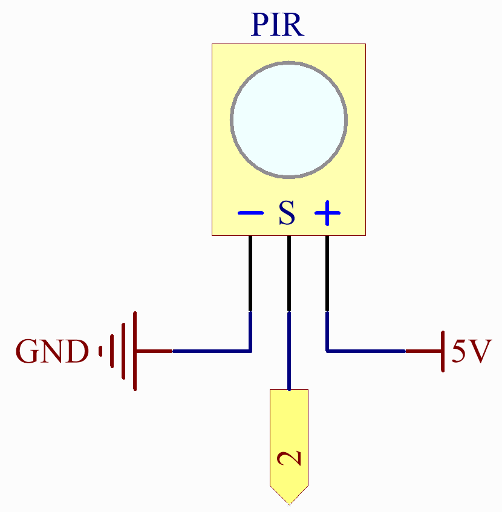

.. _iot_security_system_ifttt:

基于 IFTTT 的安全系统
============================================

.. raw:: html

   <video loop autoplay muted style = "max-width:100%">
      <source src="../_static/videos/iot_projects/03_iot_security_alert.mp4"  type="video/mp4">
      Your browser does not support the video tag.
   </video>

通过这个项目，我们创建了一个安全设备，使用 PIR 传感器检测进入您家中的入侵者或流浪动物。如果发生入侵，您将收到一封电子邮件警报。

我们将使用 Webhooks 作为基础服务。从 UNO R4 向 IFTTT 的服务发送一个 POST 请求。

**所需元件**

在这个项目中，我们需要以下元件。

购买整套套件会更方便，以下是链接：

.. list-table::
    :widths: 20 20 20
    :header-rows: 1

    *   - 名称
        - 套件所含项目
        - 链接
    *   - Elite Explorer 套件
        - 300+
        - |link_Elite_Explorer_kit|

您也可以从下面的链接单独购买。

.. list-table::
    :widths: 30 20
    :header-rows: 1

    *   - 元件介绍
        - 购买链接

    *   - :ref:`uno_r4_wifi`
        - \-
    *   - :ref:`cpn_wires`
        - |link_wires_buy|
    *   - :ref:`cpn_pir`
        - |link_pir_buy|

**接线**

.. image:: img/03-ifttt_pir_bb.png
    :width: 90%
    :align: center

**原理图**

**设置 IFTTT**

IFTTT 是一项免费服务，提供多种方法将不同的数据服务链接在一起。

让我们创建一个 Applet，响应 webhook（自定义 URL）将数据发送到 IFTTT，然后 IFTTT 将向您发送一封电子邮件。

请按照以下步骤在 IFTTT 上进行操作。

1. 访问 |link_ifttt| 登录或创建帐户。

   .. image:: img/03_ifttt_1.png
       :width: 90%

2. 点击 **Create** 。

   .. image:: img/03_ifttt_2.png
       :width: 90%

3. 添加一个 **If This** 事件。

   .. image:: img/03_ifttt_3.png
       :width: 70%

4. 搜索 **Webhooks** 。

   .. image:: img/03_ifttt_4.png
       :width: 70%

5. 选择 **Receive a web request** 。

   .. image:: img/03_ifttt_5.png
       :width: 90%

6. 填写事件名称（例如 SecurityWarning），然后点击 **Create trigger** 。

   .. image:: img/03_ifttt_6.png
       :width: 70%

7. 添加一个 **Then That** 事件。

   .. image:: img/03_ifttt_7.png
       :width: 70%

8. 搜索 Email。

   .. image:: img/03_ifttt_8.png
       :width: 80%

9. 选择 **Send me an email** 。

   .. image:: img/03_ifttt_9.png
       :width: 80%

10. 输入 **Subject ** 和 **Body ** ，然后点击 **Create action** 。

   .. image:: img/03_ifttt_10.png
       :width: 70%

11. 点击 **Continue** 完成设置。

   .. image:: img/03_ifttt_11.png
       :width: 70%

12. 根据需要调整标题名称。

   .. image:: img/03_ifttt_12.png
       :width: 80%

13. 您将自动重定向到 Applet 详情页面，在该页面可以看到 Applet 当前已连接，您可以切换开关以启用/禁用它。

   .. image:: img/03_ifttt_13.png
       :width: 70%

14. 现在我们已经创建了 IFTTT Applet，我们还需要 webhooks 密钥，可以从 |link_webhooks| 获取，以便您的设备访问 IFTTT。

   .. image:: img/03_ifttt_14.png

15. 将 webhooks 密钥复制到 "arduino_secrets.h"，并填写您的 SSID 和密码。

    .. code-block:: arduino

        #define SECRET_SSID "your_ssid"        // your network SSID (name)
        #define SECRET_PASS "your_password"        // your network password (used for WPA, or as a key for WEP)
        #define WEBHOOKS_KEY "your_key"

**运行代码**

.. note::

    * 您可以直接打开路径 ``elite-explorer-kit-main\iot_project\03_ifttt_pir`` 下的 ``03_ifttt_pir.ino`` 文件。
    * 或者将这段代码复制到 Arduino IDE 中。

.. note::
    在代码中，SSID 和密码存储在 ``arduino_secrets.h`` 中。上传此示例之前，您需要使用自己的 WiFi 凭据修改它们。此外，出于安全目的，在共享或存储代码时请确保此信息保密。

.. warning::
   为了防止您的邮箱被大量邮件淹没，请在运行该项目的代码之前先调试好 :ref:`cpn_pir` 。

.. literalinclude:: /_code/03_iot_security_alert_secrets.h
   :language: cpp
   :caption: arduino_secrets.h

.. literalinclude:: /_code/03_iot_security_alert.ino
   :language: cpp
   :linenos:
   :caption: 03_ifttt_pir.ino

**工作原理**

1. 包含必要的库和头文件：

   * ``"WiFiS3.h"``：用于管理 Wi-Fi 连接。
   * ``"arduino_secrets.h"``：包含 Wi-Fi 网络名称和密码，以保护敏感信息。

2. 定义一些全局变量和常量：

   * ``ssid``：Wi-Fi 网络的名称。
   * ``pass``：Wi-Fi 网络密码。
   * ``status``：Wi-Fi 连接的状态。
   * ``client``：用于与 Wi-Fi 服务器通信的客户端。
   * ``server``：IFTTT Webhook 服务器的地址。
   * ``event``：IFTTT Webhook 事件的名称。
   * ``webRequestURL``：构建的用于发送 HTTP 请求的 URL，包含 Webhook 事件名称和密钥。
   * ``pirPin``：连接到 PIR 传感器的数字引脚。
   * ``motionDetected``：用于跟踪运动检测的标志变量。

3. ``setup()`` 函数：

   * 初始化串行通信。
   * 检查 Wi-Fi 模块是否存在并输出其固件版本。
   * 尝试连接到 Wi-Fi 网络，如果不成功则重试。
   * 将连接到 PIR 传感器的引脚设置为输入模式。

4. ``readResponse()`` 函数：

   * 从 IFTTT 服务器读取 HTTP 响应数据并将其打印到串行控制台。

5. ``loop()`` 函数：

   * 调用 ``readResponse()`` 函数读取 HTTP 响应数据。
   * 使用 PIR 传感器检查是否检测到运动。如果检测到运动且之前未检测到：
       * 在控制台打印 "Motion detected!"。
       * 调用 ``triggerIFTTTEvent()`` 函数向 IFTTT 服务器发送 HTTP 请求，触发 Webhook 事件。
       * 将 ``motionDetected`` 标志设置为 ``true``，表示已检测到运动。
   * 如果未检测到运动，则将 ``motionDetected`` 标志设置为 ``false``。

6. ``triggerIFTTTEvent()`` 函数：

   * 与 IFTTT 服务器建立连接。
   * 发送 HTTP GET 请求，包含 Webhook 事件的 URL 和其他 HTTP 头。

7. ``printWifiStatus()`` 函数：

   * 将已连接 Wi-Fi 网络的信息（包括 SSID、IP 地址和信号强度 (RSSI)）输出到串行控制台。
