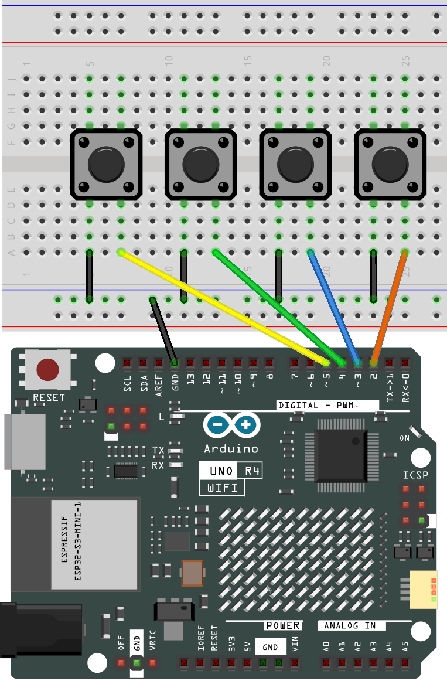
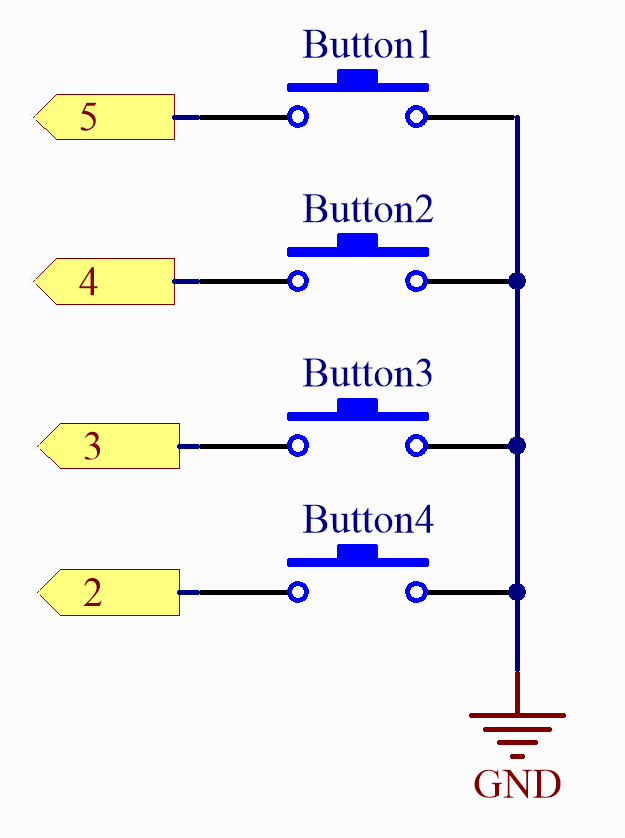

.. _iot_mqtt_publish:

Cloud-Anrufsystem mit MQTT
============================================

.. raw:: html

   <video loop autoplay muted style = "max-width:100%">
      <source src="../_static/videos/iot_projects/04_iot_mqtt_callling.mp4" type="video/mp4">
      Ihr Browser unterstützt das Video-Tag nicht.
   </video>

Message Queuing Telemetry Transport (MQTT) ist ein einfaches Messaging-Protokoll und das am weitesten verbreitete in der Welt des Internet of Things (IoT).

MQTT-Protokolle definieren, wie IoT-Geräte Daten austauschen. Sie funktionieren ereignisgesteuert und sind über das Publish/Subscribe-Modell miteinander verbunden. Der Sender (Publisher) und der Empfänger (Subscriber) kommunizieren über Themen. Ein Gerät veröffentlicht eine Nachricht zu einem bestimmten Thema, und alle Geräte, die dieses Thema abonniert haben, erhalten die Nachricht.

In diesem Abschnitt erstellen wir ein Serviceklingelsystem mit UNO R4, HiveMQ (einem kostenlosen öffentlichen MQTT-Broker-Dienst) und vier Tasten. Jede der vier Tasten entspricht einem Restauranttisch, und wenn ein Kunde eine Taste drückt, können Sie auf HiveMQ sehen, welcher Tisch bedient werden muss.

**Benötigte Komponenten**

Für dieses Projekt benötigen wir die folgenden Komponenten.

Es ist definitiv praktisch, ein ganzes Kit zu kaufen, hier ist der Link:

.. list-table::
    :widths: 20 20 20
    :header-rows: 1

    *   - Name	
        - ARTIKEL IN DIESEM KIT
        - LINK
    *   - Elite Explorer Kit
        - 300+
        - |link_Elite_Explorer_kit|

Sie können sie auch separat über die untenstehenden Links kaufen.

.. list-table::
    :widths: 30 20
    :header-rows: 1

    *   - KOMPONENTENBESCHREIBUNG
        - KAUF-LINK

    *   - :ref:`uno_r4_wifi`
        - \-
    *   - :ref:`cpn_breadboard`
        - |link_breadboard_buy|
    *   - :ref:`cpn_wires`
        - |link_wires_buy|
    *   - :ref:`cpn_button`
        - |link_button_buy|

**Verdrahtung**

**Schaltplan**

**Wie funktioniert des?**

HiveMQ ist ein MQTT-Broker und eine auf Client-Nachrichten basierende Plattform, die schnelle, effiziente und zuverlässige Datenübertragungen zu IoT-Geräten ermöglicht.

1. Öffnen Sie |link_hivemq| in Ihrem Webbrowser.

2. Verbinden Sie den Client mit dem standardmäßigen öffentlichen Proxy.

   .. image:: img/04_mqtt_1.png

3. Klicken Sie auf **Add New Topic Subscription**.

   .. image:: img/04_mqtt_2.png

4. Geben Sie die Themen ein, denen Sie folgen möchten, und klicken Sie auf **Subscribe**. Stellen Sie sicher, dass die von Ihnen festgelegten Themen einzigartig sind, um Nachrichten von anderen Benutzern zu vermeiden, und achten Sie auf Groß- und Kleinschreibung. 

   In diesem Beispielcode haben wir das Thema als ``SunFounder MQTT Test`` festgelegt. Wenn Sie Änderungen vorgenommen haben, stellen Sie sicher, dass das Thema im Code mit dem auf der Webseite abonnierten Thema übereinstimmt.

   .. image:: img/04_mqtt_3.png

**Bibliothek installieren**

Um die Bibliothek zu installieren, verwenden Sie den Arduino Library Manager und suchen Sie nach „ArduinoMqttClient“, um sie zu installieren.

``ArduinoMqttClient.h``: Wird für die MQTT-Kommunikation verwendet.

**Code ausführen**

.. note::

    * Sie können die Datei ``04_mqtt_button.ino`` direkt unter dem Pfad ``elite-explorer-kit-main\iot_project\04_mqtt_button`` öffnen.
    * Oder kopieren Sie diesen Code in die Arduino IDE.

.. note::
    Im Code werden SSID und Passwort in ``arduino_secrets.h`` gespeichert. Bevor Sie dieses Beispiel hochladen, müssen Sie sie mit Ihren eigenen WLAN-Anmeldeinformationen ändern. Außerdem sollten Sie aus Sicherheitsgründen diese Informationen vertraulich halten, wenn Sie den Code teilen oder speichern.

.. raw:: html

   <iframe src=https://create.arduino.cc/editor/sunfounder01/7a4acdf8-beed-47d4-ada8-cbaab0f3477f/preview?embed style="height:510px;width:100%;margin:10px 0" frameborder=0></iframe>

Nachdem Sie den Code ausgeführt haben, gehen Sie zurück zu |link_hivemq|, und wenn Sie einen der Tasten auf dem Breadboard drücken, sehen Sie die Nachrichtenaufforderung auf HiveMQ.

    .. image:: img/04_mqtt_4.png
  
**Wie funktioniert des?**

Dieser Code ist für ein Arduino-basiertes Projekt, das sich mit Wi-Fi verbindet und über das MQTT-Protokoll mit einem MQTT-Broker kommuniziert. Zusätzlich kann es erkennen, ob vier Tasten gedrückt werden, und sendet die entsprechenden Nachrichten an den MQTT-Broker.

Hier ist eine detaillierte Erklärung des Codes:

1. **Einschließen relevanter Bibliotheken**:

   .. code-block:: Arduino
       
       #include <WiFiS3.h>
       #include <ArduinoMqttClient.h>

2. **Sensible Informationen einbinden**:

   * Die Datei ``arduino_secrets.h`` enthält den SSID und das Passwort für das Wi-Fi-Netzwerk.
   
   .. code-block:: Arduino
       
       #include "arduino_secrets.h" 
       char ssid[] = SECRET_SSID;   
       char pass[] = SECRET_PASS;   

3. **Variablen initialisieren**:

   * Variablen für die Verwaltung von Wi-Fi- und MQTT-Verbindungen.
   * Initialisieren der Tastenpins und Tastenzustände.

4. ``setup()``:

   * Initialisieren der seriellen Kommunikation.
   * Überprüfen des Vorhandenseins des Wi-Fi-Moduls und Versuch, eine Verbindung zu Wi-Fi herzustellen.
   * Netzwerkdaten ausgeben.
   * Versuch, eine Verbindung zum MQTT-Broker herzustellen.
   * Abonnieren von MQTT-Themen.
   * Tasten auf Eingabemodus setzen.

5. ``loop()``:

   * Die MQTT-Verbindung aktiv halten.
   * Überprüfen, ob jede Taste gedrückt wird, und gegebenenfalls MQTT-Nachrichten senden.

6. **Andere Hilfsfunktionen**:

   * ``printWifiData()``: Gibt Informationen über das aktuell verbundene Wi-Fi-Netzwerk aus.
   * ``printCurrentNet()``: Gibt relevante Daten über das aktuelle Netzwerk aus.
   * ``printMacAddress(byte mac[])``: Gibt die MAC-Adresse aus.
   * ``onMqttMessage(int messageSize)``: Rückruffunktion, die ausgelöst wird, wenn eine Nachricht vom MQTT-Broker empfangen wird. Sie gibt das empfangene Nachrichtenthema und den Inhalt aus.
   * ``sendButtonMessage(int buttonNumber)``: Verwenden Sie diese Funktion, um MQTT-Nachrichten zu senden, wenn eine Taste gedrückt wird.

