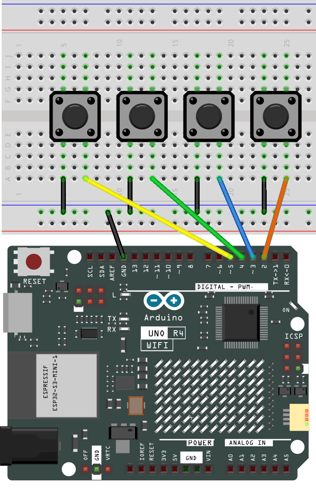
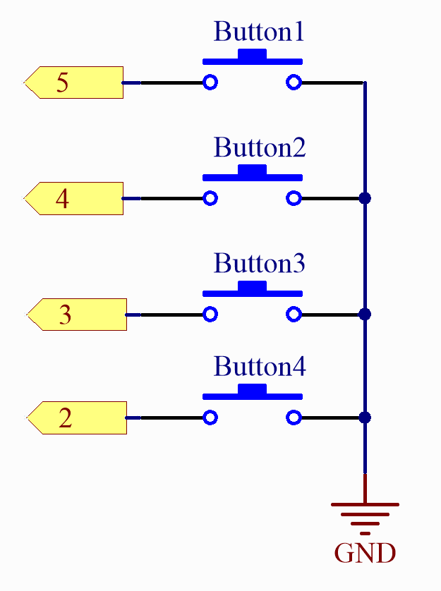

.. _iot_mqtt_publish:

基于 MQTT 的云呼叫系统
============================================

.. raw:: html

   <video loop autoplay muted style = "max-width:100%">
      <source src="../_static/videos/iot_projects/04_iot_mqtt_callling.mp4"  type="video/mp4">
      Your browser does not support the video tag.
   </video>

消息队列遥测传输 (MQTT) 是一种简单的消息传递协议。它也是物联网 (IoT) 领域中使用最广泛的消息传递协议。

MQTT 协议定义了 IoT 设备如何交换数据。它们以事件驱动的方式运行，并使用发布/订阅模型进行互连。发送方（发布者）和接收方（订阅者）通过主题进行通信。设备在特定主题上发布消息，所有订阅了该主题的设备都会收到该消息。

在本节中，我们将使用 UNO R4、HiveMQ（一个免费的公共 MQTT 代理服务）和四个按钮创建一个服务呼叫系统。四个按钮分别对应餐厅的餐桌，当顾客按下按钮时，您将能够在 HiveMQ 上看到哪张餐桌需要服务。

**所需元件**

在这个项目中，我们需要以下元件。

购买整套套件会更方便，以下是链接：

.. list-table::
    :widths: 20 20 20
    :header-rows: 1

    *   - 名称
        - 套件所含项目
        - 链接
    *   - Elite Explorer 套件
        - 300+
        - |link_Elite_Explorer_kit|

您也可以从下面的链接单独购买。

.. list-table::
    :widths: 30 20
    :header-rows: 1

    *   - 元件介绍
        - 购买链接

    *   - :ref:`uno_r4_wifi`
        - \-
    *   - :ref:`cpn_breadboard`
        - |link_breadboard_buy|
    *   - :ref:`cpn_wires`
        - |link_wires_buy|
    *   - :ref:`cpn_button`
        - |link_button_buy|

**接线**

**原理图**

**如何操作？**

HiveMQ 是一个基于 MQTT 代理和客户端的消息传递平台，可促进快速、高效和可靠的数据传输到 IoT 设备。

1. 在网络浏览器中打开 |link_hivemq| 。

2. 将客户端连接到默认的公共代理。

   .. image:: img/04_mqtt_1.png

3. 点击 **Add New Topic Subscription** 。

   .. image:: img/04_mqtt_2.png

4. 输入您想要关注的主题并点击 **Subscribe** 。确保您在此处设置的主题是唯一的，以免收到来自其他用户的消息，并注意大小写。

   在此示例代码中，我们将主题设置为 ``SunFounder MQTT Test``。如果您进行了任何更改，请确保代码中的主题与网页上订阅的主题匹配。

   .. image:: img/04_mqtt_3.png

**安装库**

要安装库，请使用 Arduino 库管理器搜索 "ArduinoMqttClient" 并安装。

``ArduinoMqttClient.h``：用于 MQTT 通信。

**运行代码**

.. note::

    * 您可以直接打开路径 ``elite-explorer-kit-main\iot_project\04_mqtt_button`` 下的 ``04_mqtt_button.ino`` 文件。
    * 或者将这段代码复制到 Arduino IDE 中。

.. note::
    在代码中，SSID 和密码存储在 ``arduino_secrets.h`` 中。上传此示例之前，您需要使用自己的 WiFi 凭据修改它们。此外，出于安全目的，在共享或存储代码时请确保此信息保密。

.. raw:: html

   <iframe src=https://create.arduino.cc/editor/sunfounder01/7a4acdf8-beed-47d4-ada8-cbaab0f3477f/preview?embed style="height:510px;width:100%;margin:10px 0" frameborder=0></iframe>

运行代码后，返回 |link_hivemq| ，当您按下面包板上的按钮之一时，您将在 HiveMQ 上看到消息提示。

    .. image:: img/04_mqtt_4.png

**工作原理**

此代码是一个基于 Arduino 的项目，它连接到 Wi-Fi 并使用 MQTT 协议与 MQTT 代理通信。此外，它可以检测四个按钮是否被按下，并将相应的消息发送到 MQTT 代理。

以下是代码的详细说明：

1. **包含相关库** ：

   .. code-block:: Arduino

       #include <WiFiS3.h>
       #include <ArduinoMqttClient.h>

2. **包含敏感信息** ：

   * ``arduino_secrets.h`` 文件包含 Wi-Fi 网络的 SSID 和密码。

   .. code-block:: Arduino

       #include "arduino_secrets.h"
       char ssid[] = SECRET_SSID;
       char pass[] = SECRET_PASS;

3. **初始化变量** ：

   * 用于管理 Wi-Fi 和 MQTT 连接的变量。
   * 初始化按钮引脚和按钮状态。

4. ``setup()``：

   * 初始化串行通信。
   * 检查 Wi-Fi 模块是否存在并尝试连接到 Wi-Fi。
   * 打印网络数据。
   * 尝试连接到 MQTT 代理。
   * 订阅 MQTT 主题。
   * 将按钮设置为输入模式。

5. ``loop()``：

   * 保持 MQTT 连接活动。
   * 检查每个按钮是否被按下，如果被按下，则发送 MQTT 消息。

6. **其他实用函数** ：

   * ``printWifiData()``：打印当前连接的 Wi-Fi 网络信息。
   * ``printCurrentNet()``：打印当前网络的相关数据。
   * ``printMacAddress(byte mac[])``：打印 MAC 地址。
   * ``onMqttMessage(int messageSize)``：当从 MQTT 代理接收到消息时触发的回调函数。它打印接收到的消息主题和内容。
   * ``sendButtonMessage(int buttonNumber)``：使用此函数在按下按钮时发送 MQTT 消息。
