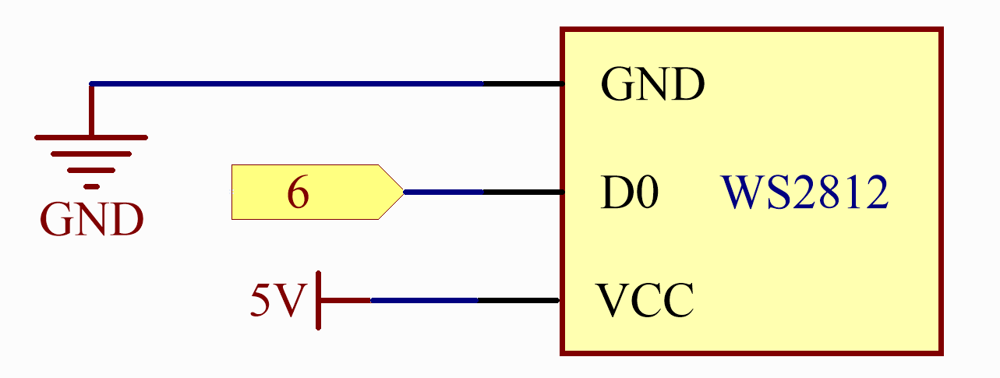

.. note::

    こんにちは、SunFounderのRaspberry Pi & Arduino & ESP32愛好家コミュニティへようこそ！Facebook上でRaspberry Pi、Arduino、ESP32についてもっと深く掘り下げ、他の愛好家と交流しましょう。

    **参加する理由は？**

    - **エキスパートサポート**：コミュニティやチームの助けを借りて、販売後の問題や技術的な課題を解決します。
    - **学び＆共有**：ヒントやチュートリアルを交換してスキルを向上させましょう。
    - **独占的なプレビュー**：新製品の発表や先行プレビューに早期アクセスしましょう。
    - **特別割引**：最新製品の独占割引をお楽しみください。
    - **祭りのプロモーションとギフト**：ギフトや祝日のプロモーションに参加しましょう。

    👉 私たちと一緒に探索し、創造する準備はできていますか？[|link_sf_facebook|]をクリックして今すぐ参加しましょう！

.. _iot_cherrylight:

CherryLight
===============================

.. raw:: html

   <video loop autoplay muted style = "max-width:100%">
      <source src="../_static/videos/iot_projects/05_iot_cheerlights.mp4"  type="video/mp4">
      お使いのブラウザではビデオタグがサポートされていません。
   </video>

CheerLightsは、誰でも制御できるグローバルな同期ライトのネットワークです。 |link_cheerlights| のLEDカラーチェンジコミュニティに参加し、世界中のLEDを同時に色を変えられるようにしましょう。オフィスの片隅にLEDを置いて、自分が一人でないことを思い出しましょう。

このケースでは、MQTTを使用しますが、自分のメッセージを公開する代わりに、「cheerlights」というトピックにサブスクライブします。これにより、他の人が「cheerlights」トピックに送信したメッセージを受信し、その情報を使用してLEDストリップの色を変更することができます。

**必要なコンポーネント**

このプロジェクトには以下のコンポーネントが必要です。

全体のキットを購入すると便利です。こちらがリンクです：

.. list-table::
    :widths: 20 20 20
    :header-rows: 1

    *   - 名称	
        - このキットのアイテム数
        - リンク
    *   - Elite Explorer Kit
        - 300+
        - |link_Elite_Explorer_kit|

以下のリンクから別々に購入することもできます。

.. list-table::
    :widths: 30 20
    :header-rows: 1

    *   - コンポーネント紹介
        - 購入リンク

    *   - :ref:`uno_r4_wifi`
        - \-
    *   - :ref:`cpn_wires`
        - |link_wires_buy|
    *   - :ref:`cpn_ws2812`
        - |link_ws2812_buy|

**配線図**

.. image:: img/05_cheerlight_bb.png
    :width: 100%
    :align: center

**回路図**

.. raw:: html

    

**ライブラリのインストール**

ライブラリをインストールするには、Arduinoライブラリマネージャーを使用し、「ArduinoMqttClient」と「FastLED」を検索してインストールしてください。

``ArduinoMqttClient.h``：MQTT通信用に使用します。

``FastLED.h``：RGB LEDストリップのドライブに使用します。

**コードの実行**

.. note::

    * ファイル ``05_cheerlight.ino`` を ``elite-explorer-kit-main\iot_project\05_cheerlight`` のパスから直接開くことができます。
    * または、このコードをArduino IDEにコピーしてください。

.. note::
    コード内で、SSIDとパスワードは ``arduino_secrets.h`` に格納されています。この例をアップロードする前に、自分のWiFiの認証情報でそれらを修正する必要があります。さらに、コードを共有または保存する際には、この情報を機密に保つためのセキュリティ対策を講じてください。

.. raw:: html

   <iframe src=https://create.arduino.cc/editor/sunfounder01/9d7ad736-9725-499f-a6ea-91602120d53e/preview?embed style="height:510px;width:100%;margin:10px 0" frameborder=0></iframe>

**グローバルな@CheerLightsデバイスを制御する**

#. |link_discord_server| に参加し、 ``/CheerLights`` ボットを利用して色を設定します。 **CheerLights Discord Server** の任意のチャンネルで「/cheerlights」と入力してボットをアクティブにします。

   .. image:: img/05_iot_cheerlights_1.png

#. ボットが提供する指示に従って色を設定します。これにより、グローバルにCheerLightsデバイスを制御できます。

   .. image:: img/05_iot_cheerlights_2.png

**どのように動作するのか？**

こちらはコードの主要部分とその機能の説明です：

1. 必要なライブラリを含む：

   * ``WiFiS3.h``：Wi-Fi接続の処理に使用します。
   * ``ArduinoMqttClient.h``：MQTT接続の処理に使用します。
   * ``FastLED.h``：NeoPixel LEDストリップの制御に使用します。

2. いくつかの定数を定義する：

   * ``NUM_LEDS``：LEDストリップ上のLEDの数。
   * ``DATA_PIN``：LEDストリップを制御するためにArduinoに接続されているデータピン。
   * ``arduino_secrets.h``：Wi-Fiネットワーク名とパスワードを含むヘッダーファイルで、機密情報を保護します。
   * ``broker``：MQTTサーバーのアドレス。
   * ``port``：MQTTサーバーのポート。
   * ``topic``：サブスクライブするMQTTトピック。

3. いくつかのグローバル変数を定義する：

   * ``CRGB leds[NUM_LEDS]``：LEDの色データを格納するための配列。
   * ``colorName``：CheerLightsプロジェクトでサポートされている色名の配列。
   * ``colorRGB``：色名に対応するRGBカラーコードの配列。

4. ``setup()`` 関数：

   * シリアル通信を初期化します。
   * Wi-Fiモジュールが存在するかを確認し、そのファームウェアバージョンを出力します。
   * Wi-Fiネットワークに接続を試み、失敗した場合は10秒待って再試行します。
   * 接続に成功したら、MQTTブローカー（サーバー）に接続し、指定されたトピックにサブスクライブします。
   * NeoPixel LEDストリップを初期化します。

5. ``loop()`` 関数：

   * 定期的に ``mqttClient.poll()`` 関数を呼び出して、MQTTメッセージを受信し、MQTTのキープアライブ信号を送信します。
   * 継続的な接続を避けるために5秒の遅延を追加します。

6. ``printWifiData()`` および ``printCurrentNet()`` 関数は、Wi-Fiネットワークおよび接続情報を出力するために使用されます。

7. ``printMacAddress()`` 関数は、MACアドレスを16進数形式で印刷するために使用されます。

8. ``onMqttMessage()`` 関数は、MQTTメッセージが受信されたときにトリガーされるコールバック関数です。受信したトピックとメッセージ内容を出力し、メッセージ内容を小文字に変換します。トピックが「cheerlights」の場合、 ``setColor()`` 関数を呼び出して、LEDストリップの色を設定します。

9. ``setColor()`` 関数は、色名をパラメータとして取り、 ``colorName`` 配列で一致する色を探します。一致する色が見つかった場合、LEDストリップの色を対応するRGB値に設定し、 ``FastLED.show()`` 関数を使用してLEDストリップの色を更新します。

