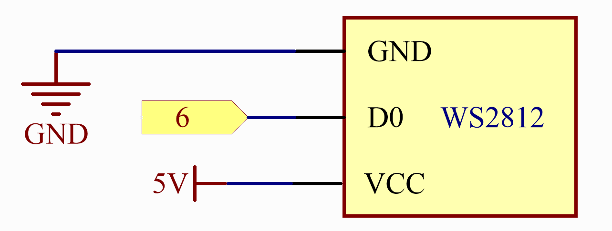

.. note::

    Hallo und willkommen in der SunFounder Raspberry Pi & Arduino & ESP32 Enthusiasten-Gemeinschaft auf Facebook! Tauchen Sie tiefer ein in die Welt von Raspberry Pi, Arduino und ESP32 mit anderen Enthusiasten.

    **Warum beitreten?**

    - **Expertenunterstützung**: Lösen Sie Nachverkaufsprobleme und technische Herausforderungen mit Hilfe unserer Gemeinschaft und unseres Teams.
    - **Lernen & Teilen**: Tauschen Sie Tipps und Anleitungen aus, um Ihre Fähigkeiten zu verbessern.
    - **Exklusive Vorschauen**: Erhalten Sie frühzeitigen Zugang zu neuen Produktankündigungen und exklusiven Einblicken.
    - **Spezialrabatte**: Genießen Sie exklusive Rabatte auf unsere neuesten Produkte.
    - **Festliche Aktionen und Gewinnspiele**: Nehmen Sie an Gewinnspielen und Feiertagsaktionen teil.

    👉 Sind Sie bereit, mit uns zu erkunden und zu erschaffen? Klicken Sie auf [|link_sf_facebook|] und treten Sie heute bei!

.. _iot_cheerlights:

CheerLights
===============================

.. raw:: html

   <video loop autoplay muted style = "max-width:100%">
      <source src="../_static/videos/iot_projects/05_iot_cheerlights.mp4" type="video/mp4">
      Ihr Browser unterstützt das Video-Tag nicht.
   </video>

CheerLights ist ein globales Netzwerk synchronisierter Lichter, das von jedem gesteuert werden kann. Treten Sie der |link_cheerlights| LED-Farbwechsel-Community bei, die es ermöglicht, dass LEDs weltweit gleichzeitig ihre Farben ändern. Platzieren Sie Ihre LEDs in einer Ecke Ihres Büros, um sich daran zu erinnern, dass Sie nicht alleine sind.

In diesem Fall nutzen wir ebenfalls MQTT, aber anstatt unsere eigenen Nachrichten zu veröffentlichen, abonnieren wir das Thema „cheerlights“. Dadurch können wir Nachrichten, die von anderen an das Thema „cheerlights“ gesendet werden, empfangen und diese Informationen verwenden, um die Farbe unseres LED-Streifens entsprechend zu ändern.

**Benötigte Komponenten**

Für dieses Projekt benötigen wir die folgenden Komponenten.

Es ist definitiv praktisch, ein ganzes Kit zu kaufen, hier ist der Link:

.. list-table::
    :widths: 20 20 20
    :header-rows: 1

    *   - Name	
        - ARTIKEL IN DIESEM KIT
        - LINK
    *   - Elite Explorer Kit
        - 300+
        - |link_Elite_Explorer_kit|

Sie können sie auch separat über die untenstehenden Links kaufen.

.. list-table::
    :widths: 30 20
    :header-rows: 1

    *   - KOMPONENTENBESCHREIBUNG
        - KAUF-LINK

    *   - :ref:`uno_r4_wifi`
        - \-
    *   - :ref:`cpn_wires`
        - |link_wires_buy|
    *   - :ref:`cpn_ws2812`
        - |link_ws2812_buy|

**Verdrahtung**

.. image:: img/05_cheerlight_bb.png
    :width: 100%
    :align: center

**Schaltplan**

.. raw:: html

    

**Bibliothek installieren**

Um die Bibliothek zu installieren, verwenden Sie den Arduino Library Manager und suchen Sie nach „ArduinoMqttClient“ und „FastLED“, um sie zu installieren.

``ArduinoMqttClient.h``: Wird für die MQTT-Kommunikation verwendet.

``FastLED.h``: Wird verwendet, um den RGB-LED-Streifen zu steuern.

.. important::
    Mit der Veröffentlichung von |link_fastled_3_7_0| unterstützt die FastLED-Bibliothek nun offiziell den Arduino UNO R4. Daher müssen Sie die Entwicklungsversion nicht mehr manuell installieren. Aktualisieren oder installieren Sie die FastLED-Bibliothek einfach über den Arduino Library Manager.

.. warning::
    **[Veraltet]** Da die |link_FastLED_lib|-Bibliothek noch keine offizielle Version mit Unterstützung für den Arduino R4 veröffentlicht hat, müssen Sie :download:`den neuesten Entwicklungsstand der FastLED-Bibliothek <https://codeload.github.com/FastLED/FastLED/zip/refs/heads/master>` herunterladen und die vorhandenen FastLED-Bibliotheksdateien überschreiben. Detaillierte Anweisungen dazu finden Sie im Abschnitt :ref:`manual_install_lib`. (Dieser Hinweis wird zurückgezogen, wenn die FastLED-Bibliothek offiziell ein Update veröffentlicht, das den Arduino UNO R4 unterstützt.)

**Code ausführen**

.. note::

    * Sie können die Datei ``05_cheerlight.ino`` direkt unter dem Pfad ``elite-explorer-kit-main\iot_project\05_cheerlight`` öffnen.
    * Oder kopieren Sie diesen Code in die Arduino IDE.

.. note::
    Im Code werden SSID und Passwort in ``arduino_secrets.h`` gespeichert. Bevor Sie dieses Beispiel hochladen, müssen Sie sie mit Ihren eigenen WLAN-Anmeldeinformationen ändern. Außerdem sollten Sie aus Sicherheitsgründen diese Informationen vertraulich halten, wenn Sie den Code teilen oder speichern.

.. literalinclude:: /_code/05_iot_cheerlights_secrets.h
   :language: cpp
   :caption: arduino_secrets.h

.. literalinclude:: /_code/05_iot_cheerlights.ino
   :language: cpp
   :linenos:
   :caption: 05_cheerlight.ino

**Steuern Sie globale @CheerLights-Geräte**

#. Treten Sie dem |link_discord_server| bei und nutzen Sie den CheerLights-Bot, um die Farbe einzustellen. Geben Sie einfach ``/cheerlights`` in einem der Kanäle des **CheerLights Discord Servers** ein, um den Bot zu aktivieren.

   .. image:: img/05_iot_cheerlights_1.png

#. Folgen Sie den Anweisungen des Bots, um die Farbe festzulegen. Dadurch können Sie CheerLights-Geräte weltweit steuern.

   .. image:: img/05_iot_cheerlights_2.png

**Wie funktioniert des?**

Hier sind die Hauptteile des Codes und Erklärungen ihrer Funktionen:

1. Einbinden der erforderlichen Bibliotheken:

   * ``WiFiS3.h``: Wird verwendet, um Wi-Fi-Verbindungen zu handhaben.
   * ``ArduinoMqttClient.h``: Wird verwendet, um MQTT-Verbindungen zu handhaben.
   * ``FastLED.h``: Wird verwendet, um NeoPixel LED-Streifen zu steuern.

2. Definition einiger Konstanten:

   * ``NUM_LEDS``: Die Anzahl der LEDs auf dem LED-Streifen.
   * ``DATA_PIN``: Der Datenpin, der mit Arduino verbunden ist, um den LED-Streifen zu steuern.
   * ``arduino_secrets.h``: Header-Datei, die den Namen und das Passwort des Wi-Fi-Netzwerks enthält, um sensible Informationen zu schützen.
   * ``broker``: Adresse des MQTT-Servers.
   * ``port``: Port des MQTT-Servers.
   * ``topic``: Das zu abonnierende MQTT-Thema.

3. Definition einiger globaler Variablen:

   * ``CRGB leds[NUM_LEDS]``: Ein Array, um LED-Farbdaten zu speichern.
   * ``colorName``: Ein Array von Farbnamen, die vom CheerLights-Projekt unterstützt werden.
   * ``colorRGB``: Ein Array von RGB-Farbcodes, die den Farbnamen entsprechen.

4. ``setup()`` Funktion:

   * Initialisieren der seriellen Kommunikation.
   * Überprüfen, ob das Wi-Fi-Modul vorhanden ist und dessen Firmware-Version ausgeben.
   * Versuchen, eine Verbindung zum Wi-Fi-Netzwerk herzustellen; falls es fehlschlägt, 10 Sekunden warten und erneut versuchen.
   * Nach erfolgreicher Verbindung, Verbindung zum MQTT-Broker (Server) herstellen und das angegebene Thema abonnieren.
   * Den NeoPixel LED-Streifen initialisieren.

5. ``loop()`` Funktion:

   * Periodisch die Funktion ``mqttClient.poll()`` aufrufen, um MQTT-Nachrichten zu empfangen und MQTT-Keep-Alive-Signale zu senden.
   * Eine 5-Sekunden-Verzögerung hinzufügen, um eine kontinuierliche Verbindung zu vermeiden.

6. Die Funktionen ``printWifiData()`` und ``printCurrentNet()`` werden verwendet, um Wi-Fi-Netzwerk- und Verbindungsinformationen auszugeben.

7. Die Funktion ``printMacAddress()`` wird verwendet, um die MAC-Adresse im Hexadezimalformat auszudrucken.

8. Die Funktion ``onMqttMessage()`` ist eine Rückruffunktion, die ausgelöst wird, wenn eine MQTT-Nachricht empfangen wird. Sie gibt das empfangene Thema und den Nachrichteninhalt aus und konvertiert den Nachrichteninhalt in Kleinbuchstaben. Wenn das Thema „cheerlights“ ist, ruft sie die Funktion ``setColor()`` auf, um die Farbe des LED-Streifens festzulegen.

9. Die Funktion ``setColor()`` nimmt einen Farbnamen als Parameter und sucht nach einer passenden Farbe im Array ``colorName``. Wenn eine passende Farbe gefunden wird, setzt sie die Farbe des LED-Streifens auf den entsprechenden RGB-Wert und aktualisiert die Farbe des LED-Streifens mit der Funktion ``FastLED.show()``.

