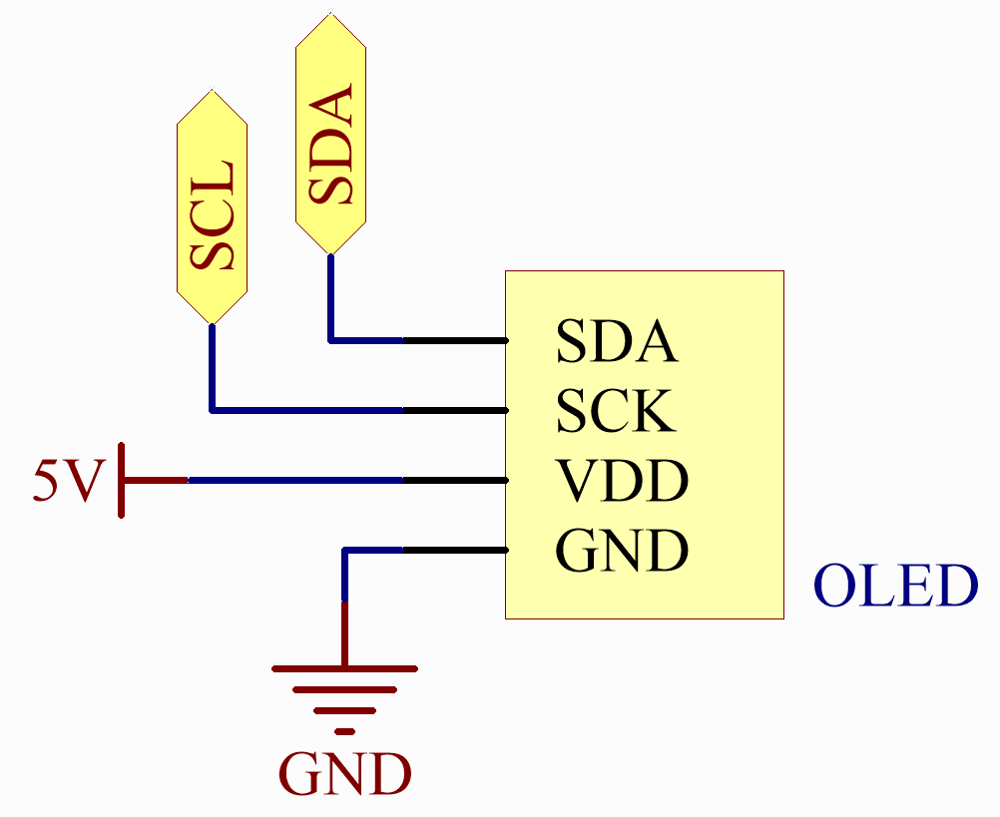

.. _iot_weathertime_screen:

天气时间屏幕
===============================

.. raw:: html

   <video loop autoplay muted style = "max-width:100%">
      <source src="../_static/videos/iot_projects/06_iot_weather_oled.mp4"  type="video/mp4">
      Your browser does not support the video tag.
   </video>

此 sketch 连接到 WiFi 网络，每分钟从 OpenWeatherMap 获取天气数据，从 NTP 服务器获取当前时间，并在 OLED 屏幕上显示日期、时间和天气信息。

**所需元件**

在这个项目中，我们需要以下元件。

购买整套套件会更方便，以下是链接：

.. list-table::
    :widths: 20 20 20
    :header-rows: 1

    *   - 名称
        - 套件所含项目
        - 链接
    *   - Elite Explorer 套件
        - 300+
        - |link_Elite_Explorer_kit|

您也可以从下面的链接单独购买。

.. list-table::
    :widths: 30 20
    :header-rows: 1

    *   - 元件介绍
        - 购买链接

    *   - :ref:`uno_r4_wifi`
        - \-
    *   - :ref:`cpn_wires`
        - |link_wires_buy|
    *   - :ref:`cpn_oled`
        - |link_oled_buy|

**接线**

.. image:: img/06_weather_oled_bb.png
    :width: 100%
    :align: center

**原理图**

**OpenWeather**

获取 OpenWeather API 密钥

`OpenWeather <https://openweathermap.org/>`_ 是 OpenWeather Ltd 拥有的在线服务，通过 API 提供全球天气数据，包括任何地理位置的当前天气数据、预报、临近预报和历史天气数据。

#. 访问 OpenWeather 登录/创建帐户。

   .. image:: img/06_owm_1.png

#. 从导航栏进入 API 页面。

   .. image:: img/06_owm_2.png

#. 找到 **Current Weather Data** 并点击 Subscribe。

   .. image:: img/06_owm_3.png

#. 在 **Current weather and forecasts collection** 下，订阅适当的服务。在我们的项目中，Free 版本就足够了。

   .. image:: img/06_owm_4.png

#. 从 **API keys** 页面复制密钥。

   .. image:: img/06_owm_5.png

#. 将其复制到 ``arduino_secrets.h``。

   .. code-block:: Arduino

       #define SECRET_SSID "<SSID>"        // your network SSID (name)
       #define SECRET_PASS "<PASSWORD>"        // your network password
       #define API_KEY "<OpenWeather_API_KEY>"
       #define LOCATION "<YOUR CITY>"

#. 设置您所在位置的时区。

   以瑞典首都斯德哥尔摩为例。在 Google 上搜索 "stockholm timezone"。

   .. image:: img/06_weather_oled_01.png

   在搜索结果中，您将看到 "GMT+1"，因此将下面函数的参数设置为 ``3600 * 1`` 秒。

   .. code-block:: Arduino

      timeClient.setTimeOffset(3600 * 1);  // Adjust for your time zone (this is +1 hour)

**安装库**

要安装库，请使用 Arduino 库管理器搜索 "ArduinoMqttClient"、"FastLED"、"Adafruit GFX" 和 "Adafruit SSD1306" 并安装它们。

``ArduinoJson.h``：用于处理 JSON 数据（从 openweathermap 获取的数据）。

``NTPClient.h``：用于获取实时时间。

``Adafruit_GFX.h``、``Adafruit_SSD1306.h``：用于 OLED 模块。

**运行代码**

.. note::

    * 您可以直接打开路径 ``elite-explorer-kit-main\iot_project\06_weather_oled`` 下的 ``06_weather_oled.ino`` 文件。
    * 或者将这段代码复制到 Arduino IDE 中。

.. note::
    在代码中，SSID 和密码存储在 ``arduino_secrets.h`` 中。上传此示例之前，您需要使用自己的 WiFi 凭据修改它们。此外，出于安全目的，在共享或存储代码时请确保此信息保密。

.. raw:: html

   <iframe src=https://create.arduino.cc/editor/sunfounder01/5f667ac1-bb24-4681-9fa1-db19fcfdd48a/preview?embed style="height:510px;width:100%;margin:10px 0" frameborder=0></iframe>

**工作原理**

1. 库和定义：

   #. ``WiFiS3.h``：这可能是特定于某个 WiFi 模块或板的库，用于管理 WiFi 连接。
   #. ``ArduinoJson.h``：此库用于解码（和编码）JSON 数据。
   #. ``arduino_secrets.h``：一个单独的文件，用于存储敏感数据（如 WiFi 凭据）。这是一个很好的做法，可以将凭据与主代码分离。
   #. **NTPClient & WiFiUdp** ：用于从 NTP（网络时间协议）服务器获取当前时间。
   #. **Adafruit 库** ：用于管理 OLED 显示屏。
   #. **各种全局变量** ：包括 WiFi 凭据、服务器详细信息等，将在整个脚本中使用。

2. ``setup()``：

   #. 初始化串行通信。
   #. 检查并打印 WiFi 模块的固件版本。
   #. 尝试使用提供的 SSID 和密码连接到 WiFi 网络。
   #. 打印已连接的 WiFi 状态（SSID、IP、信号强度）。
   #. 初始化 OLED 显示屏。
   #. 启动 NTP 客户端以获取当前时间，并设置时间偏移（此处为 8 小时，可能对应于特定时区）。

3. ``read_response()``：

   #. 读取来自服务器的响应，特别查找 JSON 数据（由 ``{`` 和 ``}`` 表示）。
   #. 如果找到 JSON 数据，则解码数据以提取天气详情，如温度、湿度、气压、风速和风向。
   #. 调用 ``displayWeatherData`` 函数在 OLED 屏幕上显示天气信息。

4. ``httpRequest()``：

   #. 关闭任何现有连接，确保 WiFi 模块的套接字是空闲的。
   #. 尝试连接到 OpenWeatherMap 服务器。
   #. 如果连接成功，发送 HTTP GET 请求以获取由 ``LOCATION`` 定义的特定位置的天气数据（可能在 ``arduino_secrets.h`` 或其他地方定义）。
   #. 记录发出请求的时间。

5. ``loop()``：

   #. 调用 ``read_response`` 函数处理来自服务器的任何传入数据。
   #. 从 NTP 服务器更新时间。
   #. 检查是否到了向天气服务器发出另一个请求的时间（基于 ``postingInterval``）。如果是，则调用 ``httpRequest`` 函数。

6. ``printWifiStatus()``：

   #. 已连接网络的 SSID。
   #. 板的本地 IP 地址。
   #. 信号强度 (RSSI)。

7. ``displayWeatherData()``：

   #. 清除 OLED 屏幕。
   #. 显示当前星期几。
   #. 以 HH:MM 格式显示当前时间。
   #. 显示提供的天气数据（温度、湿度、气压和风速）。
