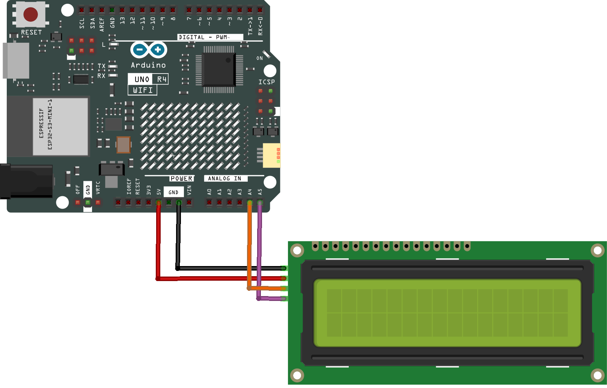
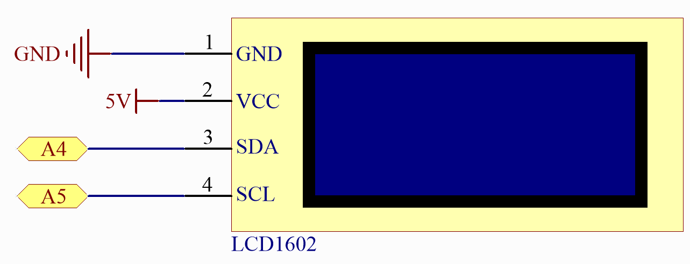

.. note::

    Bonjour et bienvenue dans la communauté des passionnés de SunFounder Raspberry Pi, Arduino et ESP32 sur Facebook ! Plongez au cœur des Raspberry Pi, Arduino et ESP32 avec d'autres passionnés.

    **Pourquoi nous rejoindre ?**

    - **Support d'experts** : Résolvez les problèmes après-vente et les défis techniques avec l'aide de notre communauté et de notre équipe.
    - **Apprendre et partager** : Échangez des astuces et des tutoriels pour améliorer vos compétences.
    - **Aperçus exclusifs** : Accédez en avant-première aux annonces de nouveaux produits et aux avant-premières.
    - **Réductions exclusives** : Profitez de réductions exclusives sur nos produits les plus récents.
    - **Promotions festives et cadeaux** : Participez à des concours et des promotions festives.

    👉 Prêt à explorer et créer avec nous ? Cliquez sur [|link_sf_facebook|] et rejoignez-nous dès aujourd'hui !
    
.. _iot_Bluetooth_lcd:

Bluetooth Message Box
=============================

.. raw:: html

   <video loop autoplay muted style = "max-width:100%">
      <source src="../_static/videos/iot_projects/07_iot_ble_lcd.mp4" type="video/mp4">
      Your browser does not support the video tag.
   </video>

Ce projet reçoit des messages et les affiche sur un écran LCD.

Vous pouvez l'utiliser comme tableau de messages familial, rappelant aux membres de la famille qui n'ont pas encore quitté la maison de ne pas oublier leurs clés.

**Composants nécessaires**

Pour ce projet, nous avons besoin des composants suivants. 

Il est certainement pratique d'acheter un kit complet, voici le lien :

.. list-table::
    :widths: 20 20 20
    :header-rows: 1

    *   - Nom	
        - ARTICLES DANS CE KIT
        - LIEN
    *   - Elite Explorer Kit
        - 300+
        - |link_Elite_Explorer_kit|

Vous pouvez également les acheter séparément à partir des liens ci-dessous.

.. list-table::
    :widths: 30 20
    :header-rows: 1

    *   - INTRODUCTION DU COMPOSANT
        - LIEN D'ACHAT

    *   - :ref:`uno_r4_wifi`
        - \-
    *   - :ref:`cpn_breadboard`
        - |link_breadboard_buy|
    *   - :ref:`cpn_wires`
        - |link_wires_buy|
    *   - :ref:`cpn_i2c_lcd1602`
        - |link_i2clcd1602_buy|

**Câblage**

**Schéma**

.. raw:: html

    

**Générer l'UUID**

Les UUID jouent un rôle crucial dans la communication BLE, assurant l'unicité des appareils et l'exactitude des échanges de données entre eux. Vous devez personnaliser les UUID pour créer vos propres services et caractéristiques BLE afin de répondre aux exigences spécifiques de l'application. (Ici, nous devons créer une caractéristique qui prend en charge la saisie de texte.)

1. Utilisez l'outil `Online UUID Generator Tool <https://www.uuidgenerator.net/version4>`_ pour créer des UUID uniques à vous afin d'éviter les conflits d'UUID.

2. Générez deux UUID version 4.

   .. image:: img/07_uuid_1.png
      :width: 70%

   .. raw:: html

        

3. Copiez-les et remplacez les deux UUID dans votre code.

   .. code-block:: arduino
   
       #define SERVICE_UUID "uuid1"
       #define CHARACTERISTIC_UUID "uuid2"

**Installer la bibliothèque**

``ArduinoBLE.h``: Utilisé pour gérer la communication Bluetooth Low Energy (BLE).
``LiquidCrystal_I2C.h``: Utilisé pour contrôler un écran LCD 16x2 avec interface I2C.

**Exécuter le code**

.. note::

    * Vous pouvez ouvrir le fichier ``07_lightblue_lcd.ino`` sous le chemin ``elite-explorer-kit-main\iot_project\07_lightblue_lcd`` directement.
    * Ou copier ce code dans Arduino IDE.

.. note:: 
      Pour installer la bibliothèque, utilisez le gestionnaire de bibliothèques Arduino pour rechercher et installer **"ArduinoBLE"** et **"LiquidCrystal I2C"**.

.. raw:: html

   <iframe src=https://create.arduino.cc/editor/sunfounder01/958c37c2-a897-4c4c-b6c1-0e7fea67c7b1/preview?embed style="height:510px;width:100%;margin:10px 0" frameborder=0></iframe>

**Comment jouer ?**

Pour interagir avec les services et caractéristiques créés dans ce sketch, vous devez utiliser une application centrale Bluetooth® Low Energy générique telle que LightBlue (disponible pour iOS et Android) ou nRF Connect (pour Android).

Utilisons LightBlue comme exemple pour montrer comment contrôler la LED de l'Arduino via Bluetooth.

1. Téléchargez l'application LightBlue depuis l'App Store (pour iOS) ou Google Play (pour Android).

   .. image:: img/07_lightblue.png

2. Connecter l'Arduino à votre smartphone via Bluetooth

   Allez dans vos paramètres Bluetooth et localisez le périphérique nommé "UNO R4 BLE". Connectez-vous à celui-ci.

   .. image:: img/07_iot_ble_01.jpg
      :width: 50%

   .. raw:: html

        

3. Interagir avec l'Arduino via Bluetooth en utilisant LightBlue

   Lancez LightBlue et appuyez sur l'onglet **Bonded** en bas de l'interface. Ici, vous verrez une liste des appareils BLE avec lesquels votre smartphone a déjà été couplé. Localisez **UNO R4 BLE** et appuyez sur **CONNECT**.

   .. image:: img/07_iot_ble_02.jpg

   Une fois connecté, vous aurez accès à des informations détaillées sur le périphérique Bluetooth. Faites défiler vers le bas pour trouver votre UUID de service et votre UUID de caractéristique.

   Appuyez sur la caractéristique. Vous remarquerez que cette caractéristique est à la fois lisible et inscriptible, vous permettant de la lire et de l'écrire.

   Continuez à faire défiler jusqu'à la section "Data format" et changez-la en UTF-8 String.
   Entrez du texte dans la zone de texte et cliquez sur write. Le message que vous avez entré apparaîtra sur le LCD.

   .. image:: img/07_iot_ble_03.jpg

**Comment ça marche ?**

Voici les principales parties du code et des explications de leurs fonctions :

1. Inclure les bibliothèques nécessaires :

   * ``ArduinoBLE.h``: Utilisé pour gérer la communication BLE.
   * ``Wire.h``: Utilisé pour la communication I2C.
   * ``LiquidCrystal_I2C.h``: Utilisé pour contrôler un écran LCD 16x2 avec interface I2C.

2. Définir un service BLE et une caractéristique BLE :

   * Utilisez la classe ``BLEService`` pour définir un service BLE et lui attribuer un UUID unique.
   * Utilisez la classe ``BLECharacteristic`` pour définir une caractéristique BLE, lui attribuer un UUID unique et lui donner les autorisations de lecture (``BLERead``) et d'écriture (``BLEWrite``).
   * Créez un tableau de caractères ``stringValue`` comme valeur initiale de la caractéristique.

3. Initialiser un écran LCD 16x2 (LCD) :

   * Utilisez la classe ``LiquidCrystal_I2C`` pour initialiser un LCD, en spécifiant l'adresse I2C (0x27) et le nombre de lignes et de colonnes (16x2).
   * Allumez le rétroéclairage du LCD, effacez l'écran, déplacez le curseur au début de la première ligne et affichez "Bluetooth LCD".

4. Effectuer l'initialisation dans la fonction ``setup()`` :

   * Initialisez la communication série.
   * Initialisez le module BLE, et si l'initialisation échoue, entrez dans une boucle infinie.
   * Définissez le nom local et l'UUID de service pour le périphérique BLE.
   * Ajoutez la caractéristique BLE au service BLE.
   * Commencez à diffuser le service BLE afin que les périphériques centraux puissent le découvrir et s'y connecter.
   * Initialisez le LCD.

5. La fonction ``loop()`` :

   * Vérifiez s'il y a un périphérique central connecté au périphérique BLE en appelant ``BLE.central()``. Si un périphérique central est connecté, entrez dans la logique de gestion de connexion.
   * Dans l'état connecté, vérifiez si des données ont été écrites dans la caractéristique BLE en vérifiant ``boxCharacteristic.written()``.
   * Si des données ont été écrites, obtenez la longueur des données écrites en utilisant ``boxCharacteristic.valueLength()`` et créez un tableau d'octets ``buffer`` pour stocker les données écrites.
   * Utilisez ``boxCharacteristic.readValue()`` pour lire les données de la caractéristique BLE dans le ``buffer``.
   * Ajoutez un caractère nul ``'\0'`` à la fin du ``buffer`` pour le convertir en chaîne de caractères.
   * Imprimez le message reçu dans le moniteur série et affichez-le sur le LCD.
   * Continuez à attendre le prochain périphérique central à se connecter après que le périphérique central se soit déconnecté.

