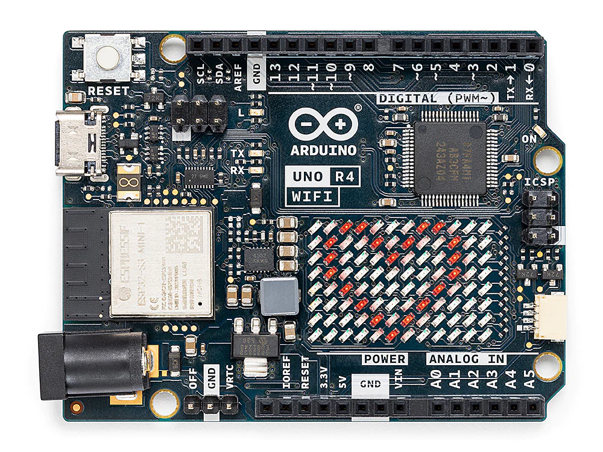

.. _new_projects:

探索 Arduino UNO R4 WiFi
========================================

**Arduino Uno R4 WiFi 板** 是 Arduino 家族的最新成员，在保持您已习惯的稳健性和多功能性的同时，提供了一系列高级功能。得益于其 32 位 Arm Cortex-M4 微控制器，该板的处理能力显著提升，并且它保持了 UNO 系列的标准外形尺寸和盾板堆叠兼容性。

**Uno R4 相较于 R3 有哪些新特性？**

- **增强处理** ：从 8 位 AVR 过渡到 32 位 Arm Cortex-M4 微控制器。
- **内存升级** ：以 32KB SRAM 和 256KB NAND 闪存提升您的项目。
- **先进连接** ：通过 USB-C 和 Wi-Fi 体验无缝连接。
- **性能提升** ：通过更快的处理和更大的内存容量完成更多任务。
- **灵活供电** ：使用高达 24V 的电压为您的板供电，为更广泛的项目提供可能性。

除了上述升级，R4 WiFi 还引入了以下新功能：

**新功能**

.. toctree::
    :maxdepth: 2

    01_wifi
    02_bluetooth
    03_rtc
    04_led_matrix
    05_hid
    06_14_bit_adc
    07_dac

- **Wi-Fi** ：由 ESP32-S3 模块提供支持，为各种 IoT 项目提供无线连接。
- **蓝牙** ：提供设备之间的短距离无线通信，也由 ESP32-S3 模块驱动。
- **内置实时时钟 (RTC)** ：非常适合对时间敏感的应用。包括用于电池供电运行的附加引脚和一个"OFF"引脚，可在保持 RTC 运行的同时关闭板。
- **12x8 LED 矩阵** ：一种显示数据或创建动画的简单方法。
- **DAC 通道** ：实现精确的模拟输出，非常适合音频项目。
- **14 位 ADC** ：Arduino Uno R4 中升级的模数转换器 (ADC) 提供高达 14 位的分辨率。与先前版本的 10 位分辨率相比，这允许更精确和详细地读取模拟信号。
- **HID 支持** ：通过内置 HID 支持通过 USB 模拟鼠标或键盘。
- **CAN 协议支持** ：将您的应用扩展到汽车和工业领域。

.. toctree::
    :maxdepth: 2
