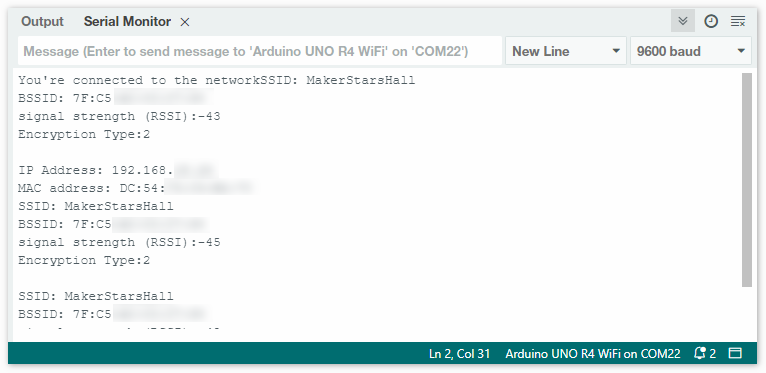

.. note::

    ¡Hola! Bienvenido a la Comunidad de Entusiastas de SunFounder para Raspberry Pi, Arduino y ESP32 en Facebook. Sumérgete en el mundo de Raspberry Pi, Arduino y ESP32 junto a otros entusiastas.

    **¿Por qué unirse?**

    - **Soporte Experto**: Resuelve problemas postventa y desafíos técnicos con la ayuda de nuestra comunidad y equipo.
    - **Aprende y Comparte**: Intercambia consejos y tutoriales para mejorar tus habilidades.
    - **Avances Exclusivos**: Obtén acceso anticipado a anuncios de nuevos productos y adelantos exclusivos.
    - **Descuentos Especiales**: Disfruta de descuentos exclusivos en nuestros productos más recientes.
    - **Promociones Festivas y Sorteos**: Participa en sorteos y promociones festivas.

    👉 ¿Listo para explorar y crear con nosotros? Haz clic en [|link_sf_facebook|] y únete hoy mismo.

Conéctate a Wi-Fi
==================

Este tutorial te guiará a través de los pasos esenciales para conectar tu placa Arduino a una red Wi-Fi. Aprenderás a inicializar el módulo Wi-Fi, verificar su firmware y unirte de manera segura a una red utilizando su SSID y contraseña. Una vez conectado, descubrirás cómo monitorear detalles importantes de la red, como las direcciones IP y MAC de tu dispositivo, así como la intensidad de la señal de la red, directamente desde la consola serial. Este tutorial sirve como una guía práctica para la conectividad Wi-Fi y una introducción al monitoreo de redes con Arduino, ayudándote a establecer y mantener una conexión Wi-Fi confiable.

1. Sube el código
=========================

Abre el archivo ``01-wifi_connect.ino`` en la ruta ``elite-explorer-kit-main\r4_new_feature\01-wifi_connect``, o copia este código en **Arduino IDE**.

.. note:: 
      El soporte Wi-Fi® está habilitado mediante la biblioteca ``WiFiS3`` incorporada que se incluye con el Arduino UNO R4 Core. Instalar el core automáticamente instala la biblioteca ``WiFiS3``.

Todavía necesitas crear o modificar ``arduino_secrets.h``, reemplazando ``SECRET_SSID`` y ``SECRET_PASS`` con el nombre y la contraseña de la red Wi-Fi a la que te quieres conectar. El archivo debería contener:

.. code:: arduino

    //archivo de cabecera arduino_secrets.h
    #define SECRET_SSID "tunetwork"
    #define SECRET_PASS "tucontraseña"

.. raw:: html
       
   <iframe src=https://create.arduino.cc/editor/sunfounder01/a41ac638-31da-464c-b5d3-e70f2aacd29c/preview?embed style="height:510px;width:100%;margin:10px 0" frameborder=0></iframe>

Abre el monitor serial y verás un contenido similar al siguiente. Arduino mostrará las direcciones IP y MAC de tu dispositivo, así como la intensidad de la señal de la red.

2. Explicación del código
=============================

1. Incluyendo Bibliotecas y Datos Secretos

   .. code-block:: arduino

      #include <WiFiS3.h>
      #include "arduino_secrets.h" 

   - ``WiFiS3`` es una biblioteca que proporciona funciones para la conectividad Wi-Fi. Instalar el core R4 automáticamente instala la biblioteca WiFiS3.
   - ``arduino_secrets.h`` es un archivo separado donde mantienes tu SSID y contraseña para que no estén expuestos en tu código principal. Almacenar la red y la contraseña por separado reduce el riesgo de compartir accidentalmente las credenciales Wi-Fi.

   .. raw:: html

       

2. Declarando Variables Globales

   .. code-block:: arduino

      char ssid[] = SECRET_SSID;
      char pass[] = SECRET_PASS;
      int status = WL_IDLE_STATUS;

   - ``ssid`` y ``pass`` contienen el nombre y la contraseña de tu red.
   - ``status`` almacenará el estado actual de tu conexión Wi-Fi.

   .. raw:: html

       

3. Función ``setup()``

   La interfaz Serial se inicializa con una tasa de baudios de 9600. La línea ``while (!Serial);`` asegura que el programa espere hasta que se establezca la conexión Serial.

   .. code-block:: arduino

      void setup() {
          //Inicializar la serie y esperar a que el puerto se abra:
          Serial.begin(9600);
          while (!Serial) {
            ; // esperar a que se conecte el puerto serie. Necesario solo para el puerto USB nativo
          }
          ...
      }

   Luego, el código verifica si el módulo Wi-Fi está disponible o no. Si no lo está, el programa se detendrá, deteniendo efectivamente cualquier ejecución adicional.

   .. code-block:: arduino

     ...
     // verificar el módulo WiFi:
     if (WiFi.status() == WL_NO_MODULE) {
         Serial.println("Communication with WiFi module failed!");
         // no continuar
         while (true);
     }
     ...

   En esta parte del código, verificamos si la versión del firmware del uno R4 wifi está actualizada. Si no es la última versión, se mostrará un aviso de actualización. Puedes consultar :ref:`update_firmware` para la actualización del firmware.

   .. https://forum.arduino.cc/t/radio-module-firmware-version-0-2-0-is-now-available/1147361

   .. code-block:: arduino

      ...
      String fv = WiFi.firmwareVersion();
      if (fv < WIFI_FIRMWARE_LATEST_VERSION) {
          Serial.println("Please upgrade the firmware");
      }
      ...

4. Función ``loop()``

   .. code-block:: arduino

      void loop() {
        // verificar la conexión de red cada 10 segundos:
        delay(10000);
        printCurrentNet();
      }

   - Cada 10 segundos, se llama a la función ``printCurrentNet()`` para imprimir los detalles actuales de la red.

**Referencia**

- |link_r4_wifi|